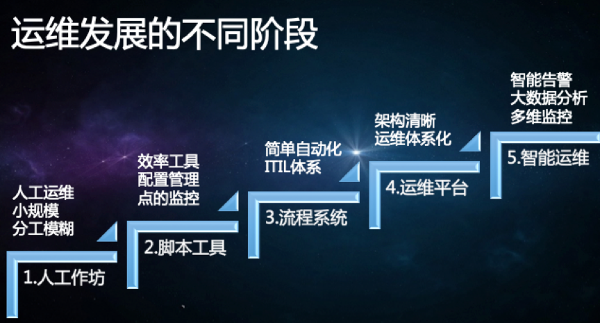

# DevOps系列：开篇

## 系列目录

[《DevOps系列：开篇》](https://cctrip.github.io/devops_series/)

[《DevOps系列：概述》](https://cctrip.github.io/devops_series_intro/)

[《DevOps系列：CMDB》]()

[《DevOps系列：CI/CD》]()

[《DevOps系列：监控》]()

[《DevOps系列：SRE》]()

***

## 1. 介绍

在Ops领域工作也接近8年了，个人也经历了从人工Ops-->工具Ops-->平台Ops的转变，最近想把自己的一些DevOps相关的学习和经验记录下来，整理成一个系列，算是对自己这么多年的工作经验的一个总结，也想对之后的发展想法做下自己的规划和判断。

***

## 2. 当我们谈论Ops，我们在谈论什么

### 2.1 从开发模型说起

早期的软件开发模型一般采用[瀑布式开发模型](https://en.wikipedia.org/wiki/Waterfall_model)，该模型将软件过程划分成几个阶段，从需求到设计、开发、测试和运维，它的理念是软件开发的规模越来越大，必须以一种工程管理的方式来定义每个阶段，以及相应的交付产物和交付标准，以期通过一种重流程，重管控，按照计划一步步推进整个项目的交付过程。Ops处于软件交付的末端。那么，具体的Ops是什么呢？

### 2.2 什么是运维(Ops)

> 运维(Ops)，  通常指IT运维（IT Operations）， 是指通过一系列步骤和方法，管理与维护线上服务（Online Service）或者产品  （Product）的过程。

运维有着非常广泛的定义，在不同的公司不同的阶段代表不同的职责与定位，没有一个统一的标准。尤其是随着互联网的发展，运维的含义也在逐渐互联网化。互联网运维通常属于技术部门，与研发、测试、系统管理同为互联网产品的技术支撑，这种划分在国内和国外以及大小公司之间都会多少有一些不同。运维的重点在于系统运行的各种环境，从机房、网络、存储、物理机、虚拟机这些基础的架构，到数据库、中间件平台、云平台、大数据平台，偏重的也不是编程，而是对这类平台的使用和管理。运维的水平可以成为衡量一个公司（IT公司）技术实力的标准。随着软件行业和规模的不断发展，Ops也在不断的改进。

### 2.3 Ops的发展历程

#### 2.3.1 人工阶段

在这个阶段，所有运维问题，基本靠人工操作完成。这种情况下，系统规模不大，遇到的问题相对简单，大多集中在硬件、网络和系统层面，所以有一定操作系统或网络维护经验的人就可以搞定。

#### 2.3.2 脚本&工具阶段

一般绝大多数企业都会很快从第一阶段过渡到第二阶段，因为上一阶段的大量重复繁琐的操作，完全可以转化为脚本来实现，而不是每次都去敲一堆类似的命令。

早期的运维主要以各种 shell 为主，所以很多运维如果会 shell 编写一些批处理脚本，就会很有竞争力了。再往后，我们大家所熟知的 Perl、Ruby、Python 等动态语言也被广泛应用于脚本工具的实现，特别是一些逻辑和场景相对复杂的自动化实现。不同的工具也被开发出现，例如ansible、chef、puppet等。

#### 2.3.3 流程&工具阶段

在该阶段，要面临更加复杂化的场景实现，比如做一次业务部署，运维同学可能要安装服务器，做系统配置变更，安装软件包、启停进程，然后再负载均衡上配置服务等等。这时，就需要有一个流程将一个个的脚本功能串联起来，同时还要有一些脚本执行结果校验及判断的过程。

所以，这就对流程和工具平台有了更大的诉求。同时，在一些 IT 化比较早的行业，如电信运营商和金融行业，由于对变更过程的严格控制，这就需要更加科学和规范的管理措施，所以会引入 ITIL 这样 IT 服务管理体系，对整个 IT 系统及其变更进行管控。

#### 2.3.4 运维平台阶段(DevOps)

从该阶段开始，随着业务复杂度和体量的增加，为了完成企业对于效率、稳定和成本的要求，倒逼着整个业务和技术架构发生转变，例如服务化和分布式等技术，而在这样新的技术体系下，运维所面临的场景复杂度也急剧上升，原有的运维技能如操作系统维护、系统配置、脚本编写已经完全满足不了要求。同时，由于软件系统复杂度的提升，也需要运维投入更多的精力去关注业务软件架构和应用服务上。也正是在这种要求下，运维人员不再是运维工作唯一参与的角色，每个在软件交付过程中需要参与的角色都将参与到DevOps中来，用于提升效率。

#### 2.3.5 智能运维阶段(AIOps)

个人理解这个是未来阶段，需要大厂来完成，因为**从 AI 的角度，AIOps 有三个方面的充要条件：机器学习算法、计算能力如 GPU、海量数据**。那么海量数据这个条件基本是只有大厂才能具备了。

***

## 3. DevOps

### 3.1 从开发模型的转变说起

#### 3.1.1 瀑布式开发模型

随着市场环境和用户需求变化的不断加速，瀑布式开发模式这种按部就班的方式有一个严重的潜在问题。

软件开发活动需要在项目一开始就确定项目目标、范围以及实现方式，而这个时间点往往是我们对用户和市场环境信息了解最少的时候，这样做出来的决策往往带有很大的不确定性，很容易导致项目范围不断变更，计划不断延期，交付上线时间不断推后，最后的结果是，即便我们投入了大量资源，却难以达到预期的效果。

从业界巨头 IBM 的统计数字来看，有 34% 的新 IT 项目延期交付，将近一半的应用系统因为缺陷导致线上回滚，这是一件多么令人沮丧的事情。

#### 3.1.2 敏捷式开发模型

基于这种问题，敏捷的思潮开始盛行。它的核心理念是，既然我们无法充分了解用户的真实需求是怎样的，那么不如将一个大的目标不断拆解，把它变成一个个可交付的小目标，然后通过不断迭代，以小步快跑的方式持续开发。

与此同时，将测试工作从研发末端的一个独立环节注入整个开发活动中，对开发交付的内容进行持续验证，保证每次可交付的都是一个可用的功能集合，并且由于质量内建在研发环节中，交付功能的质量也是有保障的。

说到底，敏捷源于开发实践，敏捷的应用使得开发和测试团队抱团取暖。可是问题又来了，开发和测试团队发现，不管研发的速度变得多快，在软件交付的另一端，始终有一群人在冷冰冰地看着他们，一句“现在没到发布窗口”让多少新开发的功能倒在了上线的门槛上。

毕竟，无论开发了多少天才的功能，如果没有经过运维环节的部署上线，并最终发布给真实用户，那么这些功能其实并没有什么用。

#### 3.1.3 DevOps模型

在传统模式下，度量开发团队效率的途径就是看开发完成了多少需求。于是，开发为了达成绩效目标，当然也是为了满足业务需求，不断地堆砌新功能，却很少有时间认真思考这些功能的可运维性和可测试性，只要需求状态流转到开发完成就万事大吉了。

而对于运维团队而言，他们的考核指标却是系统的稳定性、可用性和安全性。但现代 IT 系统是如此复杂，以至于每一次的上线发布都是一场战役，整个团队如临大敌，上线失败的焦虑始终如影随形。

很多时候，我们并不知道上线之后会发生什么，只能按照部署手册一步步操作，完成之后就听天由命。所以，每逢大促活动，就会有各种“拜服务器教”的照片广为流传。

另一方面，在无数次被开发不靠谱的功能缺陷蹂躏得体无完肤之后，运维团队意识到，变更才是影响他们绩效目标的最大敌人。于是，预先设立的上线窗口就成了运维团队的自留地，不断抬高的上线门槛也使得开发团队的交付变成了不可能完成的任务，最后，“互相伤害”就成了这个故事注定的结局。

因此，DevOps应运而生，也就是说，DevOps 最开始想要打破的就是开发和运维之间的对立和隔阂。DevOps旨在建立一种文化与环境，使构建、测试、软件发布得以快速、频繁以及更加稳定地进行。

虽然DevOps从一开始是想要促进开发和运维的协作，但是慢慢发现，其实在整个软件交付过程中，不仅只有开发和运维，业务也是重要的一环。

比方说，如果业务制定了一个不靠谱的需求，那么无论开发和运维怎样协作，得到的终究是一个不靠谱的结果，以及对人力的浪费。可是业务并不清楚用户的真实情况，于是运维团队慢慢转向运营团队，他们需要持续不断地把线上的真实数据和用户行为及时地反馈给需求团队，来帮助需求团队客观评估需求的价值，并及时作出有利于产品发展的调整，这样一来，业务也被引入到了 DevOps 之中，甚至诞生了 BizDevOps 这样一个专门的词汇。

那么，既然沟通协作放之四海皆准，安全也开始积极地参与进来。安全不再是系统上线发布之后的“定时炸弹”，而是介入到整个软件开发过程中，在每个过程中注入安全反馈机制，来帮助团队在第一时间应对安全风险，那么，对于安全团队来说，DevSecOps 就成了他们眼中的 DevOps。

这样的例子比比皆是，包括职能部门、战略部门等，都纷纷加入其中，使得 DevOps 由最开始的点，扩展为线，再到面，不断发展壮大。每个人都参与其中，这使得 DevOps 成了每一个 IT 从业人员都需要学习和了解的知识和技能体系。

***

## 结论

本篇文章，我们讲述了Ops的相关内容以及发展历程，然后讲到DevOps，我们最终要解决的是软件在企业中的效率、稳定和成本问题。接下来的文章，我们会针对DevOps说一些技术上的实现细节。

***

**参考**

[[译]当我们谈论Ops时，我们在谈论什么](https://cctrip.github.io/talk_ops/)

[运维十年回顾：当前很多新技术的本质都是在解决运维问题](https://www.infoq.cn/article/vpegnpakwjdhsjez5_x3)

[DevOps发展历程](http://bj.learnfuture.com/devops/9661)
