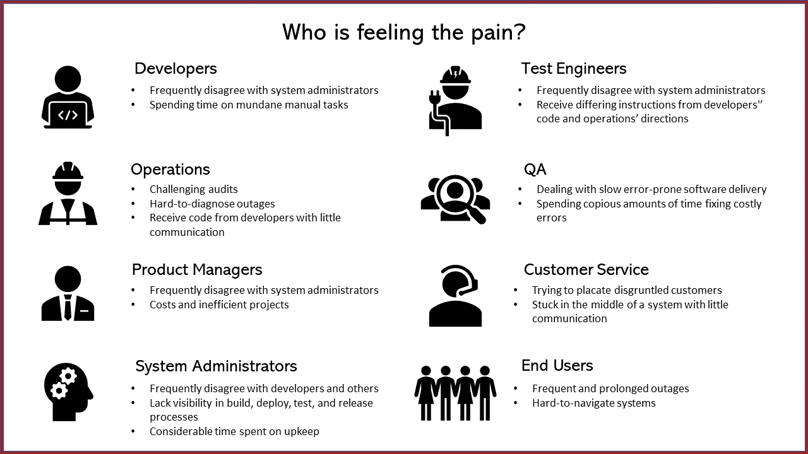
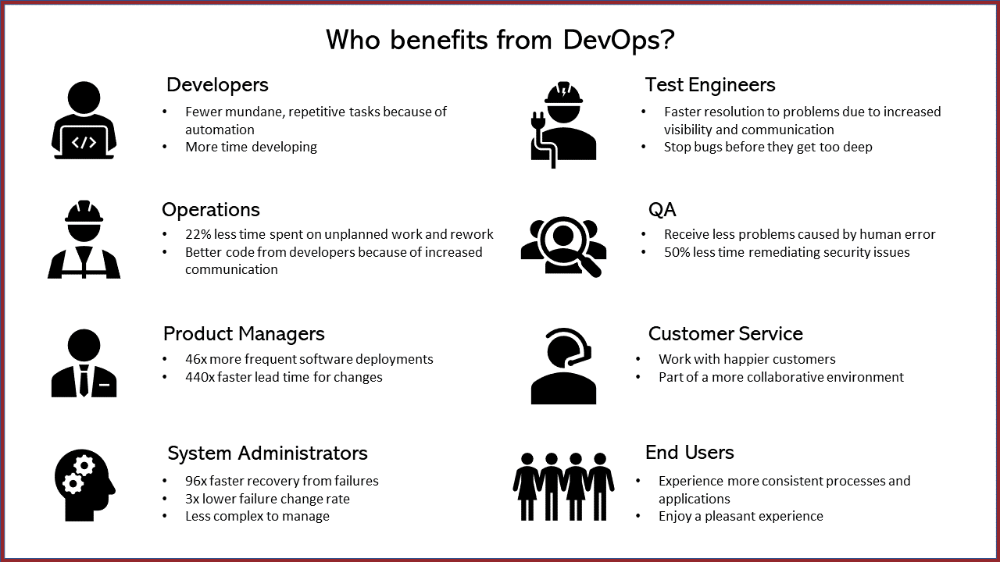
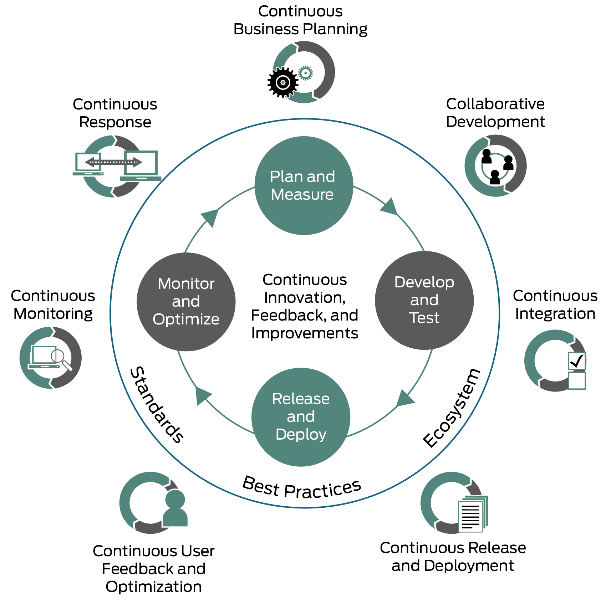

# DevOps系列：概述

## 系列目录

[《DevOps系列：开篇》](https://cctrip.github.io/devops_series/)

[《DevOps系列：概述》]()

[《DevOps系列：CMDB》]()

[《DevOps系列：CI/CD》]()

[《DevOps系列：监控》]()

[《DevOps系列：SRE》]()

***

## 1. 介绍

DevOps大概起源于08到09年之间，2010年，[**The** **Agile Admin**](https://theagileadmin.com/)博客发布了[《What is DevOps》](https://theagileadmin.com/what-is-devops/)给出了一个详细的DevOps定义，算是对DevOps有了一个初步的定义。不过，我这里还是引用一下wiki的定义：

> DevOps（开发 Development 与运维 Operations 的组合词）是一种文化、一场运动或实践，强调在自动化软件交付流程及基础设施变更过程中，软件开发人员与其他信息技术（IT）专业人员彼此之间的协作与沟通。它旨在建立一种文化与环境，使构建、测试、软件发布得以快速、频繁以及更加稳定地进行。

***

## 2. 优势

传统的瀑布模型会带来很多沟通上的问题，DevOps实际上是要来解决这些问题的。我们分别从工程上和角色上的优势来说一说

### 2.1 基于DevOps的工程上的优势

***

DevOps的主要好处是可以更快地交付质量大大提高的软件。 根据行业的不同，可能还会有其他好处。

我们知道，DevOps实际上重点在于自动化，通过自动化，可以产生如下优势

* reliability(可靠)
* faster updates(更迅速的更新)
* Reduced time to recover(减少恢复时间)

* Better user experience(更好的用户体验)
* Efficiency (高效)
* fewer failures(更少的失败)
* lower risk(更低的风险)
* Higher quality(更高的质量)
* shorter dev cycle(更短的开发周期)
* faster product delivery(更迅速的产品交付)
* stability(稳定性)
* cost savings(节省成本)

***

### 2.2 基于DevOps的角色上的好处

#### 2.2.1 不同角色的痛苦

在IT角色中，大部分的痛苦都来自于缺乏沟通和无聊的重复工作。 DevOps旨在解决这些问题。

#### 2.2.2 优势

如果采用DevOps后，不同的角色能获得不同的好处。

**开发**

如果您是没有DevOps的开发人员，那么您可能会对构建和部署流程的繁琐任务感到沮丧。您没有时间去进行创意或创新，因为您需要一遍又一遍地完成相同的任务。

借助DevOps和自动化，可以消除繁琐的重复任务！将这些耗时的项目排除在外，您就有更多的时间去做自己喜欢的事情：开发！花费更多的时间进行创新，而花费更少的时间进行维护和维护是一个胜利。

您是否不想参与软件的操作？随着DevOps消除孤岛并增加协作，这也将发生。

**运营**

开发人员在操作DevOps之前遇到的经典问题之一就是，开发人员会随机获取通常会出错的代码。沟通很少，解决问题将花费更长的时间，并使您的工作更加困难。您担心要保持环境的稳定性，这在将代码丢到墙上时很难做到。

使用DevOps，运营人员报告的计划外工作和返工时间减少了22％。这主要是由于与开发人员的交流增加了。更好的代码，共享的代码库和更稳定的操作环境使您的生活更轻松。

自动化和持续集成允许在不威胁稳定性的情况下交付新功能。

**产品**

当您的产品和服务需要更长的时间才能投入生产并付诸实践时，很难与您抗衡。如果您的软件有错误，这尤其困难。

DevOps鼓励协作环境。当生产过程中进行更多的交流时，结果就是更好的产品。当所有人都在同一页面上时，最终产品肯定会更好。

更不用说您的工作更容易了，软件部署频率提高了46倍，变更准备的时间缩短了440倍！

**系统管理员**

高效，高效地管理一支永不言语的团队几乎是不可能的。缺乏沟通使您的工作变得困难，因为该软件有错误，反馈不及时且可见性低。

协作是DevOps的主要租户之一。沟通可以带来更好的产品和更好的系统。此外，它们的管理较为简单。自动化可以减少人为错误，从而将故障更改率降低3倍。

DevOps还可以提高整个软件开发过程的可见性。当您能够检测到错误，找到错误的根源并找到原因后，就可以解决问题。 DevOps可使故障恢复速度提高96倍。

**测试**

当您看不到问题的源头和原因时，很难解决。当您找不到问题，无法解决问题并知道每时每刻都在承受压力时，压力就会越来越大，这会给越来越多的人带来不便（可能对此感到沮丧）。

DevOps可以更快地解决问题。提高可见度和沟通对于解决问题至关重要。工程师可以使用实时数据来解决问题并了解应用程序更改的影响。当出现问题时，解决方案实施越早越好。如果错误太深，则将很难修复。那真是令人头疼。

**质量保障**

确保产品和系统完好无损是您的工作。但这并不意味着您会喜欢充满错误的软件和流程。第一次尝试至少可以使某些功能生效，这是很好的。但是，如果没有沟通，协作和自动化，（DevOps的所有支柱）错误就会猖猖狂。

借助DevOps，团队成员可以共同开发出更好的产品，并且自动化可以减少容易避免的人为错误。结果？错误更少。在存在错误的地方，由于持续集成和持续交付以及它们的频繁微小更改，它们更小且更容易修复。DevOps用户报告的修复安全问题的时间减少了50％，故障恢复速度提高了96倍。

**客服**

曾经在服务行业工作过的任何人，无论是在餐馆，零售店还是客户服务部门，都知道与心怀不满的客户打交道的痛苦。当您的系统出现故障和错误时，客户也不满意。您没有创建它们，但是必须处理它们。

DevOps减少了错误，这意味着更快乐的客户。是的，您仍然会收到有投诉的客户打来的电话，但是他们之间的联系可能会越来越少。另外，与他们反复遇到相同的问题相比，他们将更加了解。更具协作性的环境意味着您的工作更加轻松。

**用户**

任何变化的意义是什么？为了改善用户体验。即使您正在为自己简化流程，这也意味着您将有更多时间为客户和客户进行更多改进。

DevOps通过改进流程和应用程序使最终用户的体验更加一致。总体而言，使交互更加有趣。

***

## 3. 使用

要让 DevOps 切实有效，您必须首先建立一套开发人员与运营部门通力协作的文化和理念。这对于该策略能否取得成功至关重要。该策略使得两个团队之间能够进行更好的沟通，从而激发创新。在打破了局限性的组织中，您可以建立一个集成环境。在该环境中，您能够反复测试并改进软件代码，然后实施一套连续发布计划以部署经过增强的软件。

您可以快速交付高质量的新产品和服务，因此客户满意度和用户体验将得到提升。通过使用内置了机器学习和算法的工具来执行连续监控和响应，任务（工作流程）可以自动触发，无需人工干预。

通过收集客户反馈和分析，您可以快速将这些信息融入到您的业务规划和未来产品开发中。然后，您可以从头开始再次启动 DevOps 循环。但这一次，您可以借助从客户那里学习并验证的知识来改进协作开发过程，并开始优化。

通过继续遵循 DevOps 方法，公司可以逐步建立一套优化的生态系统，其中包含相互作用的组件、用于优化开发的优秀实践以及用于维持高质量的既定标准。

DevOps的关键在于持续改进并且循环

- 持续业务计划
- 协作开发
- 持续测试
- 持续集成
- 持续交付(部署)
- 持续反馈
- 持续监控
- 持续响应

***

## 4. 学习DevOps

我本身是个技术人员，所以我这边更多的要从技术的角度来看DevOps，怎么成为DevOps，

## 结论

****

**参考：**

[https://devops.com/different-organizations-different-devops-outcomes/](https://devops.com/different-organizations-different-devops-outcomes/)

[https://dzone.com/articles/the-benefits-of-devops-by-role](https://dzone.com/articles/the-benefits-of-devops-by-role)

