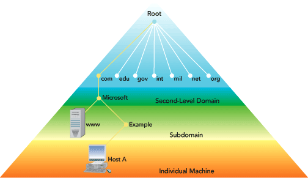
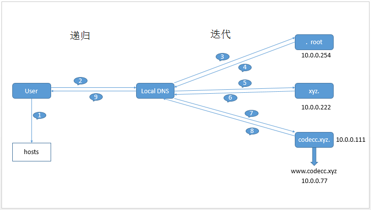
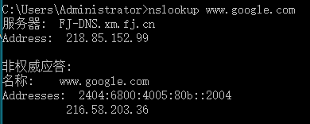
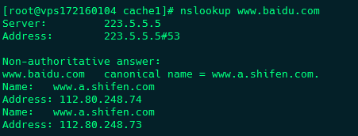
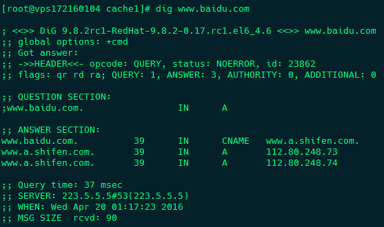

# 谈谈DNS

### 写在前面

目前，我们大部分的网络通信都是基于TCP/IP协议的，而TCP/IP又基于IP地址作为唯一标识进行通信，随着需要记忆的IP地址数量的增多，肯定会超出我们的记忆能力范围，但如果使用一种利于人们的记忆的方式，如域名，例如"www.google.com"，我们便可以轻松的记忆这种方式的标识，而不是繁杂的数字。而DNS(域名系统)就是为了可以使用这种方式提供服务的。

***

### 概念

DNS(Domain Name System)，域名系统，它是因特网的一项服务。它作为将域名和IP地址相互映射的一个分布式数据库，能够使人更方便地访问互联网。DNS使用TCP和UDP端口53。当前，对于每一级域名长度的限制是63个字符，域名总长度则不能超过253个字符。

DNS Domain Namespace，DNS域命名空间，是一种分层树状结构，其格式如下:"www.google.com",以点"."为分隔。结构如图所示：

* 根域：绝对域名(FQDN)，以点"."结尾的域名

* 顶级域：用来指示某个国家/地区或组织使用的名称的类型名称，例如.com

* 二级域：个人或组织在因特网上使用的注册名称，例如google.com

* 子域：已注册的二级域名派生的域名，一般就是网站名，例如www.google.com

* 主机名：标识网络上的特定计算机，例如h1.www.google.com

DNS资源记录：(即映射关系，通常由域名管理员进行配置)，常见类型如下：

* SOA：起始授权机构

* NS：名称服务器

* MX：邮件服务器

* A：IP地址(最常用，映射IP地址)

* CNAME：别名(较常用，映射到其他域名)

***

### DNS工作原理

当我们请求一个域名时，会通过DNS服务器将域名解析成IP访问最终的主机，那么，DNS是如何查询到域名所对应的IP并返回给我们的呢？请工作机制如图所示：

当我们请求一个域名时，直到获取到IP地址，整个过程是如何工作的？以请求www.codecc.xyz为例：

1. 首先，我们的主机会去查找本地的hosts文件和本地DNS解析器缓存，如果hosts文件和本地DNS缓存存在www.codecc.xyz和IP的映射关系，则完成域名解析，请求该IP地址，否则进入第二步。

2. 当hosts和本地DNS解析器缓存都没有对应的网址映射关系，则会根据机器(/etc/reslove.conf)配置的本地DNS服务器进行查询，此服务器收到查询时，如果要查询的域名在本地配置区域资源或者缓存中存在映射关系，则跳到步骤9，将解析结果直接返回给客户机。

PS：一二步骤为递归查询，其余步骤为迭代查询

3. 若本地DNS服务器不存在该域名的映射关系，就把请求发送至13台根DNS服务器。

4. 根DNS服务器会判断这个域名(.xyz)由谁来授权管理，并返回一个负责该顶级域的DNS服务器的一个IP给本地DNS服务器。

5. 本地DNS服务器收到该IP后，会再将查询请求发送至(.xyz)所在的DNS服务器。

6. 如果(.xyz)的DNS服务器无法解析该域名，就会去判断这个二级域名(codecc.xyz)的管理者，返回一个负责该二级域的DNS服务器的IP给本地DNS服务器。

7. 本地DNS服务器收到该IP后，会再次将查询请求发送至(codecc.xyz)所在的DNS服务器。

8. (codecc.xyz)的DNS服务器会存有www.codecc.xzy的映射关系，将解析后的IP返回给本地DNS服务器

9. 本地DNS服务器根据查询到的解析IP发送给客户机，至此，DNS解析完成。

***

### 常用DNS查询命令

* windows：

  * `nslookup 域名`

  

* Linux：

  * `nslookup 域名`

  

  * `dig 域名`

  

***

### 参考

[https://en.wikipedia.org/wiki/Domain_Name_System](https://en.wikipedia.org/wiki/Domain_Name_System)

[https://technet.microsoft.com/en-us/library/cc772774(v=ws.10).aspx](https://technet.microsoft.com/en-us/library/cc772774(v=ws.10).aspx)

[《TCP/IP详解卷1：协议》]()
