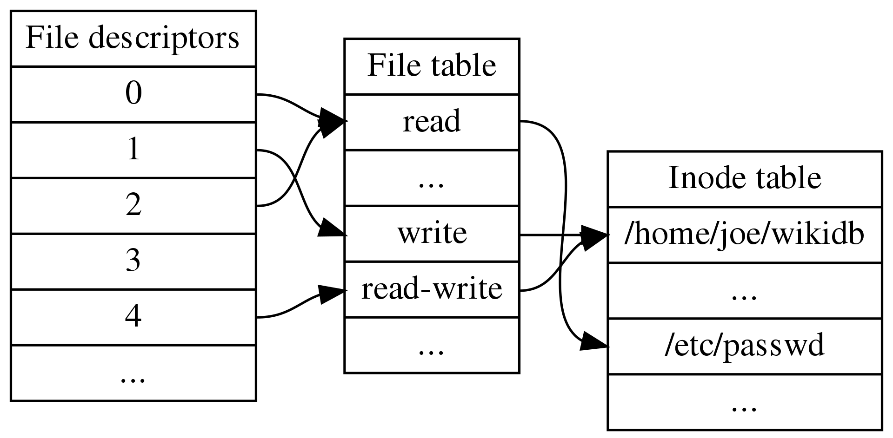
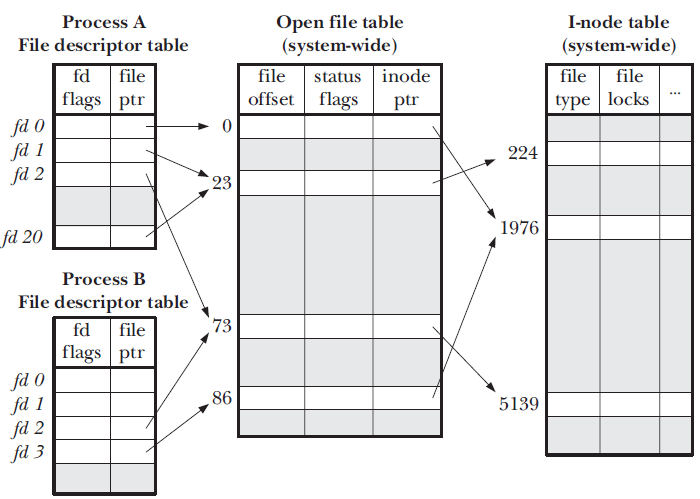

# 谈谈文件描述符


## 概念

[wiki解释](https://zh.wikipedia.org/wiki/文件描述符)，文件描述符在形式上是一个非负整数。实际上，它是一个索引值，指向[内核](https://zh.wikipedia.org/wiki/内核)为每一个[进程](https://zh.wikipedia.org/wiki/进程)所维护的该进程打开文件的记录表。当程序打开一个现有文件或者创建一个新文件时，内核向进程返回一个文件描述符。在程序设计中，一些涉及底层的程序编写往往会围绕着文件描述符展开。

一个**文件描述符**是一个数字，唯一标识一个在计算机的操作系统打开的文件。它描述了数据资源，以及如何访问该资源。

当程序要求打开文件（或其他数据资源，例如网络套接字）时，内核：

1. 授予访问权限。
2. 在全局文件表中创建一个条目。
3. 向软件提供该条目的位置。

该描述符是唯一的非负整数。系统上每个打开的文件至少存在一个文件描述符。

***

## 细节

对于内核，所有打开的文件均由文件描述符引用。文件描述符是一个非负数。当我们打开现有文件或创建新文件时，内核将文件描述符返回到进程。当我们想读取或写入文件时，我们用文件描述符标识文件。

每个Linux进程（也许是守护程序除外）都应该具有三个标准的POSIX文件描述符：

| POSIX常数名称 | 文件描述符 | 描述     |
| ------------- | ---------- | -------- |
| STDIN_FILENO  | 0          | 标准输入 |
| STDOUT_FILENO | 1          | 标准输出 |
| STDERR_FILENO | 2          | 标准误差 |

有三个“系统文件表”：有一个文件描述符表，它将文件描述符（小整数）映射到打开的文件表中的条目。打开文件表中的每个条目（除其他事项外）还包含文件偏移量和指向内存中inode表的指针。在打开的文件表中，每个open（）调用都有一个文件表条目，如果文件描述符是dup（）ed或fork（）ed，则共享该条目。

我们使用来自维基百科的示例来显示这些表的工作方式。这是一张照片： 

单个进程的文件描述符，文件表和索引节点表。请注意，多个文件描述符可以引用相同的文件表条目（例如，由于dup系统调用），并且多个文件表条目可以依次引用同一个索引节点（如果已多次打开；则该表之所以仍然简化，是因为它通过文件名来表示索引节点，即使索引节点可以具有多个名称也是如此。文件描述符3没有引用文件表中的任何内容，表明它已关闭。


理解具体情况，需要了解由内核维护的 3 个数据结构：

- 进程级 **文件描述符表** ( file descriptor table )
- 系统级 **打开文件表** ( open file table )
- 文件系统 **i-node表** ( i-node table )

这 3 个数据结构之间的关系如图所示：



### 文件描述符表

内核为每个进程维护一个 **文件描述符表** ，该表每一条目都记录了单个文件描述符的相关信息，包括：

- **控制标志** ( flags )，目前内核仅定义了一个，即 `close-on-exec`
- **打开文件描述体指针**

### 打开文件表

内核对所有打开的文件维护一个系统级别的 **打开文件描述表** ( open file description table )，简称 **打开文件表** 。 表中条目称为 **打开文件描述体** ( open file description )，存储了与一个打开文件相关的全部信息，包括：

- **文件偏移量** ( file offset )，调用 read() 和 write() 更新，调用 lseek() 直接修改
- **访问模式** ，由 open() 调用设置，例如：只读、只写或读写等
- **i-node 对象指针**

### i-node 表

每个文件系统会为存储于其上的所有文件(包括目录)维护一个 i-node 表，单个 i-node 包含以下信息：

- **文件类型** ( file type )，可以是常规文件、目录、套接字或 FIFO
- **访问权限**
- **文件锁列表** ( file locks )
- **文件大小**
- 等等

i-node 存储在磁盘设备上，内核在内存中维护了一个副本，这里的 i-node 表为后者。 副本除了原有信息，还包括： **引用计数** (从打开文件描述体)、所在 **设备号** 以及一些临时属性，例如文件锁。

***

## 参数优化

### 1. 系统最大的文件描述符数量

系统文件最大值取决于内存大小，在kernel初始化时定义

[代码](https://github.com/torvalds/linux/blob/master/fs/file_table.c):

```c
/*
 * One file with associated inode and dcache is very roughly 1K. Per default
 * do not use more than 10% of our memory for files.
 */
void __init files_maxfiles_init(void)
{
	unsigned long n;
	unsigned long nr_pages = totalram_pages();
	unsigned long memreserve = (nr_pages - nr_free_pages()) * 3/2;

	memreserve = min(memreserve, nr_pages - 1);
	n = ((nr_pages - memreserve) * (PAGE_SIZE / 1024)) / 10;

	files_stat.max_files = max_t(unsigned long, n, NR_FILE);
}
```

由代码可知，file-max的值不超过内存的10%

```shell
#获取total ram pages 和 PAGE_SIZE大小
$ getconf -a | grep "PAGE"
PAGESIZE                           4096
PAGE_SIZE                          4096
_AVPHYS_PAGES                      565489
_PHYS_PAGES                        1011579

#查看系统最大打开文件描述符数
$ cat /proc/sys/fs/file-max
399894

#查看当前系统使用的打开文件描述符数
$ cat /proc/sys/fs/file-nr
928	  0	 399894
   |  |   |_ Max no. of file descriptors allowed on the system
   |  |      
   |  |__ Total free allocated file descriptors
   |
   |__  Total allocated file descriptors
   

#设置系统最大文件描述符
#临时性
$ echo 1000000 > /proc/sys/fs/file-max

#永久性 
#在/etc/sysctl.conf中设置
fs.file-max = 1000000
$ sysctl -p

```

### 2. 进程最大描述符

```shell
# 查看某个进程的使用
$ ls -l /proc/2374/fd  | wc -l

# 进程最大打开文件描述符数
#soft limit
$ ulimit -n
65535

#hard limit
$ ulimit -Hn
65535

#soft limit不能大于hard limit

#设置
#临时性
$ ulimit -Sn 1600000

#永久性
$ vim /etc/security/limits.conf
root soft nofile 65535
root hard nofile 65535

#设置nofile的hard limit还有一点要注意的就是hard limit不能大于/proc/sys/fs/nr_open


```

### 3. 总结

```markdown
1. 所有进程打开的文件描述符数不能超过/proc/sys/fs/file-max

2. 单个进程打开的文件描述符数不能超过user limit中nofile的soft limit

3. nofile的soft limit不能超过其hard limit

4. nofile的hard limit不能超过/proc/sys/fs/nr_open
```


