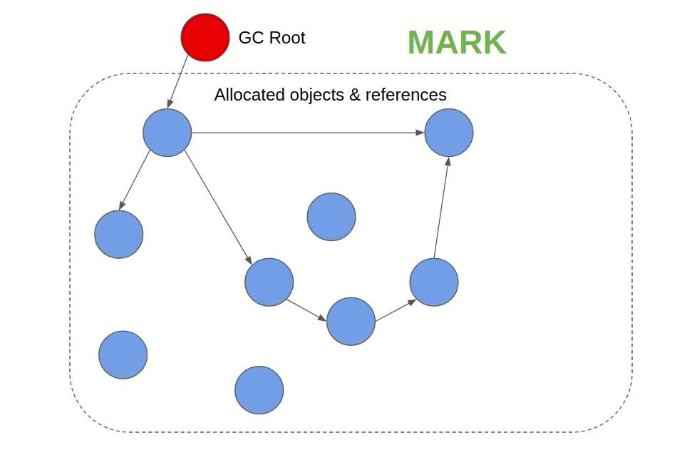
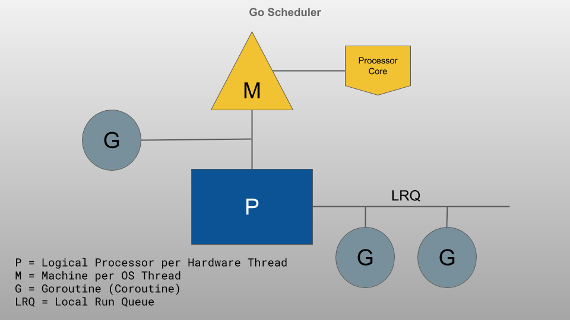
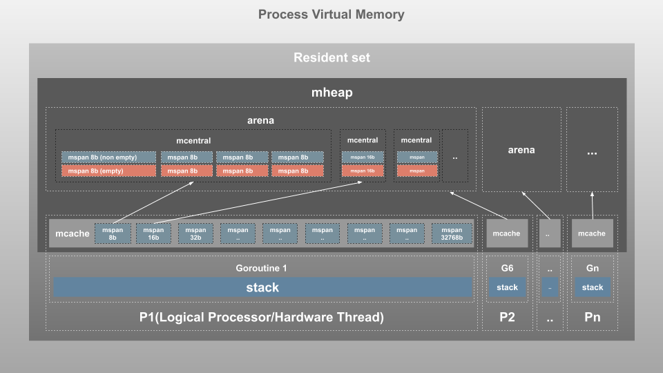
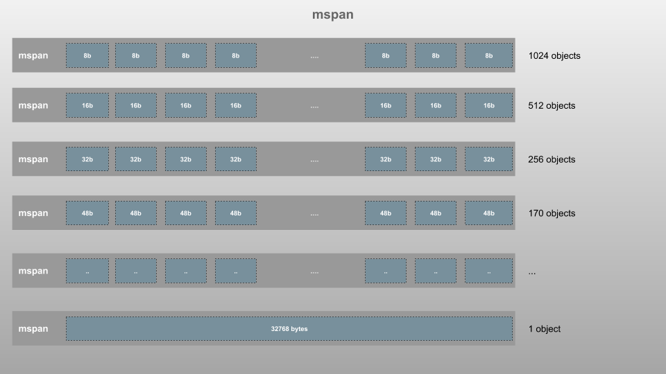
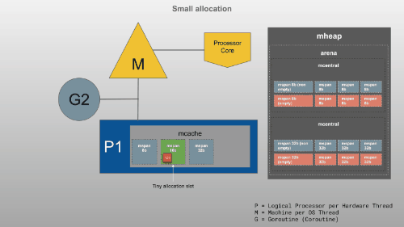
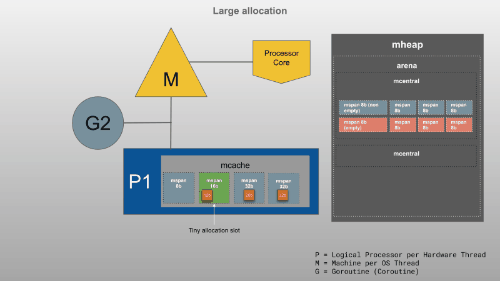

# Go系列：内存管理


## 系列目录

[《Go系列：内存管理》]()

[《Go系列：并发》]()

***

## 1.介绍

> 内存管理是控制和协调软件应用程序访问计算机内存的方式的过程。

这是软件工程中一个严肃的话题，它使一些人感到困惑，并且对某些人来说是一个黑盒。

## 2. 内存管理

当软件在计算机上的目标操作系统上运行时，它需要访问计算机RAM（随机存取存储器）以执行以下操作：

* 加载自己需要执行的**字节码**
* 存储执行的程序使用的**数据值**和**数据结构**
* 加载程序执行所需的所有**运行时系统**

当软件程序使用内存时，除了用于加载字节码的空间外，还有两个内存区域，即stack内存和heap内存。

### 2.1 Stack

Stack用于静态内存分配，顾名思义，它是一个后进先出（LIFO）堆栈（将其视为盒子堆栈）。

* 由于这种性质，由于不需要查找，因此从堆栈中存储和检索数据的过程非常快，您只需从其最上面的块中存储和检索数据即可。
* 但这意味着存储在堆栈中的任何数据都必须是有限且静态的（数据大小在编译时是已知的）。
* 这是函数的执行数据作为堆栈帧存储的位置（因此，这是实际的执行堆栈）。每个帧都是一个空间块，用于存储该功能所需的数据。例如，每当一个函数声明一个新变量时，它就被“压入”到栈顶块中。然后，每次退出函数时，都会清除最顶层的块，从而清除该函数压入堆栈的所有变量。由于此处存储的数据的静态性质，可以在编译时确定这些值。
* 多线程应用程序每个线程可以有一个堆栈。
* 堆栈的内存管理非常简单明了，并且由操作系统完成。
* 存储在堆栈中的典型数据是局部变量（值类型或原语，原语常量），指针和函数框。
* 这是您会遇到堆栈溢出错误的地方，因为与堆相比，堆栈的大小受到限制。
* 对于大多数语言，可以存储在堆栈中的值的大小是有限制的。

***

### 2.2 Heap

堆用于动态内存分配，与堆栈不同，程序需要使用指针在堆中查找数据（将其视为大型的多级库）。

* 它比堆栈慢，因为查找数据的过程涉及更多，但它可以存储比堆栈更多的数据。
* 这意味着可以在此处存储具有动态大小的数据。
* 堆在应用程序的线程之间共享。
* 由于其动态特性，堆管理起来比较棘手，这是大多数内存管理问题的起因，这也是该语言自动内存管理解决方案的起因。
* 存储在堆中的典型数据是全局变量，引用类型（如对象，字符串，映射和其他复杂数据结构）。
* 如果您的应用程序尝试使用比分配的堆更多的内存，这就是您遇到内存不足错误的地方（尽管这里还有许多其他因素在起作用，例如GC，压缩）。
* 通常，对堆中可以存储的值的大小没有限制。当然，为应用程序分配多少内存是有上限的。

***

### 2.3 为什么如此重要

与硬盘驱动器不同，RAM不是无限的。 如果程序继续消耗内存而不释放内存，最终它将耗尽内存并崩溃，甚至使操作系统崩溃。 因此，软件程序不仅会继续使用自己喜欢的RAM，还会导致其他程序和进程的内存不足。 因此，大多数编程语言都没有提供让软件开发人员解决此问题的方法，而是提供了执行自动内存管理的方法。 当我们谈论内存管理时，我们主要是在谈论管理堆内存。

***

### 2.4 垃圾回收

通过释放未使用的内存分配来自动管理堆内存。 GC是现代语言中最常见的内存管理之一，该过程通常以一定的间隔运行，因此可能会导致较小的开销，称为暂停时间。JVM（Java / Scala / Groovy / Kotlin），JavaScript，C＃，Golang，OCaml和Ruby是默认情况下使用垃圾回收进行内存管理的一些语言。



* **Mark & Sweep GC**: 也称为跟踪GC。它通常采用两阶段算法，首先将仍被引用为“活动”的对象标记为标记，然后在下一个阶段中释放未激活的对象的内存。
* **Reference counting GC**:在这种方法中，每个对象都获得一个引用计数，该引用计数随对它的引用的更改而增加或减少，并且当计数变为零时将进行垃圾回收。它不是首选，因为它不能处理循环引用。

## 3. Golang内存管理

Go是一种静态类型化和编译的语言，例如C / C ++和Rust。Go应用程序二进制文件中嵌入了一个小型运行时程序，可以处理诸如垃圾收集，调度和并发之类的语言功能。

### 3.1 Go内部存储器结构

> *Go Runtime schedules Goroutines (*`G`*) onto Logical Processors (*`P`*) for execution. Each* `P` *has a machine (*`M`*).*



每个Go程序进程都由操作系统（OS）分配了一些虚拟内存，这是该进程可以访问的总内存。虚拟内存中使用的实际内存称为常驻集。



 [**TCMalloc**](http://goog-perftools.sourceforge.net/doc/tcmalloc.html)(Thread-Caching Malloc)，Go自己的内存分配器就是以此为模型的。

#### 3.1.1 Page Heap(mheap)

Go在这里存储动态数据（在编译时无法计算大小的任何数据）。这是最大的内存块，这是进行垃圾回收（GC）的地方。

驻留集分为每个8KB的页面，并由一个全局mheap对象管理。

> *Large objects(Object of Size > 32kb) are allocated directly from* `mheap`*. These large requests come at an expense of central lock, so only one* `P`*’s request can be served at any given point of time.*

mheap管理分为以下不同结构的页面：

* **mspan**:mspan是管理mheap中的内存页面的最基本结构。这是一个双向链接列表，其中包含起始页的地址，跨度大小类和跨度中的页面数。像TCMalloc一样，Go还将内存页按大小分为67个不同类的块，大小从8个字节开始，最高到32 KB，如下图所示

  

  每个span存在两次，一个用于带指针的对象（扫描类），另一个用于不带指针的对象（noscan类）。这在GC期间很有帮助，因为无需遍历noscan跨度即可查找活动对象。

* **mcentral**：mcentral将相同大小类别的spans分组在一起。每个mcentral包含两个mspanList：

  * **empty**：非空闲对象或spans将以双链表的spans缓存在mcache中。当一个span释放后，它将移至非空列表。
  * **non-empty**：具有空闲对象的spans的双链接列表。当从mcentral请求一个新的span时，它将从非空列表中获取该span并将其移到空列表中。

  当mcentral没有任何可用跨度时，它会要求mheap重新运行页面。

* **arena**:堆内存在分配的虚拟内存中根据需要增长和缩小。需要更多内存时，mheap将从虚拟内存中拉出一块64MB（用于64位体系结构）的arena块。pages在此处映射到spans。

* **mcache**: 这是一个非常有趣的构造。mcache是提供给P（逻辑处理器）以存储小对象（对象大小<= 32Kb）的内存缓存。尽管它类似于线程堆栈，但它是堆的一部分，用于动态数据。 mcache包含适用于所有类大小的mspan的scan和noscan类型。Goroutine可以从mcache获取内存而没有任何锁，因为P一次只能有一个G。因此，这是更有效的。如果需要，mcache会从mcentral请求新的span。

***

#### 3.1.2 Stack

这是堆栈存储区，每个Goroutine（G）都有一个堆栈。在这里存储了静态数据，包括功能框架，静态结构，原始值和指向动态结构的指针。这与分配给P的mcache不同。

***

### 3.2 Go内存使用

现在我们已经清楚了内存的组织方式，让我们看看Go在执行程序时如何使用Stack和Heap。

让我们使用下面的Go程序，该代码并未针对正确性进行优化，因此可以忽略诸如不必要的中间变量之类的问题，因此，重点是可视化堆栈和堆内存的使用情况。

```Go
package main

import "fmt"

type Employee struct {
	name   string
	salary int
	sales  int
	bonus  int
}

const BONUS_PERCENTAGE = 10

func getBonusPercentage(salary int) int {
	percentage := (salary * BONUS_PERCENTAGE) / 100
	return percentage
}

func findEmployeeBonus(salary, noOfSales int) int {
	bonusPercentage := getBonusPercentage(salary)
	bonus := bonusPercentage * noOfSales
	return bonus
}

func main() {
	var john = Employee{"John", 5000, 5, 0}
	john.bonus = findEmployeeBonus(john.salary, john.sales)
	fmt.Println(j
```

与许多垃圾回收语言相比，Go的一个主要区别是许多对象直接在程序堆栈上分配。Go编译器使用一种称为[escape analysis](https://www.ardanlabs.com/blog/2017/05/language-mechanics-on-escape-analysis.html) 的过程来查找其生命周期在编译时已知的对象，并将它们分配在堆栈上，而不是在垃圾收集的堆内存中。在编译过程中，Go进行了逃逸分析，以确定哪些内容可以放入堆栈（静态数据），哪些内容需要放入堆（动态数据）。我们可以在编译期间通过运行带有-gcflags'-m'标志的go build来查看此详细信息。对于上面的代码，它将输出如下内容：

```shell
$ go build -gcflags '-m' gc.go
# command-line-arguments
temp/gc.go:14:6: can inline getBonusPercentage
temp/gc.go:19:6: can inline findEmployeeBonus
temp/gc.go:20:39: inlining call to getBonusPercentage
temp/gc.go:27:32: inlining call to findEmployeeBonus
temp/gc.go:27:32: inlining call to getBonusPercentage
temp/gc.go:28:13: inlining call to fmt.Println
temp/gc.go:28:18: john.bonus escapes to heap
temp/gc.go:28:13: io.Writer(os.Stdout) escapes to heap
temp/gc.go:28:13: main []interface {} literal does not escape
<autogenerated>:1: os.(*File).close .this does not escape
```

让我们将其形象化。单击幻灯片，然后使用箭头键向前/向后移动，以查看如何执行上述程序以及如何使用堆栈和堆存储器：


<iframe class="speakerdeck-iframe" frameborder="0" src="https://speakerdeck.com/player/c237c60018de490fa71e34cef7a50f0f?" allowfullscreen="true" mozallowfullscreen="true" webkitallowfullscreen="true" style="box-sizing: border-box; max-width: 100%; border: 0px; background: padding-box rgba(0, 0, 0, 0.1); margin: 0px; padding: 0px; border-radius: 6px; box-shadow: rgba(0, 0, 0, 0.2) 0px 5px 40px; width: 803px; height: 452px;"></iframe>


https://speakerdeck.com/deepu105/golang-memory-usage-stack-vs-heap

如你看到的：

* main函数保存在stack上的"main frame"中
* 每个函数调用都以frame-block的形式添加到堆栈存储器中
* 所有静态变量（包括参数和返回值）都保存在堆栈上的功能框内
* 无论类型如何，所有静态值都直接存储在堆栈中。这也适用于全局范围
* 所有在堆上创建并使用堆栈指针从堆栈中引用的动态类型。大小小于32Kb的对象将进入P的mcache。这也适用于全局范围
* 具有静态数据的结构将保留在堆栈上，直到在该位置将任何动态值添加到该结构为止
* 从当前函数调用的函数被推入栈顶
* 当函数返回时，其框架从堆栈中删除
* 旦主过程完成，堆上的对象将不再具有来自Stack的指针，并成为孤立对象

如您所见，堆栈是由操作系统自动管理的，而不是由Go本身自动管理的。因此，我们不必担心堆栈。另一方面，Heap并不是由操作系统自动管理的，并且由于其最大的内存空间并保存动态数据，因此它可能呈指数增长，从而导致我们的程序随着时间的推移而耗尽内存。随着时间的流逝，它也变得支离破碎，使应用程序变慢。这是垃圾收集进来的地方。

***

### 3.3 Go内存管理

Go的内存管理包括在需要内存时自动分配内存，在不再需要内存时进行垃圾回收。这是由标准库完成的。与C / C ++不同，开发人员不必处理它，并且Go进行的基础管理得到了很好的优化和高效。

#### 3.3.1 内存分配

许多采用垃圾收集的编程语言都使用代内存结构来使收集高效，同时进行压缩以减少碎片。正如我们前面所看到的，Go在这里采用了不同的方法，Go在构造内存方面有很大的不同。Go使用线程本地缓存来加快小型对象分配的速度，并保持扫描/非扫描范围以加快GC的速度。这种结构以及整个过程避免了碎片，从而在GC期间无需紧凑。让我们看看这种分配是如何进行的。

Go根据对象的大小决定对象的分配过程，并分为三类：

* **Tiny(size < 16B)**: 小于16个字节的对象是使用mcache的微型分配器分配的。这是高效的，并且在单个16字节块上完成了多个微小分配。

  

* **Small(size 16B ~ 32KB)**: 在运行G的P的mcache上，将大小在16字节到32 KB之间的对象分配给相应的大小类（mspan）。

  

  无论是小型分配还是小型分配，如果mspan的列表为空，则分配器将从mheap中获取大量页面供mspan使用。

* **Large(size > 32KB)**: 大小大于32 KB的对象直接分配到相应的mheap大小级别上。如果mheap为空或没有足够大的页面运行，则它将从OS中分配一组新的页面（至少1MB）。

  

***

#### 3.3.2 垃圾回收

现在我们知道Go如何分配内存，让我们看看它如何自动收集Heap内存，这对于应用程序的性能非常重要。当程序尝试在堆上分配的内存大于可用内存时，我们会遇到内存不足错误。管理不当的堆也可能导致内存泄漏。

Go通过垃圾回收管理堆内存。简单来说，它释放了孤立对象（即不再从堆栈中直接或间接（通过另一个对象中的引用）引用的对象）使用的内存，从而为创建新对象腾出了空间。

从版本1.12开始，Golang使用了非世代的并发三色标记和清除收集器。收集过程大致如下所示，由于版本之间的差异，我不想赘述。有时间，可以看下[这篇](https://www.ardanlabs.com/blog/2018/12/garbage-collection-in-go-part1-semantics.html)

当完成一定百分比（GC百分比）的堆分配并且收集器执行不同的工作阶段时，该过程开始：

* **Mark Setup** (Stop the world): 当GC启动时，收集器将打开写屏障，以便可以在下一个并发阶段保持数据完整性。此步骤需要非常小的暂停，因为每个正在运行的Goroutine都会暂停以启用此功能，然后继续。
* **Marking** (Concurrent): 一旦打开写屏障，就会使用25％的可用CPU容量与应用程序并行开始实际的标记过程。保留相应的P，直到标记完成。这是使用专用Goroutines完成的。在这里，GC标记了活动堆中的值（从任何活动Goroutine的堆栈中引用）。当采集花费更长的时间时，该过程可以从应用程序中使用活动的Goroutine来辅助标记过程。这称为标记辅助。
* **Mark Termination** (Stop the world):标记完成后，将暂停每个活动的Goroutine，并关闭写屏障并开始执行清理任务。GC还会在此处计算下一个GC目标。完成此操作后，保留的P会释放回应用程序。
* **Sweeping** (Concurrent):完成收集并尝试分配后，清除过程将开始从未标记为活动的堆中回收内存。扫描的内存量与分配的内存量同步。

让我们在一个Goroutine中看到它们的实际作用。为了简洁起见，将对象的数量保持较小。单击幻灯片，然后使用箭头键向前/向后移动以查看该过程：


<iframe class="speakerdeck-iframe" frameborder="0" src="https://speakerdeck.com/player/f162d0725e1940a69bdbb8c0cd9e302a?" allowfullscreen="true" mozallowfullscreen="true" webkitallowfullscreen="true" style="box-sizing: border-box; max-width: 100%; border: 0px; background: padding-box rgba(0, 0, 0, 0.1); margin: 0px; padding: 0px; border-radius: 6px; box-shadow: rgba(0, 0, 0, 0.2) 0px 5px 40px; width: 803px; height: 452px;"></iframe>


1. 我们正在查看一个Goroutine，实际过程是对所有活动Goroutine进行的。首先打开写屏障。
2. 标记过程选择GC根并将其着色为黑色，并以深度优先的树状方式遍历该指针，将遇到的每个对象标记为灰色
3. 当它到达无扫描范围内的对象时，或者当对象不再有指针时，它将完成根操作并拾取下一个GC根对象
4. 当它到达无扫描范围内的对象时，或者当对象不再有指针时，它将完成根操作并拾取下一个GC根对象
5. 扫描完所有GC根之后，它将拾取灰色对象，并以类似方式继续遍历其指针
6. 当不再有灰色物体留下时，标记过程完成，并且写入屏障被关闭
7. 分配开始时将进行扫描


他有一些制止世界的过程，但通常情况下它可以忽略不计，这是非常快的。对象的着色发生在跨度的gcmarkBits属性中

***

## 4. 结论

这里我们讲述了什么是内存管理，以及Go在内存管理上的操作。 

***

**参考**

https://deepu.tech/memory-management-in-programming/
