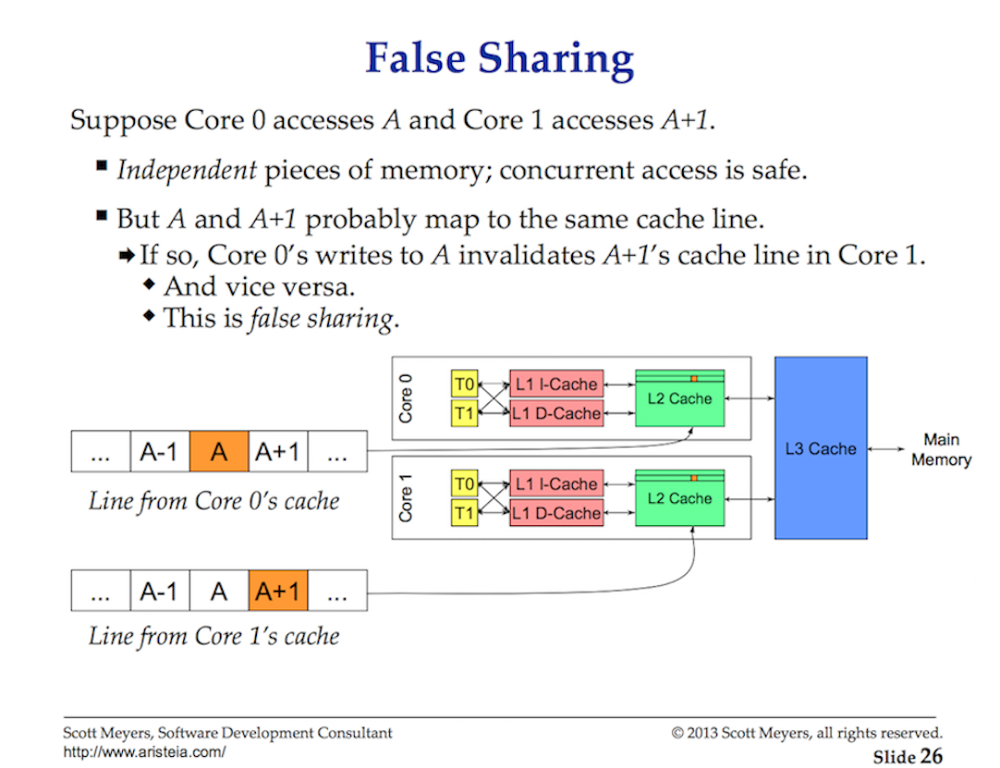
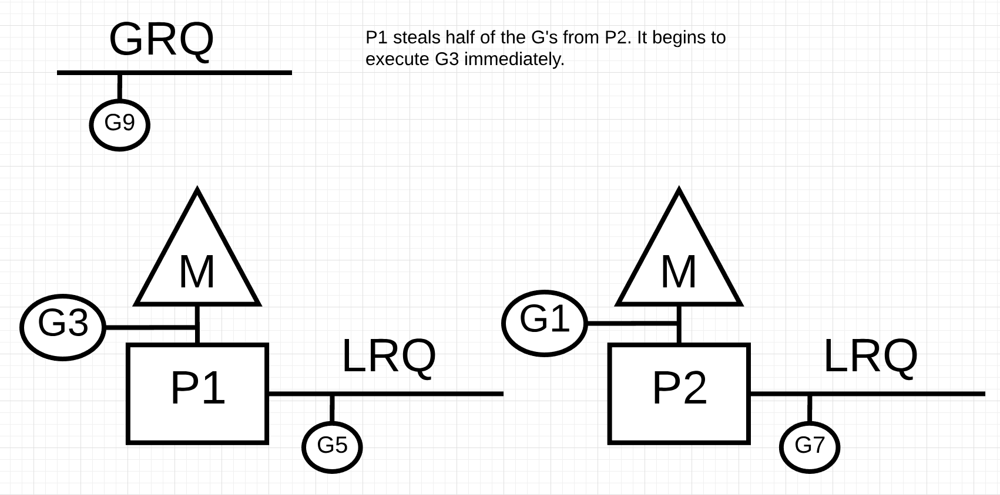
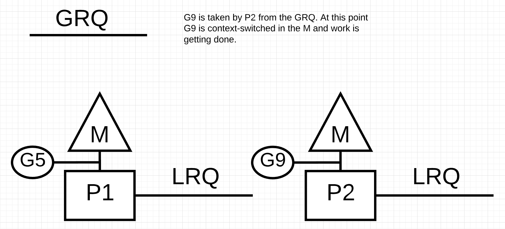

# Go系列：调度器


## 系列目录

[《Go系列：内存管理》]()

[《Go系列：调度器》]()

[《Go系列：并发》]()

***

## 1. 介绍

随着技术的不断发展，CPU也在不断发展，出现了多处理器、多核心、CPU缓存、NUMA架构等概念。为了最大化利用CPU的计算能力，软件也在不断发展，出现了并发和并行等概念。而为了支持并发和并行，就需要调度器，用于处理计算任务在不同CPU上的计算。我们主要从系统调度和语言层面的调度来说明。

***

## 2. OS Scheduler

我们的的程序只是一系列机器指令，需要依次执行。为此，操作系统使用了线程的概念，线程的工作就是负责说明并按顺序执行分配给它的指令集。执行将不断进行，直到没有更多指令可以执行。

在操作系统上，我们运行的每个程序都会创建一个进程，并且为每个进程分配一个初始线程。线程具有创建更多线程的能力。所有这些不同的线程彼此独立运行，并且调度决策是在线程级别而不是在进程级别做出的。线程可以同时运行(并发，每个任务运行在同一个的core上)，也可以并行运行(并行，每个任务运行在不同core上同时运行)。线程还维护自己的状态，以允许在本地安全和独立地执行指令。

如果存在可以执行的线程时，OS Scheduler负责确保core不处于空闲状态。它还必须产生一种幻想，即所有可以执行的线程正在同时执行。在创建这种幻想的过程中，Scheduler需要优先运行优先级较高的线程，而不是运行优先级较低的线程。但是，具有较低优先级的线程并无法节省执行时间。Scheduler还需要通过做出快速而明智的决策来最大程度地减少调度延迟。

***

### 2.1 执行指令

程序计数器(PC)有时也称为指令指针(IP)，它使线程可以跟踪要执行的下一条指令。在大多数处理器中，PC指向下一条指令，而不是当前指令。


***

### 2.2 Thread状态

* **Waiting**，这意味着线程已经停止执行并需要等待某些操作才能继续。这可能是由于诸如等待硬件(磁盘，网络)，操作系统(系统调用)或同步调用(原子，互斥体)之类的原因。这些类型的延迟是导致性能下降的根本原因。
* **Runnable** ，这意味着线程需要获得cpu时间，这样它可以执行其分配的机器指令。如果您有很多需要cpu时间的线程，则线程必须等待更长的时间才能获得cpu时间。而且，随着更多线程争夺cpu时间，任何给定线程获得的cpu时间都将缩短。这种类型的调度延迟也可能是性能下降的原因
* **Executing**，这意味着线程已放置在core上并正在执行其机器指令。与应用程序相关的工作已经完成。这是每个人都想要的状态。

***

### 2.3 工作类型

**CPU-Bound**，这项工作永远不会造成线程可能处于等待状态的情况。这是不断进行计算的工作。计算Pi到第N位的线程将是CPU-Bound的。

**IO-Bound**，这项工作导致线程进入等待状态。这项工作包括请求通过网络访问资源或对操作系统进行系统调用。需要访问数据库的线程将是IO-Bound。我将包括同步事件(互斥量，原子)等导致线程进入等待状态的事件都归为此类。

***

### 2.4 上下文切换

**抢占式调度**

首先，这意味着在任何给定时间选择要运行的线程时，调度程序都是不可预测的。线程优先级和事件(例如在网络上接收数据)一起使得无法确定调度程序将选择做什么以及何时执行。

其次，这意味着您绝不能基于自己幸运的经历但不能保证每次都发生的某些感知行为来编写代码。让自己思考很容易，因为我已经看到这种情况以1000次相同的方式发生，这是有保证的行为。如果需要在应用程序中确定性，则必须控制线程的同步和编排。

***

在内核上交换线程的物理行为称为上下文切换。当调度程序从core中拉出一个excuting线程并将其替换为可runnable线程时，就会发生上下文切换。从运行队列中选择的线程将进入excuting状态。被拉出的线程可以移回runnable状态(如果它仍具有运行能力)或waitting状态(如果由于IO-Bound类型的请求而被替换)。

上下文切换被认为是昂贵的，因为在core上和在core外交换线程都需要时间。上下文切换期间的延迟等待时间量取决于不同的因素，但花费约1000到1500纳秒的时间并非没有道理。虑到硬件应该能够合理地(平均)在每核每纳秒执行12条指令，上下文切换可能会花费大约12000至18k的延迟指令。本质上，您的程序在上下文切换期间将失去执行大量指令的能力。

如果您有一个专注于IO-Bound工作的程序，那么上下文切换将是一个优势。一旦一个线程进入等待状态，另一个处于可运行状态的线程就会代替它。这使核心始终可以工作。这是调度的最重要方面之一。如果有工作要做(线程处于可运行状态)，请不要让core闲置。

如果您的程序专注于CPU-Bound工作，那么上下文切换将成为性能噩梦。由于Thead总是有工作要做，因此上下文切换将阻止该工作的进行。这种情况与IO-Bound工作负载形成鲜明对比。

***

### 2.5 少即是多

制定调度决策时，scheduler还需要考虑和处理更多的事情。您可以控制在应用程序中使用的线程数。当要考虑的线程更多，并且发生IO-Bound工作时，就会出现更多的混乱和不确定性行为。任务需要更长的时间来计划和执行。

这就是为什么游戏规则是“少即是多”的原因。处于runnable状态的线程越少，意味着获得调度的时间越少，并且每个线程随着时间的流逝会花费更多的时间。更多线程处于runnable状态意味着每个线程随着时间流逝的时间更少。这意味着随着时间的流逝，您完成的工作也更少了。

***

### 2.6 寻找平衡

您需要在拥有的core数量与为应用程序获得最佳吞吐量所需的线程数量之间找到平衡。在管理这种平衡时，线程池是一个很好的答案。

如果您的服务正在执行许多不同类型的工作该怎么办？这可能会产生不同且不一致的延迟。也许它还会创建许多需要处理的不同的系统级事件。不可能找到一个在所有不同工作负荷下始终有效的魔术数字。当涉及到使用线程池来调整服务的性能时，找到正确的一致配置会变得非常复杂。

***

### 2.7 CPU缓存

从主存储器访问数据具有很高的延迟成本（〜100至〜300个时钟周期），以致处理器和内核具有本地缓存，以使数据保持在需要它的硬件线程附近。从缓存访问数据的成本要低得多（约3至40个时钟周期），具体取决于要访问的缓存。今天，性能的一个方面是关于如何有效地将数据输入处理器以减少这些数据访问延迟。编写改变状态的多线程应用程序需要考虑缓存系统的机制。


使用cache line在处理器和主存储器之间交换数据。缓存行是在主内存和缓存系统之间交换的64字节内存块。每个内核都会获得所需的任何高速缓存行的副本，这意味着硬件使用值语义。这就是为什么多线程应用程序中的内存突变会造成性能方面的噩梦。

当多个并行运行的线程正在访问同一数据值或什至彼此接近的数据值时，它们将在同一高速缓存行上访问数据。在任何内核上运行的任何线程都将获得该同一缓存行的副本。

***



如果给定核心上的一个线程更改了其缓存行的副本，则必须借助硬件的魔力，将同一缓存行的所有其他副本标记为脏。当线程尝试对脏的缓存行进行读写访问时，需要主存储器访问（〜100至〜300个时钟周期）才能获取缓存行的新副本.

也许在2核处理器上这没什么大不了，但是如果32核处理器并行运行32个线程，所有访问和变异数据都在同一缓存行上，那又如何呢？带有两个分别具有16个内核的物理处理器的系统又如何呢？由于处理器间通信增加了延迟，因此情况将变得更糟。该应用程序将遍历内存，性能将非常糟糕，并且很可能您将不明白为什么。

这称为高速缓存一致性问题，还引入了错误共享之类的问题。当编写将改变共享状态的多线程应用程序时，必须考虑缓存系统.

***

### 2.8 调度决策方案

想象一下，我要您根据我给您的高级信息编写操作系统调度程序。考虑一下您必须考虑的一种情况。请记住，这是调度程序在做出调度决策时必须考虑的许多有趣的事情之一。

您启动您的应用程序，并创建了主线程并在核心1上执行该线程。随着该线程开始执行其指令，由于需要数据，因此正在检索缓存行。线程现在决定为某些并发处理创建一个新线程。这是问题。

创建线程并准备就绪后，调度程序应：

1. 上下文切换核心1的主线程？这样做可以提高性能，因为此新线程需要与已缓存的数据相同的机会非常好。但是主线程无法获得其全部时间片。
2. 线程是否等待核心1可用，等待主线程的时间片完成？线程未运行，但是一旦开始，将消除获取数据的延迟。
3. 线程是否正在等待下一个可用core？这意味着将清除，检索和复制所选核心的缓存行，从而导致延迟。但是，线程将启动得更快，并且主线程可以完成其时间片。


玩得开心吗？在做出调度决策时，OS调度程序需要考虑这些有趣的问题。幸运的是，对于每个人来说，我都不是一个。我只能告诉您的是，如果有一个空闲的内核，它将被使用。您希望线程可以在运行时运行。

***

## 3. Go Scheduler

### 3.1 进程、线程和协程

* **进程**，
* **线程**，
* **协程**，

***

### 3.2 程序开始

Go程序为主机上标识的每个虚拟core分配了逻辑处理器(P)。如果您的处理器每个物理核心具有多个硬件线程(超线程)，则每个硬件线程将作为虚拟core呈现给您的Go程序。

每个P都分配有一个OS线程(M)。"M"代表machine。该线程仍由操作系统管理，并且操作系统仍负责将线程放置在内核上执行。

每个Go程序还会获得一个初始Goroutine(G)，这是Go程序的“线程”。Goroutine本质上是一个协程，但是它是Go，因此我们将字母"C"替换为"G"，然后得到单词Goroutine。您可以将Goroutines视为应用程序级线程，并且它们在许多方面类似于OS线程。就像OS线程在上下文中打开和关闭core一样，Goroutine在上下文中打开和关闭M。

最后一个难题是运行队列。Go调度程序中有两个不同的运行队列：全局运行队列(GRQ)和本地运行队列(LRQ)。每个P都有一个LRQ，该LRQ管理分配给在P上下文中执行的Goroutine。这些Goroutine轮流在上下文中切换分配给该P的M。GRQ用于尚未分配给P的Goroutine。有一个将Goroutines从GRQ转移到LRQ的过程，我们将在后面讨论。


***

### 3.3 协作式调度

Go Scheduler是Go运行时的一部分，并且Go运行时已内置到您的应用程序中。这意味着Go Scheduler在内核上方的用户空间中运行。 Go Scheduler的当前实现不是抢占式调度器，而是协作式调度器。成为协作调度器味着调度器需要在代码的安全点发生的定义明确的用户空间事件，以制定调度决策。

Go协作调度器的出色之处在于它看起来和感觉都是抢先的。您无法预测Go Scheduler将要执行的操作。这是因为该协作调度器的决策权不掌握在开发人员手中，而在于Go运行时。Go Scheduler视为抢占式调度器很重要，并且由于该调度器是不确定的，因此这并不是一件容易的事。

***

### 3.4 Goroutine状态

**Waiting**: 这意味着Goroutine已停止并等待某些东西才能继续。这可能是由于诸如等待操作系统(系统调用)或同步调用(原子和互斥操作)之类的原因。这些类型的延迟是导致性能下降的根本原因。

**Runnable**: 这意味着Goroutine需要获得在M上的执行时间，因此它可以执行其分配的指令。如果您有很多需要M时间的Goroutine，那么Goroutine必须等待更长的时间才能获得时间。而且，随着更多Goroutine争夺时间，任何给定Goroutine所获得的时间都将缩短。这种类型的调度延迟也可能是性能下降的原因。

**Executing**: 这意味着Goroutine已放置在M上并正在执行其指令。与应用程序相关的工作已经完成。这就是每个人都想要的。

***

### 3.5 上下文切换

Go Scheduler需要定义明确的用户空间事件，这些事件发生在代码中的安全点处，以便从上下文进行切换。函数调用对于Go调度程序的运行状况至关重要。今天(使用Go 1.11或更低版本)，如果运行任何未进行函数调用的紧密循环，则将导致调度程序和垃圾回收中的延迟。在合理的时间内进行函数调用至关重要。

Go程序中发生了四类事件，这些事件使计划程序可以做出计划决策。这并不意味着它将永远在这些事件之一中发生。这意味着调度器会获得机会。

* **使用关键字go**，关键字go是创建Goroutine的方式。一旦创建了新的Goroutine，它将为调度器提供做出调度决策的机会。
* **垃圾回收**，由于GC使用自己的Goroutine集合运行，因此这些Goroutine需要M上的时间才能运行。这导致GC造成很多调度混乱。但是，调度器对于Goroutine所做的事情非常聪明，它将利用该情报做出明智的决策。这个明智的决定是在GC中将要触摸堆的Goroutine与不触摸堆的Goroutine进行上下文切换。当GC运行时，将制定许多计划决策。
* **系统调用**，如果Goroutine进行了导致Goroutine阻塞M的系统调用，则有时调度器能够将Goroutine上下文切换到M之外，并在上下文中将新Goroutine切换到该M上。但是，有时需要一个新的M来继续执行在P中排队的Goroutine。在下一节中将更详细地说明其工作原理。
* **同步与编排**，如果原子，互斥或channel操作调用将导致Goroutine阻塞，则调度器可以进行上下文切换运行新的Goroutine。一旦Goroutine可以再次运行，就可以对其重新排队，并最终在M上进行上下文切换。

***

### 3.6 异步系统调用

当您正在运行的OS能够异步处理系统调用时，可以使用称为网络轮询器的东西来更有效地处理系统调用。这是通过在各个操作系统中使用kqueue(MacOS)，epoll(Linux)或iocp(Windows)来完成的。

我们今天使用的许多操作系统都可以异步处理基于网络的系统调用。这是网络轮询器的名称，这是因为它的主要用途是处理网络操作。通过使用网络轮询器进行网络系统调用，调度器可以防止Goroutine在进行这些系统调用时阻止M。这有助于使M保持可用以执行P的LRQ中的其他Goroutine，而无需创建新的M。这有助于减少OS上的调度负载。

例子：


基本调度图，Goroutine-1正在M上执行，并且还有3个Goroutine在LRQ中等待以获取其在M上的时间。网络轮询器闲置无事可做


Goroutine-1希望进行网络系统调用，因此Goroutine-1被移至网络轮询器并处理了异步网络系统调用。将Goroutine-1移至网络轮询器后，M现在可用于执行与LRQ不同的Goroutine。在这种情况下，Goroutine-2在M上进行了上下文切换。


网络轮询器完成了异步网络系统调用，并将Goroutine-1移回了P的LRQ中。一旦Goroutine-1可以在M上上下文切换回去，它负责的Go相关代码就可以再次执行。这里最大的好处是，执行网络系统调用不需要额外的M。

***

### 3.7 同步系统调用

当Goroutine想要进行无法异步完成的系统调用时，会发生什么情况？在这种情况下，无法使用网络轮询器，并且进行系统调用的Goroutine将阻止M。不幸的是，但是无法阻止这种情况的发生。无法异步进行的系统调用的一个示例是基于文件的系统调用。如果使用的是CGO，则在其他情况下，调用C函数也会阻塞M。让我们逐一介绍同步系统调用（例如文件I / O）会导致M阻塞的情况。


再次显示了我们的基本调度图，但是这次Goroutine-1将进行一次同步系统调用，该调用将阻塞M1。


调度器可以识别Goroutine-1导致M阻塞。此时，调度器将M1与P分离，而阻塞Goroutine-1仍处于连接状态。然后，调度器会引入一个新的M2来为P服务。这时，可以从LRQ中选择Goroutine-2，并在M2上进行上下文切换。如果由于先前的交换已存在M，则此过渡比必须创建新的M更快。


Goroutine-1进行的阻止系统调用完成。此时，Goroutine-1可以移回LRQ并再次由P服务。如果这种情况需要再次发生，则将M1放在一边以备将来使用。

***

### 3.8 工作窃取

计划程序的另一个方面是，它是一种可以窃取工作的计划程序。这有助于在某些方面保持调度效率。首先，您想要的最后一件事是M进入等待状态，因为一旦发生这种情况，操作系统将上下文M切换到core。这意味着，即使有一个Goroutine处于可运行状态，P也无法完成任何工作，直到M在上下文中切换回Core为止。窃取工作还有助于在所有P上平衡Goroutine，从而更好地分配工作并更高效地完成工作。

例子：


我们有一个多线程Go程序，其中两个P分别为四个Goroutine和GRQ中的一个Goroutine提供服务。如果P的服务之一迅速地执行其所有Goroutine，会怎样？


P1没有更多的Goroutines可以执行。但是在P2的LRQ和GRQ中都有可运行状态的Goroutine。这是P1需要窃取工作的时刻。窃取工作的规则如下。

```
runtime.schedule() {
    // only 1/61 of the time, check the global runnable queue for a G.
    // if not found, check the local queue.
    // if not found,
    //     try to steal from other Ps.
    //     if not, check the global runnable queue.
    //     if not found, poll network.
}
```

因此，根据清单2中的这些规则，P1需要在其LRQ中检查P2中的Goroutines，并取其发现结果的一半。



Goroutine的一半来自P2，现在P1可以执行这些Goroutine。

如果P2完成其所有Goroutine的服务并且P1的LRQ中没有剩余，该怎么办？


P2完成了所有工作，现在需要偷一些东西。首先，它将查看P1的LRQ，但找不到任何Goroutine。接下来，将查看GRQ。在那里它将找到Goroutine-9。



P2从GRQ窃取Goroutine-9，并开始执行工作。所有这些偷窃工作的最大好处是，它可以让M保持忙碌而不会闲着。内部，这种窃取工作被认为是在旋转M。这种旋转还有其他好处，JBD在她的[工作窃取](https://rakyll.org/scheduler/)博客文章中很好地解释了这一点。

***

## 4. 结论

这里讲了OS Scheduler和Go Scheduler的相关的实现原理。

***

**参考**

[OS Scheduler](https://www.ardanlabs.com/blog/2018/08/scheduling-in-go-part1.html)

[Go Scheduler](https://www.ardanlabs.com/blog/2018/08/scheduling-in-go-part2.html)
