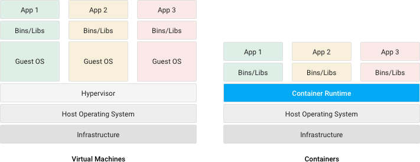

# Kubernetes系列：容器


## 系列目录

[《Kubernetes系列：开篇》](../k8s_series)

[《Kubernetes系列：概述》](../k8s_series_intro)

[《Kubernetes系列：架构》](../k8s_series_arch)

[《Kubernetes系列：容器》](../k8s_series_container)

[《Kubernetes系列：网络》](../k8s_series_network)

[《Kubernetes系列：存储》](../k8s_series_storage)

[《Kubernetes系列：Service》](../k8s_series_service)

[《Kubernetes系列：Ingress》](../k8s_series_ingress)

[《Kubernetes系列：OAM》](../k8s_series_oma)

***

## 1. 介绍

### 1.1 容器技术

> LXC（Linux容器）是一种操作系统级虚拟化技术，用于使用单个Linux内核在控制主机上运行多个隔离的Linux系统（容器）。

每个运行的容器都是可重复的； 包含依赖环境在内的标准，意味着无论您在哪里运行它，您都会得到相同的行为。容器将应用程序从底层的主机设施中解耦。 这使得在不同的云或 OS 环境中部署更加容易。

### 1.2 容器镜像

> [容器镜像](https://kubernetes.io/zh/docs/concepts/containers/images/)是一个随时可以运行的软件包， 包含运行应用程序所需的一切：代码和它需要的所有运行时、应用程序和系统库，以及一些基本设置的默认值。

根据设计，容器是不可变的：你不能更改已经运行的容器的代码。 如果有一个容器化的应用程序需要修改，则需要构建包含更改的新镜像，然后再基于新构建的镜像重新运行容器。

### 1.3 容器运行时

> 容器运行环境是负责运行容器的软件。

Kubernetes 支持多个容器运行环境: [Docker](https://kubernetes.io/zh/docs/reference/kubectl/docker-cli-to-kubectl/)、 [containerd](https://containerd.io/docs/)、[CRI-O](https://cri-o.io/#what-is-cri-o) 以及任何实现 [Kubernetes CRI (容器运行环境接口)](https://github.com/kubernetes/community/blob/master/contributors/devel/sig-node/container-runtime-interface.md)。

### 1.4 CRI(容器运行时接口)

> CRI，一个插件接口，使kubelet可以使用各种容器运行时，而无需重新编译。
>
> CRI由规范/要求(待添加)、protobuf API和用于容器运行时的库组成，以与节点上的kubelet集成。

***

## 2. 为什么使用容器？

容器提供了一种逻辑打包机制，以这种机制打包的应用可以脱离其实际运行的环境。利用这种脱离，不管目标环境是私有数据中心、公有云，还是开发者的个人笔记本电脑，您都可以轻松、一致地部署基于容器的应用。容器化使开发者和 IT 运营团队的关注点泾渭分明 - 开发者专注于应用逻辑和依赖项，而 IT 运营团队可以专注于部署和管理，不必为具体的软件版本和应用特有的配置等应用细节分心。

我们通过与虚拟机的对比来看下容器的优势



与虚拟机的硬件栈虚拟化不同，容器在操作系统级别进行虚拟化，且可以直接在操作系统内核上运行多个容器。也就是说，容器更轻巧：它们共享操作系统内核，启动速度更快，且与启动整个操作系统相比其占用的内存微乎其微。

**一致的环境**

容器让开发者可以创建与其他应用相隔离的可预测环境。容器还可以包含应用所需的软件依赖项，比如具体的编程语言运行时版本和其他软件库。从开发者的角度看，无论应用最终部署在什么地方，都可以保证这些条件一致。这一切将转化为生产力的提升：开发者和 IT 运营团队可以减少调试和诊断环境差异所需的时间，将更多的时间用于为用户提供新的功能。而且这也意味着 bug 更少，因为开发者现可在开发和测试环境中做出在生产环境中也适用的假设。

**在任何地方运行**

容器几乎能在任何地方运行，极大减轻了开发和部署工作量：在 Linux、Windows 和 Mac 操作系统中；在虚拟机或裸机上；在开发者的机器或本地数据中心的机器上；当然还有在公有云上。而 [Docker 容器映像格式](https://cloud.google.com/container-registry/docs/ui?hl=zh-cn)广受欢迎，则进一步增强了可移植性。无论您希望在什么地方运行软件，都可以使用容器。

**隔离**

容器会在操作系统级别虚拟化 CPU、内存、存储和网络资源，为开发者提供在逻辑上与其他应用相隔离的沙盒化操作系统接口。

|                  | 容器的优势 | 虚拟机的优势 |
| :--------------- | :--------- | :----------- |
| 一致的运行时环境 | *true*     | *true*       |
| 应用沙盒化       | *true*     | *true*       |
| 占用的存储空间少 | *true*     |              |
| 开销低           | *true*     |              |

***

## 3. 实现机制

### 3.1 资源隔离(namespace)

> Namespace是对全局系统资源的一种封装隔离，使得处于不同namespace的进程拥有独立的全局系统资源，改变一个namespace中的系统资源只会影响当前namespace里的进程，对其他namespace中的进程没有影响。

目前，Linux内核里面实现了7种不同类型的namespace。

```markdown
名称        宏定义             隔离内容
Cgroup      CLONE_NEWCGROUP   Cgroup root directory (since Linux 4.6)
IPC         CLONE_NEWIPC      System V IPC, POSIX message queues (since Linux 2.6.19)
Network     CLONE_NEWNET      Network devices, stacks, ports, etc. (since Linux 2.6.24)
Mount       CLONE_NEWNS       Mount points (since Linux 2.4.19)
PID         CLONE_NEWPID      Process IDs (since Linux 2.6.24)
User        CLONE_NEWUSER     User and group IDs (started in Linux 2.6.23 and completed in Linux 3.8)
UTS         CLONE_NEWUTS      Hostname and NIS domain name (since Linux 2.6.19)
```

#### 3.1.1 查看namespace

系统中的每个进程都有/proc/[pid]/ns/这样一个目录，里面包含了这个进程所属namespace的信息，里面每个文件的描述符都可以用来作为setns函数(后面会介绍)的参数。

```shell
#查看当前bash进程所属的namespace
dev@ubuntu:~$ ls -l /proc/$$/ns     
total 0
lrwxrwxrwx 1 dev dev 0 7月 7 17:24 cgroup -> cgroup:[4026531835] #(since Linux 4.6)
lrwxrwxrwx 1 dev dev 0 7月 7 17:24 ipc -> ipc:[4026531839]       #(since Linux 3.0)
lrwxrwxrwx 1 dev dev 0 7月 7 17:24 mnt -> mnt:[4026531840]       #(since Linux 3.8)
lrwxrwxrwx 1 dev dev 0 7月 7 17:24 net -> net:[4026531957]       #(since Linux 3.0)
lrwxrwxrwx 1 dev dev 0 7月 7 17:24 pid -> pid:[4026531836]       #(since Linux 3.8)
lrwxrwxrwx 1 dev dev 0 7月 7 17:24 user -> user:[4026531837]     #(since Linux 3.8)
lrwxrwxrwx 1 dev dev 0 7月 7 17:24 uts -> uts:[4026531838]       #(since Linux 3.0)
```

- 上面每种类型的namespace都是在不同的Linux版本被加入到/proc/[pid]/ns/目录里去的，比如pid namespace是在Linux 3.8才被加入到/proc/[pid]/ns/里面，但这并不是说到3.8才支持pid namespace，其实pid namespace在2.6.24的时候就已经加入到内核了，在那个时候就可以用pid namespace了，只是有了/proc/[pid]/ns/pid之后，使得操作pid namespace更方便了
- 虽然说cgroup是在Linux 4.6版本才被加入内核，可是在Ubuntu 16.04上，尽管内核版本才4.4，但也支持cgroup namespace，估计应该是Ubuntu将4.6的cgroup namespace这部分代码patch到了他们的4.4内核上。
- 以ipc:[4026531839]为例，ipc是namespace的类型，4026531839是inode number，如果两个进程的ipc namespace的inode number一样，说明他们属于同一个namespace。这条规则对其他类型的namespace也同样适用。
- 从上面的输出可以看出，对于每种类型的namespace，进程都会与一个namespace ID关联。

#### 3.1.2 namespace API

和namespace相关的函数只有三个

**[clone](http://man7.org/linux/man-pages/man2/clone.2.html)： 创建一个新的进程并把他放到新的namespace中**

```c
int clone(int (*child_func)(void *), void *child_stack
            , int flags, void *arg);

/***
flags： 
    指定一个或者多个上面的CLONE_NEW*（当然也可以包含跟namespace无关的flags）， 
    这样就会创建一个或多个新的不同类型的namespace， 
    并把新创建的子进程加入新创建的这些namespace中。
***/
```

**[setns](http://man7.org/linux/man-pages/man2/setns.2.html)： 将当前进程加入到已有的namespace中**

```c
int setns(int fd, int nstype);

/***
fd： 
    指向/proc/[pid]/ns/目录里相应namespace对应的文件，
    表示要加入哪个namespace

nstype：
    指定namespace的类型（上面的任意一个CLONE_NEW*）：
    1. 如果当前进程不能根据fd得到它的类型，如fd由其他进程创建，
    并通过UNIX domain socket传给当前进程，
    那么就需要通过nstype来指定fd指向的namespace的类型
    2. 如果进程能根据fd得到namespace类型，比如这个fd是由当前进程打开的，
    那么nstype设置为0即可
***/
```

**[unshare](http://man7.org/linux/man-pages/man2/unshare.2.html): 使当前进程退出指定类型的namespace，并加入到新创建的namespace（相当于创建并加入新的namespace）**

```c
int unshare(int flags);

/***
flags：
    指定一个或者多个上面的CLONE_NEW*，
    这样当前进程就退出了当前指定类型的namespace并加入到新创建的namespace
***/
```

**clone和unshare的区别**

clone和unshare的功能都是创建并加入新的namespace， 他们的区别是：

- unshare是使当前进程加入新的namespace
- clone是创建一个新的子进程，然后让子进程加入新的namespace，而当前进程保持不变

#### 3.1.3 其它

当一个namespace中的所有进程都退出时，该namespace将会被销毁。当然还有其他方法让namespace一直存在，假设我们有一个进程号为1000的进程，以ipc namespace为例：

1. 通过mount --bind命令。例如mount --bind /proc/1000/ns/ipc /other/file，就算属于这个ipc namespace的所有进程都退出了，只要/other/file还在，这个ipc namespace就一直存在，其他进程就可以利用/other/file，通过setns函数加入到这个namespace
2. 在其他namespace的进程中打开/proc/1000/ns/ipc文件，并一直持有这个文件描述符不关闭，以后就可以用setns函数加入这个namespace。

***

### 3.2 资源限制(cgroup)

> cgroup和namespace类似，也是将进程进行分组，但它的目的和namespace不一样，namespace是为了隔离进程组之间的资源，而cgroup是为了对一组进程进行统一的资源监控和限制。

术语cgroup在不同的上下文中代表不同的意思，可以指整个Linux的cgroup技术，也可以指一个具体进程组。

cgroup是Linux下的一种将进程按组进行管理的机制，在用户层看来，cgroup技术就是把系统中的所有进程组织成一颗一颗独立的树，每棵树都包含系统的所有进程，树的每个节点是一个进程组，而每颗树又和一个或者多个subsystem关联，树的作用是将进程分组，而subsystem的作用就是对这些组进行操作。cgroup主要包括下面两部分：

- **subsystem** 一个subsystem就是一个内核模块，他被关联到一颗cgroup树之后，就会在树的每个节点（进程组）上做具体的操作。subsystem经常被称作"resource controller"，因为它主要被用来调度或者限制每个进程组的资源，但是这个说法不完全准确，因为有时我们将进程分组只是为了做一些监控，观察一下他们的状态，比如perf_event subsystem。到目前为止，Linux支持12种subsystem，比如限制CPU的使用时间，限制使用的内存，统计CPU的使用情况，冻结和恢复一组进程等，后续会对它们一一进行介绍。
- **hierarchy** 一个hierarchy可以理解为一棵cgroup树，树的每个节点就是一个进程组，每棵树都会与零到多个subsystem关联。在一颗树里面，会包含Linux系统中的所有进程，但每个进程只能属于一个节点（进程组）。系统中可以有很多颗cgroup树，每棵树都和不同的subsystem关联，一个进程可以属于多颗树，即一个进程可以属于多个进程组，只是这些进程组和不同的subsystem关联。目前Linux支持12种subsystem，如果不考虑不与任何subsystem关联的情况（systemd就属于这种情况），Linux里面最多可以建12颗cgroup树，每棵树关联一个subsystem，当然也可以只建一棵树，然后让这棵树关联所有的subsystem。当一颗cgroup树不和任何subsystem关联的时候，意味着这棵树只是将进程进行分组，至于要在分组的基础上做些什么，将由应用程序自己决定，systemd就是一个这样的例子。

#### 3.2.1 查看cgroup

可以通过查看/proc/cgroups(since Linux 2.6.24)知道当前系统支持哪些subsystem，下面是一个例子

```shell
#subsys_name    hierarchy       num_cgroups     enabled
cpuset          11              1               1
cpu             3               64              1
cpuacct         3               64              1
blkio           8               64              1
memory          9               104             1
devices         5               64              1
freezer         10              4               1
net_cls         6               1               1
perf_event      7               1               1
net_prio        6               1               1
hugetlb         4               1               1
pids            2               68              1
```

从左到右，字段的含义分别是：

1. subsystem的名字
2. subsystem所关联到的cgroup树的ID，如果多个subsystem关联到同一颗cgroup树，那么他们的这个字段将一样，比如这里的cpu和cpuacct就一样，表示他们绑定到了同一颗树。如果出现下面的情况，这个字段将为0：
   - 当前subsystem没有和任何cgroup树绑定
   - 当前subsystem已经和cgroup v2的树绑定
   - 当前subsystem没有被内核开启
3. subsystem所关联的cgroup树中进程组的个数，也即树上节点的个数
4. 1表示开启，0表示没有被开启(可以通过设置内核的启动参数“cgroup_disable”来控制subsystem的开启).

#### 3.2.2 使用cgroup

cgroup相关的所有操作都是基于内核中的cgroup virtual filesystem，使用cgroup很简单，挂载这个文件系统就可以了。一般情况下都是挂载到/sys/fs/cgroup目录下，当然挂载到其它任何目录都没关系。

这里假设目录/sys/fs/cgroup已经存在，下面用到的xxx为任意字符串，取一个有意义的名字就可以了，当用mount命令查看的时候，xxx会显示在第一列

- 挂载一颗和所有subsystem关联的cgroup树到/sys/fs/cgroup

  ```shell
  mount -t cgroup xxx /sys/fs/cgroup
  ```

- 挂载一颗和cpuset subsystem关联的cgroup树到/sys/fs/cgroup/cpuset

  ```shell
  mkdir /sys/fs/cgroup/cpuset
  mount -t cgroup -o cpuset xxx /sys/fs/cgroup/cpuset
  ```

- 挂载一颗与cpu和cpuacct subsystem关联的cgroup树到/sys/fs/cgroup/cpu,cpuacct

  ```shell
  mkdir /sys/fs/cgroup/cpu,cpuacct
  mount -t cgroup -o cpu,cpuacct xxx /sys/fs/cgroup/cpu,cpuacct
  ```

- 挂载一棵cgroup树，但不关联任何subsystem，下面就是systemd所用到的方式

  ```bash
  mkdir /sys/fs/cgroup/systemd
  mount -t cgroup -o none,name=systemd xxx /sys/fs/cgroup/systemd
  ```

#### 3.2.3 查看进程归属cgroup

可以通过查看/proc/[pid]/cgroup(since Linux 2.6.24)知道指定进程属于哪些cgroup。

```shell
dev@ubuntu:~$ cat /proc/777/cgroup
11:cpuset:/
10:freezer:/
9:memory:/system.slice/cron.service
8:blkio:/system.slice/cron.service
7:perf_event:/
6:net_cls,net_prio:/
5:devices:/system.slice/cron.service
4:hugetlb:/
3:cpu,cpuacct:/system.slice/cron.service
2:pids:/system.slice/cron.service
1:name=systemd:/system.slice/cron.service
```

每一行包含用冒号隔开的三列，他们的意思分别是

1. cgroup树的ID， 和/proc/cgroups文件中的ID一一对应。
2. 和cgroup树绑定的所有subsystem，多个subsystem之间用逗号隔开。这里name=systemd表示没有和任何subsystem绑定，只是给他起了个名字叫systemd。
3. 进程在cgroup树中的路径，即进程所属的cgroup，这个路径是相对于挂载点的相对路径。

#### 3.2.4 所有subsystems

目前Linux支持下面12种subsystem

- [cpu](https://www.kernel.org/doc/Documentation/scheduler/sched-bwc.txt) (since Linux 2.6.24; CONFIG_CGROUP_SCHED)
  用来限制cgroup的CPU使用率。
- [cpuacct](https://www.kernel.org/doc/Documentation/cgroup-v1/cpuacct.txt) (since Linux 2.6.24; CONFIG_CGROUP_CPUACCT)
  统计cgroup的CPU的使用率。
- [cpuset](https://www.kernel.org/doc/Documentation/cgroup-v1/cpusets.txt) (since Linux 2.6.24; CONFIG_CPUSETS)
  绑定cgroup到指定CPUs和NUMA节点。
- [memory](https://www.kernel.org/doc/Documentation/cgroup-v1/memory.txt) (since Linux 2.6.25; CONFIG_MEMCG)
  统计和限制cgroup的内存的使用率，包括process memory, kernel memory, 和swap。
- [devices](https://www.kernel.org/doc/Documentation/cgroup-v1/devices.txt) (since Linux 2.6.26; CONFIG_CGROUP_DEVICE)
  限制cgroup创建(mknod)和访问设备的权限。
- [freezer](https://www.kernel.org/doc/Documentation/cgroup-v1/freezer-subsystem.txt) (since Linux 2.6.28; CONFIG_CGROUP_FREEZER)
  suspend和restore一个cgroup中的所有进程。
- [net_cls](https://www.kernel.org/doc/Documentation/cgroup-v1/net_cls.txt) (since Linux 2.6.29; CONFIG_CGROUP_NET_CLASSID)
  将一个cgroup中进程创建的所有网络包加上一个classid标记，用于[tc](http://man7.org/linux/man-pages/man8/tc.8.html)和iptables。 只对发出去的网络包生效，对收到的网络包不起作用。
- [blkio](https://www.kernel.org/doc/Documentation/cgroup-v1/blkio-controller.txt) (since Linux 2.6.33; CONFIG_BLK_CGROUP)
  限制cgroup访问块设备的IO速度。
- [perf_event](https://www.kernel.org/doc/Documentation/perf-record.txt) (since Linux 2.6.39; CONFIG_CGROUP_PERF)
  对cgroup进行性能监控
- [net_prio](https://www.kernel.org/doc/Documentation/cgroup-v1/net_prio.txt) (since Linux 3.3; CONFIG_CGROUP_NET_PRIO)
  针对每个网络接口设置cgroup的访问优先级。
- [hugetlb](https://www.kernel.org/doc/Documentation/cgroup-v1/hugetlb.txt) (since Linux 3.5; CONFIG_CGROUP_HUGETLB)
  限制cgroup的huge pages的使用量。
- [pids](https://www.kernel.org/doc/Documentation/cgroup-v1/pids.txt) (since Linux 4.3; CONFIG_CGROUP_PIDS)
  限制一个cgroup及其子孙cgroup中的总进程数。

上面这些subsystem，有些需要做资源统计，有些需要做资源控制，有些即不统计也不控制。对于cgroup树来说，有些subsystem严重依赖继承关系，有些subsystem完全用不到继承关系，而有些对继承关系没有严格要求。

***

### 3.3 镜像技术

#### 3.3.1 (re)mount

我们知道，namespace可以对系统资源进行隔离，而mount namespace是隔离各个挂载点的，因此在容器内部对文件系统进行mount和umount对其他进程并不影响。但是，新创建的容器是会直接继承宿主机的各个挂载点，因此我们会看到之前宿主机的各个挂载目录。但是对于用户来讲，当我们启动一个新的容器的时候，应该是一个干净的文件系统，不应该把宿主机的文件系统挂载进来，因此，我们在操作mount时应该做一个重新挂载整个根目录的操作。

#### 3.3.2 rootfs

在linux中，可以由**chroot**或者**pivot_root**来实现根目录的"挂载"。

**chroot**顾名思义，它的作用就是帮你“change root file system”，即改变进程的根目录到你指定的位置。不过chroot是只改变即将运行的某进程的根目录。

**pivot_root**主要是把整个系统切换到一个新的root目录，然后去掉对之前rootfs的依赖，以便于可以**umount**    之前的文件系统（pivot_root需要root权限）

为了能够让容器的这个根目录看起来更“真实”，我们一般会在这个容器的根目录下挂载一个完整操作系统的文件系统，比如 Ubuntu16.04 的 ISO。这样，在容器启动之后，我们在容器里通过执行 "ls /" 查看根目录下的内容，就是 Ubuntu 16.04 的所有目录和文件。

**而这个挂载在容器根目录上、用来为容器进程提供隔离后执行环境的文件系统，就是所谓的“容器镜像”。它还有一个更为专业的名字，叫作：rootfs（根文件系统）。**

### 3.3.3 Union File System

> 所谓UnionFS就是把不同物理位置的目录合并mount到同一个目录中。

在变更rootfs内容时，我们不可能每次都重新重头到位制作一个完整的rootfs，这样太麻烦。那我们可不可以只对rootfs做增量操作呢？

而这正是UnionFS的功能。docker正是对这个技术引用才脱颖而出的。

> Docker 在镜像的设计中，引入了层（layer）的概念。也就是说，用户制作镜像的每一步操作，都会生成一个层，也就是一个增量 rootfs。


每个image layer和container layer在Docker主机上均表示为/var/lib/docker/中的子目录

***

## 4. CRI(容器运行时接口)

### 4.1 初衷

每个容器运行时都有自己的优势，许多用户要求Kubernetes支持更多运行时。但是，Kubelet使用声明性的Pod级接口，该接口充当容器运行时的唯一集成点，高级别的声明性接口导致更高的集成和维护成本，并且由于一些原因，还降低了功能速度。因此，CRI就是提供一个通用的接口以实现以下目标：

* 提高可扩展性：简化容器运行时集成。
* 提高特征速度。
* 提高代码可维护性

### 4.2 CRI概述

Kubelet使用gRPC框架通过Unix socket与容器运行时(或运行时的CRI shim)进行通信，其中kubelet充当客户端，而CRI shim充当服务器。


protocol buffer API包括两个gRPC服务，即ImageService和RuntimeService。

ImageService提供RPC，用于从repository中提取、检查并删除镜像。

RuntimeService包含RPC，用于管理容器和容器的生命周期以及与容器进行交互的调用(exec/attach/port-forward)。

同时管理镜像和容器(例如Docker和rkt)的整体容器运行时可以通过单个套接字同时提供这两种服务。

### 4.3 pod和容器生命周期管理

```go
service RuntimeService {

    // Sandbox operations.

    rpc RunPodSandbox(RunPodSandboxRequest) returns (RunPodSandboxResponse) {}  
    rpc StopPodSandbox(StopPodSandboxRequest) returns (StopPodSandboxResponse) {}  
    rpc RemovePodSandbox(RemovePodSandboxRequest) returns (RemovePodSandboxResponse) {}  
    rpc PodSandboxStatus(PodSandboxStatusRequest) returns (PodSandboxStatusResponse) {}  
    rpc ListPodSandbox(ListPodSandboxRequest) returns (ListPodSandboxResponse) {}  

    // Container operations.  
    rpc CreateContainer(CreateContainerRequest) returns (CreateContainerResponse) {}  
    rpc StartContainer(StartContainerRequest) returns (StartContainerResponse) {}  
    rpc StopContainer(StopContainerRequest) returns (StopContainerResponse) {}  
    rpc RemoveContainer(RemoveContainerRequest) returns (RemoveContainerResponse) {}  
    rpc ListContainers(ListContainersRequest) returns (ListContainersResponse) {}  
    rpc ContainerStatus(ContainerStatusRequest) returns (ContainerStatusResponse) {}

    ...  
}
```

Pod由具有资源约束的隔离环境中的一组应用程序容器组成。在CRI中，此环境称为PodSandbox。PodSandbox必须遵守Pod资源规范。在v1alpha1 API中，这是通过启动kubelet创建并传递到运行时的pod级cgroup中的所有进程来实现的。

在启动Pod之前，kubelet会调用RuntimeService。RunPodSandbox创建环境。这包括为Pod设置网络连接(例如分配IP)。一旦PodSandbox处于活动状态，就可以独立创建/启动/停止/删除单个容器。要删除pod，kubelet将在停止和删除PodSandbox之前停止并删除容器。

Kubelet负责通过RPC管理容器的生命周期，行使容器生命周期的hook和liveness/readiness检查，同时遵守pod的重新启动策略。

***

## 5. 结论

该篇我们介绍了容器技术的基本实现机制，包含namespace和cgroup进行资源的隔离和限制，通过chroot和unionFS技术实现镜像的功能。之后还介绍了CRI的初衷和实现。

***

**参考**

[https://github.com/kubernetes/kubernetes/blob/release-1.5/docs/proposals/container-runtime-interface-v1.md](https://github.com/kubernetes/kubernetes/blob/release-1.5/docs/proposals/container-runtime-interface-v1.md)

[https://kubernetes.io/blog/2016/12/container-runtime-interface-cri-in-kubernetes/](https://kubernetes.io/blog/2016/12/container-runtime-interface-cri-in-kubernetes/)

[https://github.com/kubernetes/community/blob/master/contributors/devel/sig-node/container-runtime-interface.md](https://github.com/kubernetes/community/blob/master/contributors/devel/sig-node/container-runtime-interface.md)

[https://docs.docker.com/storage/storagedriver/aufs-driver/](https://docs.docker.com/storage/storagedriver/aufs-driver/)

[https://segmentfault.com/a/1190000009732550](https://segmentfault.com/a/1190000009732550)

[https://coolshell.cn/articles/17061.html](https://coolshell.cn/articles/17061.html)


