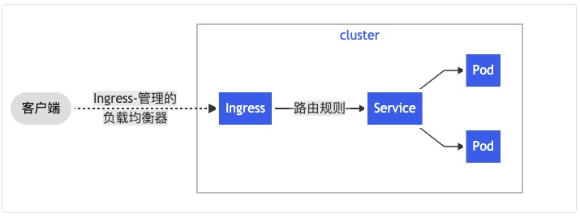

# Kubernetes系列：Ingress


## 系列目录

[《Kubernetes系列：开篇》](../k8s_series)

[《Kubernetes系列：概述》](../k8s_series_intro)

[《Kubernetes系列：架构》](../k8s_series_arch)

[《Kubernetes系列：容器》](../k8s_series_container)

[《Kubernetes系列：网络》](../k8s_series_network)

[《Kubernetes系列：存储》](../k8s_series_storage)

[《Kubernetes系列：Service》](../k8s_series_service)

[《Kubernetes系列：Ingress》](../k8s_series_ingress)

[《Kubernetes系列：OAM》](../k8s_series_oma)

***

## 1. 介绍

### 1.1 Ingress

> [Ingress](https://kubernetes.io/docs/reference/generated/kubernetes-api/v1.20/#ingress-v1beta1-networking-k8s-io) 公开了从集群外部到集群内[service](https://kubernetes.io/zh/docs/concepts/services-networking/service/)的 HTTP 和 HTTPS 路由。 流量路由由 Ingress 资源上定义的规则控制。



可以将 Ingress 配置为服务提供外部可访问的 URL、负载均衡流量、终止 SSL/TLS，以及提供基于名称的虚拟主机等能力。 [Ingress Controller](https://kubernetes.io/zh/docs/concepts/services-networking/ingress-controllers) 通常负责通过负载均衡器来实现 Ingress，尽管它也可以配置边缘路由器或其他前端来帮助处理流量。

***

### 1.2 Ingress Controller

为了让 Ingress 资源工作，集群必须有一个正在运行的 Ingress Controller。

与作为 `kube-controller-manager` 可执行文件的一部分运行的其他类型的控制器不同，Ingress 控制器不是随集群自动启动的。

***

## 2. Ingress Contoller 选择

下表是一些常用的Contoller对比：

| control plane | data plane | backend service discovery | protocols                                                | ssl termination | websocket | routing                    | scope           | resiliency                                                   | lb algorithms                   | auth                                                         | Tracing | canary/shadow | istio integration | state      | Paid support | Linkaaaaaaaaaaaaaa                                         | dashboard                                                    | sticky sessions | lua  |
| ------------- | ---------- | ------------------------- | -------------------------------------------------------- | --------------- | --------- | -------------------------- | --------------- | ------------------------------------------------------------ | ------------------------------- | ------------------------------------------------------------ | ------- | ------------- | ----------------- | ---------- | ------------ | ---------------------------------------------------------- | ------------------------------------------------------------ | --------------- | ---- |
| ingress-nginx | nginx      | dynamic                   | http,https,tcp (separate lb),udp,grpc,fastcgi,IPC socket | yes             | yes       | host,path(with regex)      | cross-namespace | rate limit, retries                                          | rr,ewma,ip_hash                 | basic, digest, external auth                                 | yes     | canary        |                   | kubernetes |              | https://kubernetes.github.io/ingress-nginx/                | Metrics can be seen in Grafana                               | Yes             | Yes  |
| kong          | nginx      | dynamic                   | http,https, grpc                                         | yes             | yes       | host, header, path, method | cross-namespace | active and passive health check, circuit break, rate limit, retries | rr, hash, header, cookie        | Basic Auth, HMAC, JWT, Key, LDAP, OAuth 2.0, PASETO, plus paid Kong Enterprise options like OpenID Connect | yes     | canary        |                   | kubernetes |              | https://github.com/Kong/kubernetes-ingress-controller      | Admin Dashboard + Grafana+Prometheus<br/>statsd<br/>Datadog<br/>SignalFx | Yes             | Yes  |
| traefik       | traefik    | dynamic                   | http,https,grpc,tcp + tls (alpha)                        | yes             | yes       | host,path                  | cross-namespace | circuit break, retries                                       | rr, wrr                         | basic, digest and forward auth in alpha                      | yes     | canary        | yes               | kubernetes |              | https://docs.traefik.io/configuration/backends/kubernetes/ | Included                                                     | Yes             | no   |
| istio ingress | envoy      | dynamic                   | tcp,http,https,grpc                                      | yes             | yes       | host,user                  | cross-namespace | circuit break, retries                                       | rr,leastconn,random,passthrough | JWT                                                          | yes     |               | yes               | kubernetes |              | https://istio.io/docs/tasks/traffic-management/ingress/    | Metrics can be seen in Grafana and Prometheus, tracing can be seen through jaeger or zipkin UI | Yes             | Yes  |

***

### 2.1 ingress-nginx

- [*github.com/kubernetes/ingress-nginx*](https://github.com/kubernetes/ingress-nginx)
- *Implemented in: Go/Lua (while nginx is written in C)*
- *License: Apache 2.0*

官方的ingress controller，它是由社区开发的。基于nginx Web服务器，并补充了一组用于实现额外功能的Lua插件。

#### 2.1.1 配置

一个最小的 Ingress 资源示例：

```yaml
apiVersion: networking.k8s.io/v1
kind: Ingress
metadata:
  name: minimal-ingress
  annotations:
    nginx.ingress.kubernetes.io/rewrite-target: /
spec:
  rules:
  - http:
      paths:
      - path: /testpath
        pathType: Prefix
        backend:
          service:
            name: test
            port:
              number: 80
```

与所有其他 Kubernetes 资源一样，Ingress 需要使用 `apiVersion`、`kind` 和 `metadata` 字段。 Ingress 对象的命名必须是合法的 [DNS 子域名名称](https://kubernetes.io/zh/docs/concepts/overview/working-with-objects/names#dns-subdomain-names)。 有关使用配置文件的一般信息，请参见[部署应用](https://kubernetes.io/zh/docs/tasks/run-application/run-stateless-application-deployment/)、 [配置容器](https://kubernetes.io/zh/docs/tasks/configure-pod-container/configure-pod-configmap/)、 [管理资源](https://kubernetes.io/zh/docs/concepts/cluster-administration/manage-deployment/)。 Ingress 经常使用注解（annotations）来配置一些选项，具体取决于 Ingress 控制器，例如 [重写目标注解](https://github.com/kubernetes/ingress-nginx/blob/master/docs/examples/rewrite/README.md)。 不同的 [Ingress 控制器](https://kubernetes.io/zh/docs/concepts/services-networking/ingress-controllers) 支持不同的注解。查看文档以供你选择 Ingress 控制器，以了解支持哪些注解。

Ingress [规约](https://git.k8s.io/community/contributors/devel/sig-architecture/api-conventions.md#spec-and-status) 提供了配置负载均衡器或者代理服务器所需的所有信息。 最重要的是，其中包含与所有传入请求匹配的规则列表。 Ingress 资源仅支持用于转发 HTTP 流量的规则。

#### 2.1.2 Ingress 规则

每个 HTTP 规则都包含以下信息：

- 可选的 `host`。在此示例中，未指定 `host`，因此该规则适用于通过指定 IP 地址的所有入站 HTTP 通信。 如果提供了 `host`（例如 foo.bar.com），则 `rules` 适用于该 `host`。
- 路径列表 paths（例如，`/testpath`）,每个路径都有一个由 `serviceName` 和 `servicePort` 定义的关联后端。 在负载均衡器将流量定向到引用的服务之前，主机和路径都必须匹配传入请求的内容。
- `backend`（后端）是 [Service 文档](https://kubernetes.io/zh/docs/concepts/services-networking/service/)中所述的服务和端口名称的组合。 与规则的 `host` 和 `path` 匹配的对 Ingress 的 HTTP（和 HTTPS ）请求将发送到列出的 `backend`。

通常在 Ingress 控制器中会配置 `defaultBackend`（默认后端），以服务于任何不符合规约中 `path` 的请求。

#### 2.1.3 DefaultBackend

没有 `rules` 的 Ingress 将所有流量发送到同一个默认后端。 `defaultBackend` 通常是 [Ingress 控制器](https://kubernetes.io/zh/docs/concepts/services-networking/ingress-controllers) 的配置选项，而非在 Ingress 资源中指定。

如果 `hosts` 或 `paths` 都没有与 Ingress 对象中的 HTTP 请求匹配，则流量将路由到默认后端。

#### 2.1.4 资源后端

`Resource` 后端是一个 `ObjectRef`，指向同一名字空间中的另一个 Kubernetes，将其作为 Ingress 对象。`Resource` 与 `Service` 配置是互斥的，在 二者均被设置时会无法通过合法性检查。 `Resource` 后端的一种常见用法是将所有入站数据导向带有静态资产的对象存储后端。

[`service/networking/ingress-resource-backend.yaml`](https://raw.githubusercontent.com/kubernetes/website/master/content/zh/examples/service/networking/ingress-resource-backend.yaml) 

```yaml
apiVersion: networking.k8s.io/v1
kind: Ingress
metadata:
  name: ingress-resource-backend
spec:
  defaultBackend:
    resource:
      apiGroup: k8s.example.com
      kind: StorageBucket
      name: static-assets
  rules:
    - http:
        paths:
          - path: /icons
            pathType: ImplementationSpecific
            backend:
              resource:
                apiGroup: k8s.example.com
                kind: StorageBucket
                name: icon-assets
```

创建了如上的 Ingress 之后，你可以使用下面的命令查看它：

```bash
kubectl describe ingress ingress-resource-backend
Name:             ingress-resource-backend
Namespace:        default
Address:
Default backend:  APIGroup: k8s.example.com, Kind: StorageBucket, Name: static-assets
Rules:
  Host        Path  Backends
  ----        ----  --------
  *
              /icons   APIGroup: k8s.example.com, Kind: StorageBucket, Name: icon-assets
Annotations:  <none>
Events:       <none>
```

#### 2.1.5 路径类型

Ingress 中的每个路径都需要有对应的路径类型（Path Type）。未明确设置 `pathType` 的路径无法通过合法性检查。当前支持的路径类型有三种：

- `ImplementationSpecific`：对于这种路径类型，匹配方法取决于 IngressClass。 具体实现可以将其作为单独的 `pathType` 处理或者与 `Prefix` 或 `Exact` 类型作相同处理。
- `Exact`：精确匹配 URL 路径，且区分大小写。
- `Prefix`：基于以 `/` 分隔的 URL 路径前缀匹配。匹配区分大小写，并且对路径中的元素逐个完成。 路径元素指的是由 `/` 分隔符分隔的路径中的标签列表。 如果每个 *p* 都是请求路径 *p* 的元素前缀，则请求与路径 *p* 匹配。

***

### 2.2 Kong Ingress

- [*github.com/Kong/kubernetes-ingress-controller*](https://github.com/Kong/kubernetes-ingress-controller)
- *Implemented in: Go*
- *License: Apache 2.0*

Kong Ingress建立在NGINX之上，并增加了扩展其功能的Lua模块。

它的主要优点是易于安装和配置的大量其他模块/插件（包括来自第三方开发人员的模块/插件）。

它为多种附加功能开辟了道路。附带地，内置功能已经提供了许多可能性。使用CRD执行配置。

Kong的一个重要功能是它只能在一个环境中运行（而不是支持跨命名空间），这是一个颇具争议的主题：有人认为它是一个缺点（您必须为每个环境生成实例），而其他人则认为这是一个特殊功能（较高的隔离级别，因此一个控制器的故障影响仅限于其环境）。

### 2.3 Istio Ingress

- [*istio.io/docs/tasks/traffic-management/ingress*](https://istio.io/docs/tasks/traffic-management/ingress/)
- *Implemented in: Go*
- *License: Apache 2.0*

Istio是IBM，Google和Lyft（Envoy的原始作者）的一个联合项目，它是一个全面的服务网格解决方案。它不仅可以管理所有传入的外部流量（作为Ingress控制器），还可以控制集群内部的所有流量。在幕后，Istio将Envoy用作每种服务的辅助代理。从本质上讲，它是一个可以执行几乎所有操作的大型处理器。其中心思想是最大程度的控制，可扩展性，安全性和透明性。

借助Istio Ingress，您可以微调流量路由，服务之间的访问授权，平衡，监控，金丝雀发布等。

*Here is a great intro to learn about Istio: “*[*Back to microservices with Istio*](https://medium.com/google-cloud/back-to-microservices-with-istio-p1-827c872daa53)*”.*

***

### 2.4 Traefik

- [*github.com/containous/traefik*](https://github.com/containous/traefik)
- *Implemented in: Go*
- *License: MIT*

最初，此代理是为微服务及其动态环境的请求路由而创建的，因此，它具有许多有用的功能：连续更新配置（不重新启动），支持多种负载平衡算法，Web UI，指标导出，支持各种协议，REST API，canary版本等。他对开箱即用的“加密”证书的支持是另一个不错的功能。主要缺点是，为了组织控制器的高可用性，您必须安装并连接其自己的KV存储器。

***

## 3. 结论

本文讲述了ingress是啥，以及一些基础的配置。

***

**参考**

[https://medium.com/flant-com/comparing-ingress-controllers-for-kubernetes-9b397483b46b](https://medium.com/flant-com/comparing-ingress-controllers-for-kubernetes-9b397483b46b)

[https://kubernetes.io/docs/concepts/services-networking/ingress/](https://kubernetes.io/docs/concepts/services-networking/ingress/)

[https://docs.konghq.com/kubernetes-ingress-controller/1.1.x/introduction/](https://docs.konghq.com/kubernetes-ingress-controller/1.1.x/introduction/)

[https://doc.traefik.io/traefik/middlewares/overview/](https://doc.traefik.io/traefik/middlewares/overview/)
