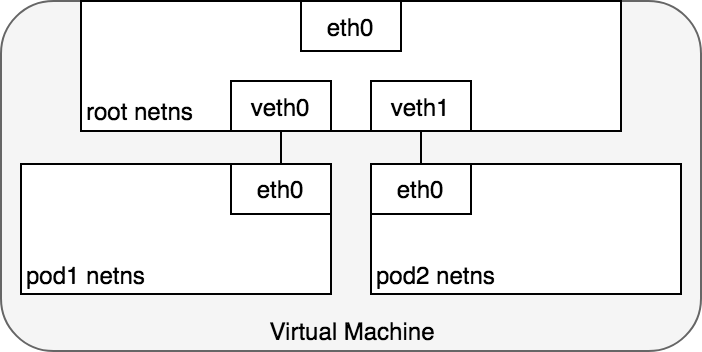
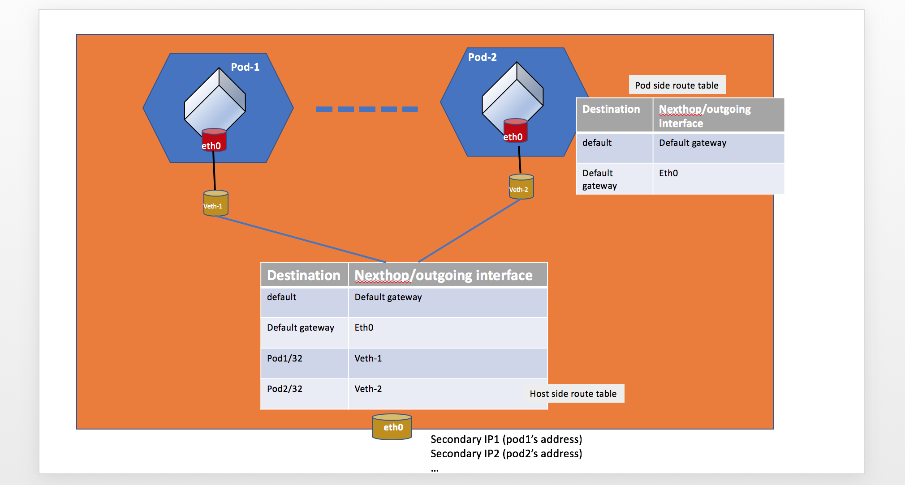

# Kubernetes系列：CNI


## 系列目录

[《Kubernetes系列：开篇》](../k8s_series)

[《Kubernetes系列：概述》](../k8s_series_intro)

[《Kubernetes系列：架构》](../k8s_series_arch)

[《Kubernetes系列：容器》](../k8s_series_container)

[《Kubernetes系列：网络》](../k8s_series_network)

[《Kubernetes系列：存储》](../k8s_series_storage)

[《Kubernetes系列：Service》](../k8s_series_service)

[《Kubernetes系列：Ingress》](../k8s_series_ingress)

[《Kubernetes系列：OAM》](../k8s_series_oma)

***

## 1. 介绍

网络是 Kubernetes 的核心部分，不过，Kubernetes本身并不提供网络功能，只是把网络接口开放出来，通过插件的形式实现。这就是CNI(Container Network Interface)。

> CNI（Container Network Interface）是 CNCF 旗下的一个项目，由一组用于配置 Linux 容器的网络接口的规范和库组成，同时还包含了一些插件。CNI 仅关心容器创建时的网络分配，和当容器被删除时释放网络资源。通过此链接浏览该项目：https://github.com/containernetworking/cni。

Kubernetes 对所有网络设施的实施，都需要满足以下的基本要求：

- 节点上的 Pod 可以不通过 NAT 和其他任何节点上的 Pod 通信
- 节点上的代理(比如：系统守护进程、kubelet)可以和节点上的所有Pod通信
- Pod自己的IP就是其他人看到的IP

因此，一个kubernetes网络插件必须要解决下面五个问题：

1. Container-to-Container 网络通信
2. Pod-to-Pod 网络通信
3. Pod-to-Service 网络通信
4.  Internet-to-Service 网络通信
5. Pod IP在集群内唯一

***

## 2. 基本原理

### 2.1 Container-to-Container

在kubernetes中，一个Pod是一组Container的组合，并且，Pod内的Container是共享network namespace的，因此该Pod内的Container的ip和mac地址都是相同的，所以它们只需要通过localhost就能跟Pod内其他Container通信了，不过，因为是共享network namespace，因此该Pod内的端口必须是唯一的，不能冲突。


***

### 2.2 Pod-to-Pod

在容器中，容器可以通过network namespace的技术将不同的容器的网络隔离起来，并通过veth pair技术将两个namespace连接起来以进行通信。如下图所示，每个pod都有自己的netns，通过veth pair跟节点的root netns连接起来，这样一来，pod就能直接跟node进行通信了



但是呢，我们又希望pod1跟pod2进行通信，因此，又需要添加额外的技术允许数据包通过root netns传入不同的pod的netns中，比如bridge技术，当然，也有些可以用路由表来实现。


#### 2.2.1 同Node

通过network namespace、veth pair和bridge技术，我们就能实现同node内的pod之间的通信了，下图是一个数据包在不同pod之间的流程图：


* pod1将数据包通过自己的eth0设备发送到root namespace的veth0上
* veth0将数据包转发给cbr0 网桥设备
* 网桥设备解析正确的网段，使用ARP协议将数据包发送到veth1
* veth1将数据包转发给pod2的namespace中的eth0设备上，返回也是一样的操作

#### 2.2.2 跨Node

通常，集群中的每个Node都分配有一个CIDR块，该CIRD块指定了该节点上运行的Pod可用的IP地址。一旦发往CIDR块的流量到达Node，则Node有责任将流量转发到正确的Pod上。在跨Node的Pod上，这里就需要CNI插件具有知道每个Pod的ip在哪个node上的功能，并且有能力将数据包路由到正确的Node上。


* Pod1将数据包发往eth0，通过veth0到达了root namespace
* Node(VM1)通过路由表信息将数据包发往网络中
* CNI插件知道目标ip在哪个Node上，将数据包发送给对应的Node(VM2)
* VM2接收到数据包后，发现目标ip在pod4上，通过veth1将数据包发送到pod4的eth0上

在后续的不同CNI插件中，我们会了解一下各个插件针对跨Node的网络通信的实现机制。

***

### 2.3 Pod-to-Service 和 Internet-to-Service 

这个网络通信将在Service章节中细说。

***

## 3. CNI

### 3.1 接口定义

CNI 的接口中包括以下几个方法：

```go
type CNI interface {AddNetworkList (net *NetworkConfigList, rt *RuntimeConf) (types.Result, error)
    DelNetworkList (net *NetworkConfigList, rt *RuntimeConf) error

    AddNetwork (net *NetworkConfig, rt *RuntimeConf) (types.Result, error)
    DelNetwork (net *NetworkConfig, rt *RuntimeConf) error
}
```

该接口只有四个方法，添加网络、删除网络、添加网络列表、删除网络列表。

### 3.2 设计考量

CNI 设计的时候考虑了以下问题：

- 容器运行时必须在调用任何插件之前为容器创建一个新的网络命名空间。
- 然后，运行时必须确定这个容器应属于哪个网络，并为每个网络确定哪些插件必须被执行。
- 网络配置采用 JSON 格式，可以很容易地存储在文件中。网络配置包括必填字段，如 `name` 和 `type` 以及插件（类型）。网络配置允许字段在调用之间改变值。为此，有一个可选的字段 `args`，必须包含不同的信息。
- 容器运行时必须按顺序为每个网络执行相应的插件，将容器添加到每个网络中。
- 在完成容器生命周期后，运行时必须以相反的顺序执行插件（相对于执行添加容器的顺序）以将容器与网络断开连接。
- 容器运行时不能为同一容器调用并行操作，但可以为不同的容器调用并行操作。
- 容器运行时必须为容器订阅 ADD 和 DEL 操作，这样 ADD 后面总是跟着相应的 DEL。 DEL 可能跟着额外的 DEL，但是，插件应该允许处理多个 DEL（即插件 DEL 应该是幂等的）。
- 容器必须由 ContainerID 唯一标识。存储状态的插件应该使用（网络名称，容器 ID）的主键来完成。
- 运行时不能调用同一个网络名称或容器 ID 执行两次 ADD（没有相应的 DEL）。换句话说，给定的容器 ID 必须只能添加到特定的网络一次。

### 3.3 CNI 插件

CNI 插件必须实现一个可执行文件，这个文件可以被容器管理系统（例如 rkt 或 Kubernetes）调用。

CNI 插件负责将网络接口插入容器网络命名空间（例如，veth 对的一端），并在主机上进行任何必要的改变（例如将 veth 的另一端连接到网桥）。然后将 IP 分配给接口，并通过调用适当的 IPAM 插件来设置与 “IP 地址管理” 部分一致的路由。

#### 3.3.1 参数

CNI 插件必须支持以下操作：

**将容器添加到网络**

参数：

- **版本**调用者正在使用的 CNI 规范（容器管理系统或调用插件）的版本。
- **容器 ID**由运行时分配的容器的唯一明文标识符。一定不能是空的。
- **网络命名空间路径**要添加的网络名称空间的路径，即 `/proc/[pid]/ns/net` 或绑定挂载 / 链接。
- **网络配置**描述容器可以加入的网络的 JSON 文档。架构如下所述。
- **额外的参数**这提供了一个替代机制，允许在每个容器上简单配置 CNI 插件。
- **容器内接口的名称**这是应该分配给容器（网络命名空间）内创建的接口的名称；因此它必须符合 Linux 接口名称上的标准限制。

结果：

- **接口列表**根据插件的不同，这可以包括沙箱（例如容器或管理程序）接口名称和 / 或主机接口名称，每个接口的硬件地址以及接口所在的沙箱（如果有的话）的详细信息。
- **分配给每个接口的 IP 配置**分配给沙箱和 / 或主机接口的 IPv4 和 / 或 IPv6 地址，网关和路由。
- **DNS 信息**包含 nameserver、domain、search domain 和 option 的 DNS 信息的字典。

**从网络中删除容器**

参数：

- **版本**调用者正在使用的 CNI 规范（容器管理系统或调用插件）的版本。
- **容器 ID**，如上所述。
- **网络命名空间路径**，如上定义。
- **网络配置**，如上所述。
- **额外的参数**，如上所述。
- **上面定义的容器**内的接口的名称。

- 所有参数应与传递给相应的添加操作的参数相同。
- 删除操作应释放配置的网络中提供的 containerid 拥有的所有资源。

报告版本

- 参数：无。
- 结果：插件支持的 CNI 规范版本信息。

```json
{“cniVersion”：“0.3.1”，// 此输出使用的 CNI 规范的版本
“supportedVersions”：[“0.1.0”，“0.2.0”，“0.3.0”，“0.3.1”] // 此插件支持的 CNI 规范版本列表
}
```

CNI 插件的详细说明请参考：[CNI SPEC](https://github.com/containernetworking/cni/blob/master/SPEC.md)。

#### 3.3.2 IP 分配

作为容器网络管理的一部分，CNI 插件需要为接口分配（并维护）IP 地址，并安装与该接口相关的所有必要路由。这给了 CNI 插件很大的灵活性，但也给它带来了很大的负担。众多的 CNI 插件需要编写相同的代码来支持用户需要的多种 IP 管理方案（例如 dhcp、host-local）。

为了减轻负担，使 IP 管理策略与 CNI 插件类型解耦，我们定义了 IP 地址管理插件（IPAM 插件）。CNI 插件的职责是在执行时恰当地调用 IPAM 插件。 IPAM 插件必须确定接口 IP/subnet，网关和路由，并将此信息返回到 “主” 插件来应用配置。 IPAM 插件可以通过协议（例如 dhcp）、存储在本地文件系统上的数据、网络配置文件的 “ipam” 部分或上述的组合来获得信息。

***

## 4. 主流方案

- flannel
- calico
- cilium
- 云厂商(VPC)

因为我自己接触的是通过基于AWS的EKS实现的kubernetes集群，因此先说下aws的CNI插件方案

***

### 4.1 amazon-vpc-cni-k8s

#### 4.1.1 K8S运行在AWS VPC上的目标 

- Pod联网必须支持与用户从EC2联网中获得的特性相当的高吞吐量和可用性，低延迟和最小抖动
- 可以使用跟EC2一样的网络安全组
- 网络操作必须简单安全。用户必须能够应用现有的AWS VPC网络和安全最佳实践，以通过AWS VPC构建Kubernetes集群
- 只需几秒钟即可设置Pod网络
- 管理员应能够将群集扩展到2000个节点

#### 4.1.2 方案

- 为每个Node(ec2)创建多个弹性网络接口(ENIs)，并分配secondary IP
- 对于每个Pod，选择一个可用的secondary IP，将其分配给Pod，并实现以下功能：
  - 在单个主机上进行Pod到Pod的通信
  - 在不同主机上进行Pod到Pod的通信
  - 允许在Pod和AWS服务进行通信
  - 允许Pod和本地数据中心进行通信
  - 允许Pod和Internet进行通信

> 在EC2-VPC里，每个实例可以创建多个ENI，每个ENI可以分配多个IP地址。 任何发往这些IP地址之一的数据包，EC2-VPC都会将该数据包传递到实例。
>
> ENI是虚拟网络接口，您可以将其附加到VPC中的实例。 将ENI附加到实例后，将创建一个对应的接口。 主ENI IP地址会自动分配给该接口。 所有辅助地址均未分配，并且由主机所有者决定如何配置它们。

#### 4.1.3 架构

**Pod to Pod**



***

**Inside a Pod**

IP address

```shell
# ip addr show
1: lo: <LOOPBACK,UP,LOWER_UP> mtu 65536 qdisc noqueue state UNKNOWN group default qlen 1000
    link/loopback 00:00:00:00:00:00 brd 00:00:00:00:00:00
    inet 127.0.0.1/8 scope host lo
       valid_lft forever preferred_lft forever
3: eth0@if173: <BROADCAST,MULTICAST,UP,LOWER_UP> mtu 9001 qdisc noqueue state UP group default
    link/ether 6a:f3:a1:ff:38:a8 brd ff:ff:ff:ff:ff:ff link-netnsid 0
    inet 172.31.176.184/32 scope global eth0
       valid_lft forever preferred_lft forever
```

route

```shell
# ip route show
default via 169.254.1.1 dev eth0
169.254.1.1 dev eth0 scope link
```

static arp

```shell
# arp -a
172-31-177-243.node-exporter.monitoring.svc.cluster.local (172.31.177.243) at 8e:6b:e1:80:7c:de [ether] on eth0
_gateway (169.254.1.1) at 8e:6b:e1:80:7c:de [ether] PERM on eth0
```

**On Host side**

ip address

```shell
# ip addr show
1: lo: <LOOPBACK,UP,LOWER_UP> mtu 65536 qdisc noqueue state UNKNOWN group default qlen 1000
    link/loopback 00:00:00:00:00:00 brd 00:00:00:00:00:00
    inet 127.0.0.1/8 scope host lo
       valid_lft forever preferred_lft forever
    inet6 ::1/128 scope host
       valid_lft forever preferred_lft forever
2: eth0: <BROADCAST,MULTICAST,UP,LOWER_UP> mtu 9001 qdisc mq state UP group default qlen 1000
    link/ether 02:b1:bf:9a:b2:cb brd ff:ff:ff:ff:ff:ff
    inet 172.31.177.243/23 brd 172.31.177.255 scope global dynamic eth0
       valid_lft 2539sec preferred_lft 2539sec
    inet6 fe80::b1:bfff:fe9a:b2cb/64 scope link
       valid_lft forever preferred_lft forever
8: eth1: <BROADCAST,MULTICAST,UP,LOWER_UP> mtu 9001 qdisc mq state UP group default qlen 1000
    link/ether 02:cd:2d:55:75:29 brd ff:ff:ff:ff:ff:ff
    inet 172.31.177.128/23 brd 172.31.177.255 scope global eth1
       valid_lft forever preferred_lft forever
    inet6 fe80::cd:2dff:fe55:7529/64 scope link
       valid_lft forever preferred_lft forever
173: enic614534eb15@if3: <BROADCAST,MULTICAST,UP,LOWER_UP> mtu 9001 qdisc noqueue state UP group default
    link/ether 8e:6b:e1:80:7c:de brd ff:ff:ff:ff:ff:ff link-netnsid 3
    inet6 fe80::8c6b:e1ff:fe80:7cde/64 scope link
       valid_lft forever preferred_lft forever
```

通过路由表控制Pod的出入流量

- main route控制进入pod的流量

  ```shell
  # ip route show
  default via 172.31.176.1 dev eth0
  169.254.169.254 dev eth0
  172.31.176.0/23 dev eth0 proto kernel scope link src 172.31.177.243
  172.31.176.184 dev enic614534eb15 scope link   # <----- Pod's IP 
  ```

- 每个ENI都有自己的路由表，该路由表用于路由Pod的传出流量。

  ```shell
  # ip route show table 2
  default via 172.31.176.1 dev eth1
  172.31.176.1 dev eth1 scope link
  ```

- 需要给pod ip配置策略路由，否则流量无法走到ENI的路由表

  ```shell
  # ip rule list
  0:	from all lookup local
  512:	from all to 172.31.176.184 lookup main  --> 到Pod的流量走默认路由表
  1024:	from all fwmark 0x80/0x80 lookup main
  1536:	from 172.31.176.184 lookup 2            --> 从Pod出来的流量走ENI自己的路由表     
  32766:	from all lookup main
  32767:	from all lookup default
  ```

#### 4.1.4 CNI插件执行的操作

- 创建veth pair，一个放到主机的namespace，一个放到Pod’s namespace

  ```markdown
  ip link add veth-1 type veth peer name veth-1c  /* on host namespace */
  ip link set veth-1c netns ns1  /* move veth-1c to Pod's namespace ns1 */
  ip link set veth-1 up /* bring up veth-1 */
  ip netns exec ns1 ip link set veth-1c up /* bring up veth-1c */
  ```

- 获取分配给实例的secondary IP地址，并在Pod的namespace中执行以下操作：

  - 分配IP给Pod的eth0
  - 添加默认网关和默认路由到Pod的路由表
  - 给默认网关添加静态ARP条目

  ```markdown
  /* To assign IP address 172.31.176.184 to Pod's namespace ns1 */
   ip netns exec ns1 ip addr add 172.31.176.184/32 dev veth-1c /* assign a IP address to veth-1c */
   ip netns exec ns1 ip route add 169.254.1.1 dev veth-1c /* add default gateway */ 
   ip netns exec ns1 ip route add default via 169.254.1.1 dev veth-1c /* add default route */
    
   ip netns exec ns1 arp -i veth-1c -s 169.254.1.1 <veth-1's mac> /* add static ARP entry for default gateway */
  ```

- 在主机上添加到Pod的路由

  ```markdown
  /* Pod's IP address is 172.31.176.184 */
   ip route add 172.31.176.184/32 dev veth-1 /* add host route */
  ```

#### 4.1.5 流量过程 

```markdown
#以172.31.176.184为例说明node1's pod1 to node2's pod2的流量发出过程
1. pod1的默认出口为169.254.1.1(mac地址为veth pair的另一端)
2. 匹配策略路由from 172.31.176.184 lookup 2
3. 匹配路由表2 default via 172.31.176.1 dev eth1，流量从node1的eth1出口出去
4. EC2-VPC流量转发到node2的ethX

#通过172.31.176.184为例解释node2's pod2的接收过程
5. 流量进入node2的eth1接口
6. 匹配策略路由from all to 172.31.176.184 lookup main
7. 匹配路由表main 172.31.176.184 dev enic614534eb15 scope link,流量发往enic614534eb15接口
8. 通过veth pair传输给pod2
```

**Pod To Pod**


**Pod To External **


**AWS_VPC_K8S_CNI_EXTERNALSNAT = False**

使用iptables SNAT规则，将pod ip转换成主ENI的主IP地址

```
-A POSTROUTING ! -d <VPC-CIDR> -m comment --comment "kubenetes: SNAT for outbound traffic from cluster" -m addrtype ! --dst-typ
```

**AWS_VPC_K8S_CNI_EXTERNALSNAT = True**

当将SNAT功能关闭后，无法通过主ENI的主IP地址做外网映射，此时需要给对应的ENI的主IP地址配置对应的外网IP，或者给子网配置默认网关

***

## 5. 结论

该篇我们了解了k8s网络的实现方式，以及CNI插件具备的功能，并了解了一些主流的CNI网络方案。

***

**参考**

https://github.com/containernetworking/cni

https://sookocheff.com/post/kubernetes/understanding-kubernetes-networking-model/

https://github.com/aws/amazon-vpc-cni-k8s/blob/master/docs/cni-proposal.md


