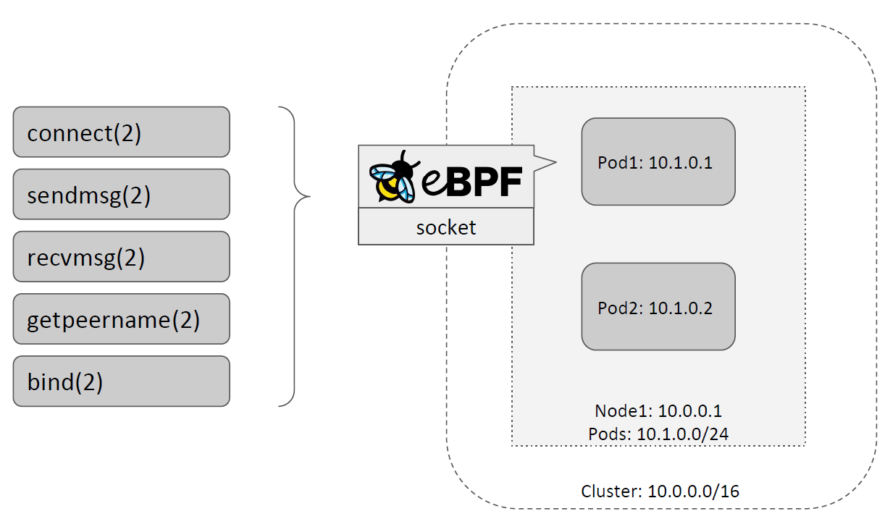
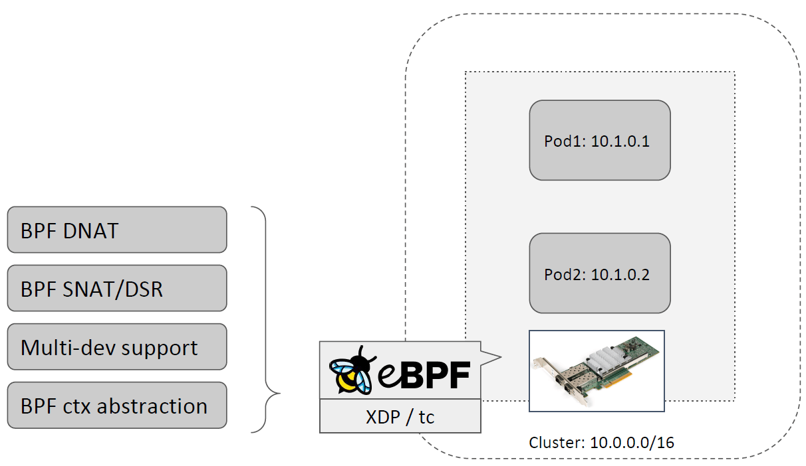

# Kubernetes系列：Service


## 系列目录

[《Kubernetes系列：开篇》]()

[《Kubernetes系列：概述》]()

[《Kubernetes系列：架构》]()

[《Kubernetes系列：CRI》]()

[《Kubernetes系列：CNI》]()

[《Kubernetes系列：CSI》]()

[《Kubernetes系列：Service》]()

[《Kubernetes系列：Ingress》]()

[《Kubernetes系列：OAM》]()

***

## 1. 介绍

> 在Kubernetes中，Service是将运行在一组Pods上的应用程序公开为网络服务的抽象方法。

### 1. 1 为什么需要Service？

pod是一个非永久性的资源。如果我们使用Deployment来运行应用程序，则pod是可以被动态创建和销毁的。

这导致了一个问题： 如果一组 Pod（称为“后端”）为集群内的其他 Pod（称为“前端”）提供功能， 那么前端如何找出并跟踪要连接的 IP 地址，以便前端可以使用提供工作负载的后端部分？

### 1.2 Service资源

Kubernetes Service 定义了这样一种抽象：逻辑上的一组 Pod，一种可以访问它们的策略 —— 通常称为微服务。 Service 所针对的 Pods 集合通常是通过[选择算符](https://kubernetes.io/zh/docs/concepts/overview/working-with-objects/labels/)来确定的。

***

## 2. 配置

Service 在 Kubernetes 中是一个 REST 对象，和 Pod 类似。 像所有的 REST 对象一样，Service 定义可以基于 `POST` 方式，请求 API server 创建新的实例。 Service 对象的名称必须是合法的 [DNS 标签名称](https://kubernetes.io/zh/docs/concepts/overview/working-with-objects/names#dns-label-names)。

### 2.1 一般配置

一个例子，有一组 Pod，它们对外暴露了 9376 端口，同时还被打上 `app=MyApp` 标签：

```yaml
apiVersion: v1
kind: Service
metadata:
  name: my-service
spec:
  selector:
    app: MyApp
  ports:
    - protocol: TCP
      port: 80
      targetPort: 9376
```

上述配置创建一个名称为 "my-service" 的 Service 对象，它会将请求代理到使用 TCP 端口 9376，并且具有标签 `"app=MyApp"` 的 Pod 上。

### 2.2 多端口

对于某些服务，你需要公开多个端口。 Kubernetes 允许你在 Service 对象上配置多个端口定义。 为服务使用多个端口时，必须提供所有端口名称，以使它们无歧义。

一个例子，

```yaml
apiVersion: v1
kind: Service
metadata:
  name: my-service
spec:
  selector:
    app: MyApp
  ports:
    - name: http
      protocol: TCP
      port: 80
      targetPort: 9376
    - name: https
      protocol: TCP
      port: 443
      targetPort: 9377
```

> **说明：**
>
> 与一般的Kubernetes名称一样，端口名称只能包含小写字母数字字符 和 `-`。 端口名称还必须以字母数字字符开头和结尾。
>
> 例如，名称 `123-abc` 和 `web` 有效，但是 `123_abc` 和 `-web` 无效。

### 2.3 服务类型

对一些应用的某些部分（如前端），可能希望将其暴露给 Kubernetes 集群外部 的 IP 地址。

Kubernetes `ServiceTypes` 允许指定你所需要的 Service 类型，默认是 `ClusterIP`。

`Type` 的取值以及行为如下：

- `ClusterIP`：通过集群的内部 IP 暴露服务，选择该值时服务只能够在集群内部访问。 这也是默认的 `ServiceType`。
- [`NodePort`](https://kubernetes.io/zh/docs/concepts/services-networking/service/#nodeport)：通过每个节点上的 IP 和静态端口（`NodePort`）暴露服务。 `NodePort` 服务会路由到自动创建的 `ClusterIP` 服务。 通过请求 `<节点 IP>:<节点端口>`，你可以从集群的外部访问一个 `NodePort` 服务。
- [`LoadBalancer`](https://kubernetes.io/zh/docs/concepts/services-networking/service/#loadbalancer)：使用云提供商的负载均衡器向外部暴露服务。 外部负载均衡器可以将流量路由到自动创建的 `NodePort` 服务和 `ClusterIP` 服务上。
- [`ExternalName`](https://kubernetes.io/zh/docs/concepts/services-networking/service/#externalname)：通过返回 `CNAME` 和对应值，可以将服务映射到 `externalName` 字段的内容（例如，`foo.bar.example.com`）。 无需创建任何类型代理。

NodePort例子：

```yaml
apiVersion: v1
kind: Service
metadata:
  name: my-service
spec:
  type: NodePort
  selector:
    app: MyApp
  ports:
      # 默认情况下，为了方便起见，`targetPort` 被设置为与 `port` 字段相同的值。
    - port: 80
      targetPort: 80
      # 可选字段
      # 默认情况下，为了方便起见，Kubernetes 控制平面会从某个范围内分配一个端口号（默认：30000-32767）
      nodePort: 30007
```

LoadBalnacer例子：

```yaml
apiVersion: v1
kind: Service
metadata:
  name: my-service
spec:
  selector:
    app: MyApp
  ports:
    - protocol: TCP
      port: 80
      targetPort: 9376
  clusterIP: 10.0.171.239
  type: LoadBalancer
status:
  loadBalancer:
    ingress:
      - ip: 192.0.2.127
```

来自外部负载均衡器的流量将直接重定向到后端 Pod 上，不过实际它们是如何工作的，这要依赖于云提供商。

***

## 3. 工作原理

在 Kubernetes 集群中，每个 Node 运行一个 `kube-proxy` 进程。 `kube-proxy` 负责为 Service 实现了一种 VIP（虚拟 IP）的形式，而不是 [`ExternalName`](https://kubernetes.io/zh/docs/concepts/services-networking/service/#externalname) 的形式。

### 3.1 为什么不使用DNS轮询

使用服务代理有以下几个原因：

- DNS 实现的历史由来已久，它不遵守记录 TTL，并且在名称查找结果到期后对其进行缓存。
- 有些应用程序仅执行一次 DNS 查找，并无限期地缓存结果。
- 即使应用和库进行了适当的重新解析，DNS 记录上的 TTL 值低或为零也可能会给 DNS 带来高负载，从而使管理变得困难。


### 3.2 userspace 代理模式

这种模式，kube-proxy 会监视 Kubernetes 控制平面对 Service 对象和 Endpoints 对象的添加和移除操作。 对每个 Service，它会在本地 Node 上打开一个端口（随机选择）。 任何连接到“代理端口”的请求，都会被代理到 Service 的后端 `Pods` 中的某个上面（如 `Endpoints` 所报告的一样）。 使用哪个后端 Pod，是 kube-proxy 基于 `SessionAffinity` 来确定的。

最后，它配置 iptables 规则，捕获到达该 Service 的 `clusterIP`（是虚拟 IP） 和 `Port` 的请求，并重定向到代理端口，代理端口再代理请求到后端Pod。

默认情况下，用户空间模式下的 kube-proxy 通过轮转算法选择后端。


***

### 3.3 iptables模式

这种模式，`kube-proxy` 会监视 Kubernetes 控制节点对 Service 对象和 Endpoints 对象的添加和移除。 对每个 Service，它会配置 iptables 规则，从而捕获到达该 Service 的 `clusterIP` 和端口的请求，进而将请求重定向到 Service 的一组后端中的某个 Pod 上面。 对于每个 Endpoints 对象，它也会配置 iptables 规则，这个规则会选择一个后端组合。

默认的策略是，kube-proxy 在 iptables 模式下随机选择一个后端。

使用 iptables 处理流量具有较低的系统开销，因为流量由 Linux netfilter 处理， 而无需在用户空间和内核空间之间切换。 这种方法也可能更可靠。

如果 kube-proxy 在 iptables 模式下运行，并且所选的第一个 Pod 没有响应， 则连接失败。 这与用户空间模式不同：在这种情况下，kube-proxy 将检测到与第一个 Pod 的连接已失败， 并会自动使用其他后端 Pod 重试。

你可以使用 Pod [就绪探测器](https://kubernetes.io/zh/docs/concepts/workloads/pods/pod-lifecycle/#container-probes) 验证后端 Pod 可以正常工作，以便 iptables 模式下的 kube-proxy 仅看到测试正常的后端。 这样做意味着你避免将流量通过 kube-proxy 发送到已知已失败的 Pod。


**例子**

```markdown
# 以aws为例,cluster ip为10.100.254.226，endpoint为172.31.178.122:80,172.31.178.161:80,172.31.179.80:80,nodeport为30028

# pod or node --> cluster ip --> endpoint
*nat
-A PREROUTING -m comment --comment "kubernetes service portals" -j KUBE-SERVICES #pod所有流量先进入KUBE-SERVICES检查
-A OUTPUT -m comment --comment "kubernetes service portals" -j KUBE-SERVICES  #node流量通过OUTPUT进入KUBE-SERVICES
-A KUBE-SERVICES -d 10.100.254.226/32 -p tcp -m comment --comment "ops-test/nginx-service: cluster IP" -m tcp --dport 80 -j KUBE-SVC-473SUSYUDXM6XRRH    #匹配目的ip为10.100.254.226
#随机选择后端
-A KUBE-SVC-473SUSYUDXM6XRRH -m statistic --mode random --probability 0.33333333349 -j KUBE-SEP-WWIE6AZWAXCTMCNN
-A KUBE-SVC-473SUSYUDXM6XRRH -m statistic --mode random --probability 0.50000000000 -j KUBE-SEP-ZBMAWDEBUXPXQHDH
-A KUBE-SVC-473SUSYUDXM6XRRH -j KUBE-SEP-VPHXZB6KBMWRSLML
#将目标地址转换为172.31.178.243:9300
-A KUBE-SEP-VPHXZB6KBMWRSLML -s 172.31.179.80/32 -j KUBE-MARK-MASQ
-A KUBE-SEP-VPHXZB6KBMWRSLML -p tcp -m tcp -j DNAT --to-destination 172.31.179.80:80

通过路由规则找对应的pod(pod到pod间通信)

# endpoint --> cluster ip --> pod or node
回来的包经过conntrack模块直接做SNAT操作


# externel --> nodeport --> endpoint
*nat
-A PREROUTING -m comment --comment "kubernetes service portals" -j KUBE-SERVICES #外部所有流量先进入KUBE-SERVICES检查
-A KUBE-SERVICES -m comment --comment "kubernetes service nodeports; NOTE: this must be the last rule in this chain" -m addrtype --dst-type LOCAL -j KUBE-NODEPORTS   #KUBE-SERVICES最后一条进入KUBE-NODEPORTS
-A KUBE-NODEPORTS -p tcp -m comment --comment "ops-test/nginx-service:" -m tcp --dport 30028 -j KUBE-MARK-MASQ #打标
-A KUBE-NODEPORTS -p tcp -m comment --comment "ops-test/nginx-service:" -m tcp --dport 30028 -j KUBE-SVC-473SUSYUDXM6XRRH  #后续的DNAT跟cluster ip类似

# endpoint --> nodeport
回来的包经过conntrack模块直接做SNAT操作，转换成nodeport

# nodeport --> externel
-A KUBE-POSTROUTING -m comment --comment "kubernetes service traffic requiring SNAT" -m mark --mark 0x4000/0x4000 -j MASQUERADE --random-fully   #跟外部交互需要做SNAT
```

***

### 3.4 ipv 代理模式

在 `ipvs` 模式下，kube-proxy 监视 Kubernetes 服务和端点，调用 `netlink` 接口相应地创建 IPVS 规则， 并定期将 IPVS 规则与 Kubernetes 服务和端点同步。 该控制循环可确保IPVS 状态与所需状态匹配。访问服务时，IPVS 将流量定向到后端Pod之一。

IPVS代理模式基于类似于 iptables 模式的 netfilter 挂钩函数， 但是使用哈希表作为基础数据结构，并且在内核空间中工作。 这意味着，与 iptables 模式下的 kube-proxy 相比，IPVS 模式下的 kube-proxy 重定向通信的延迟要短，并且在同步代理规则时具有更好的性能。 与其他代理模式相比，IPVS 模式还支持更高的网络流量吞吐量。

IPVS 提供了更多选项来平衡后端 Pod 的流量。 这些是：

- `rr`：轮替（Round-Robin）
- `lc`：最少链接（Least Connection），即打开链接数量最少者优先
- `dh`：目标地址哈希（Destination Hashing）
- `sh`：源地址哈希（Source Hashing）
- `sed`：最短预期延迟（Shortest Expected Delay）
- `nq`：从不排队（Never Queue）

> **说明：**
>
> 要在 IPVS 模式下运行 kube-proxy，必须在启动 kube-proxy 之前使 IPVS 在节点上可用。
>
> 当 kube-proxy 以 IPVS 代理模式启动时，它将验证 IPVS 内核模块是否可用。 如果未检测到 IPVS 内核模块，则 kube-proxy 将退回到以 iptables 代理模式运行。


```markdown
# pod or node --> cluster ip --> endpoint
-A PREROUTING -m comment --comment "kubernetes service portals" -j KUBE-SERVICES
-A OUTPUT -m comment --comment "kubernetes service portals" -j KUBE-SERVICES
-A KUBE-SERVICES -m set --match-set KUBE-CLUSTER-IP dst,dst -j ACCEPT

ipvs处理dnat，进入POSTROUTING链
# endpoint --> cluster ip --> pod or node
回来的包经过conntrack模块直接做SNAT操作


# externel --> nodeport --> endpoint
*nat
-A PREROUTING -m comment --comment "kubernetes service portals" -j KUBE-SERVICES
-A KUBE-SERVICES -m addrtype --dst-type LOCAL -j KUBE-NODE-PORT
-A KUBE-NODE-PORT -p tcp -m comment --comment "Kubernetes nodeport TCP port with externalTrafficPolicy=local" -m set --match-set KUBE-NODE-PORT-LOCAL-TCP dst -j RETURN
-A KUBE-NODE-PORT -p tcp -m comment --comment "Kubernetes nodeport TCP port for masquerade purpose" -m set --match-set KUBE-NODE-PORT-TCP dst -j KUBE-MARK-MASQ

ipvs处理dnat，进入POSTROUTING链
# endpoint --> nodeport
回来的包经过conntrack模块直接做SNAT操作，转换成nodeport

-A POSTROUTING -m comment --comment "kubernetes postrouting rules" -j KUBE-POSTROUTING
-A POSTROUTING -s 169.254.123.0/24 ! -o docker0 -j MASQUERADE
-A KUBE-POSTROUTING -m comment --comment "kubernetes service traffic requiring SNAT" -m mark --mark 0x4000/0x4000 -j MASQUERADE
-A KUBE-POSTROUTING -m comment --comment "Kubernetes endpoints dst ip:port, source ip for solving hairpin purpose" -m set --match-set KUBE-LOOP-BACK dst,dst,src -j MASQUERADE
```

ipvs 会使用 iptables 进行包过滤、SNAT、masquared(伪装)。具体来说，ipvs 将使用`ipset`来存储需要`DROP`或`masquared`的流量的源或目标地址，以确保 iptables 规则的数量是恒定的，这样我们就不需要关心我们有多少服务了

下表就是 ipvs 使用的 ipset 集合：

| set name                       | members                                                      | usage                                                        |
| ------------------------------ | ------------------------------------------------------------ | ------------------------------------------------------------ |
| KUBE-CLUSTER-IP                | All service IP + port                                        | Mark-Masq for cases that `masquerade-all=true` or `clusterCIDR` specified |
| KUBE-LOOP-BACK                 | All service IP + port + IP                                   | masquerade for solving hairpin purpose                       |
| KUBE-EXTERNAL-IP               | service external IP + port                                   | masquerade for packages to external IPs                      |
| KUBE-LOAD-BALANCER             | load balancer ingress IP + port                              | masquerade for packages to load balancer type service        |
| KUBE-LOAD-BALANCER-LOCAL       | LB ingress IP + port with `externalTrafficPolicy=local`      | accept packages to load balancer with `externalTrafficPolicy=local` |
| KUBE-LOAD-BALANCER-FW          | load balancer ingress IP + port with `loadBalancerSourceRanges` | package filter for load balancer with `loadBalancerSourceRanges` specified |
| KUBE-LOAD-BALANCER-SOURCE-CIDR | load balancer ingress IP + port + source CIDR                | package filter for load balancer with `loadBalancerSourceRanges` specified |
| KUBE-NODE-PORT-TCP             | nodeport type service TCP port                               | masquerade for packets to nodePort(TCP)                      |
| KUBE-NODE-PORT-LOCAL-TCP       | nodeport type service TCP port with `externalTrafficPolicy=local` | accept packages to nodeport service with `externalTrafficPolicy=local` |
| KUBE-NODE-PORT-UDP             | nodeport type service UDP port                               | masquerade for packets to nodePort(UDP)                      |
| KUBE-NODE-PORT-LOCAL-UDP       | nodeport type service UDP port with `externalTrafficPolicy=local` | accept packages to nodeport service with `externalTrafficPolicy=local` |

------

### 3.5 第三方插件，基于BPF/XDP实现K8S Service功能

[[译] 基于 BPF/XDP 实现 K8s Service 负载均衡 (LPC, 2020)](https://arthurchiao.art/blog/cilium-k8s-service-lb-zh/)

#### 3.5.1 Socket 层负载均衡（东西向流量）

Socket 层 BPF 负载均衡负责处理**集群内的东西向流量**。

实现方式是：**将 BPF 程序 attach 到 socket 的系统调用 hooks，使客户端直接和后端 pod 建连和通信**，如下图所示，这里能 hook 的系统调用包括 `connect()`、`sendmsg()`、 `recvmsg()`、`getpeername()`、`bind()` 等，



这里的一个问题是，K8s 使用的还是 cgroup v1，但这个功能需要使用 v2， 而由于兼容性问题，v2 完全替换 v1 还需要很长时间。所以我们目前所能做的就是 支持 v1 和 v2 的混合模式。这也是为什么 Cilium 会 mount 自己的 cgroup v2 instance 的原因（将宿主机 `/var/run/cilium/cgroupv2` mount 到 cilium-agent 容器内，译注）。

> Cilium mounts cgroup v2, attaches BPF to root cgroup. Hybrid use works well for root v2.

具体到实现上，

- `connect + sendmsg` 做**正向变换**（translation）
- `recvmsg + getpeername` 做**反向**变换，

这个变换或转换是**基于 socket structure 的，此时还没有创建 packet**，因此 **不存在 packet 级别的 NAT！**目前已经支持 TCP/UDP v4/v6, v4-in-v6。 **应用对此是无感知的，它以为自己连接到的还是 Service IP，但其实是 PodIP**。

> 想知道 socket-level translation 具体是如何实现的， 可参考 [Cracking kubernetes node proxy (aka kube-proxy)](https://arthurchiao.art/blog/cracking-k8s-node-proxy/)， 其中有一个 20 多行 bpf 代码实现的例子，可认为是 Cilium 相关代码的极度简化。译注。

**查找后端pod**

Service lookup **不一定能选到所有的 backend pods**（scoped lookup），我们将 backend pods 拆成不同的集合。

**这样设计的好处**：可以根据**流量类型**，例如是来自集群内还是集群外（ internal/external），**来选择不同的 backends**。例如，如果是到达 node 的 external traffic，我们可以限制它只能选择本机上的 backend pods，这样相比于转发到其他 node 上的 backend 就少了一跳。

另外，还支持通配符（wildcard）匹配，这样就能将 Service 暴露到 localhost 或者 loopback 地址，能在宿主机 netns 访问 Service。但这种方式不会将 Service 暴露到宿 主机外面。

显然，这种 **socket 级别的转换是非常高效和实用的**，它可以直接将客户端 pod 连 接到某个 backend pod，与 kube-proxy 这样的实现相比，转发路径少了好几跳。

此外，`bind` BPF 程序在 NodePort 冲突时会**直接拒绝应用的请求**，因此相比产生流 量（packet）然后在后面的协议栈中被拒绝，bind 这里要更加高效，**因为此时 流量（packet）都还没有产生**。

对这一功能至关重要的两个函数：

- `bpf_get_socket_cookie()`

  主要用于 UDP sockets，我们希望每个 UDP flow 都能选中相同的 backend pods。

- `bpf_get_netns_cookie()`

  用在两个地方：

  1. 用于区分 host netns 和 pod netns，例如检测到在 host netns 执行 bind 时，直接拒绝（reject）；
  2. 用于 serviceSessionAffinity，实现在某段时间内永远选择相同的 backend pods。

  由于 **cgroup v2 不感知 netns**，因此在这个 context 中我们没用 Pod 源 IP 信 息，通过这个 helper 能让它感知到源 IP，并以此作为它的 source identifier。

***

#### 3.5.2 TC & XDP 层负载均衡（南北向流量）

第二种是进出集群的流量，称为南北向流量，在宿主机 tc 或 XDP hook 里处理。



BPF 做的事情，将入向流量转发到后端 Pod，

1. 如果 Pod 在本节点，做 DNAT；
2. 如果在其他节点，还需要做 SNAT 或者 DSR。

**这些都是 packet 级别的操作**。

***

## 4. 服务发现

Kubernetes 支持两种基本的服务发现模式 —— 环境变量和 DNS。

### 环境变量

当 Pod 运行在 `Node` 上，kubelet 会为每个活跃的 Service 添加一组环境变量。 它同时支持 [Docker links兼容](https://docs.docker.com/userguide/dockerlinks/) 变量 （查看 [makeLinkVariables](https://releases.k8s.io/master/pkg/kubelet/envvars/envvars.go#L49)）、 简单的 `{SVCNAME}_SERVICE_HOST` 和 `{SVCNAME}_SERVICE_PORT` 变量。 这里 Service 的名称需大写，横线被转换成下划线。

举个例子，一个名称为 `redis-master` 的 Service 暴露了 TCP 端口 6379， 同时给它分配了 Cluster IP 地址 10.0.0.11，这个 Service 生成了如下环境变量：

```shell
REDIS_MASTER_SERVICE_HOST=10.0.0.11
REDIS_MASTER_SERVICE_PORT=6379
REDIS_MASTER_PORT=tcp://10.0.0.11:6379
REDIS_MASTER_PORT_6379_TCP=tcp://10.0.0.11:6379
REDIS_MASTER_PORT_6379_TCP_PROTO=tcp
REDIS_MASTER_PORT_6379_TCP_PORT=6379
REDIS_MASTER_PORT_6379_TCP_ADDR=10.0.0.11
```

> **说明：**
>
> 当你具有需要访问服务的 Pod 时，并且你正在使用环境变量方法将端口和集群 IP 发布到客户端 Pod 时，必须在客户端 Pod 出现 *之前* 创建服务。 否则，这些客户端 Pod 将不会设定其环境变量。
>
> 如果仅使用 DNS 查找服务的集群 IP，则无需担心此设定问题。

### DNS

你可以（几乎总是应该）使用[附加组件](https://kubernetes.io/zh/docs/concepts/cluster-administration/addons/) 为 Kubernetes 集群设置 DNS 服务。

支持集群的 DNS 服务器（例如 CoreDNS）监视 Kubernetes API 中的新服务，并为每个服务创建一组 DNS 记录。 如果在整个集群中都启用了 DNS，则所有 Pod 都应该能够通过其 DNS 名称自动解析服务。

例如，如果你在 Kubernetes 命名空间 `my-ns` 中有一个名为 `my-service` 的服务， 则控制平面和 DNS 服务共同为 `my-service.my-ns` 创建 DNS 记录。 `my-ns` 命名空间中的 Pod 应该能够通过简单地按名检索 `my-service` 来找到它 （`my-service.my-ns` 也可以工作）。

其他命名空间中的 Pod 必须将名称限定为 `my-service.my-ns`。 这些名称将解析为为服务分配的集群 IP。

Kubernetes 还支持命名端口的 DNS SRV（服务）记录。 如果 `my-service.my-ns` 服务具有名为 `http`　的端口，且协议设置为 TCP， 则可以对 `_http._tcp.my-service.my-ns` 执行 DNS SRV 查询查询以发现该端口号, `"http"` 以及 IP 地址。

Kubernetes DNS 服务器是唯一的一种能够访问 `ExternalName` 类型的 Service 的方式。 更多关于 `ExternalName` 信息可以查看 [DNS Pod 和 Service](https://kubernetes.io/zh/docs/concepts/services-networking/dns-pod-service/)。

***

## 5. 无头服务（Headless Services）

有时不需要或不想要负载均衡，以及单独的 Service IP。 遇到这种情况，可以通过指定 Cluster IP（`spec.clusterIP`）的值为 `"None"` 来创建 `Headless` Service。

你可以使用无头 Service 与其他服务发现机制进行接口，而不必与 Kubernetes 的实现捆绑在一起。

对这无头 Service 并不会分配 Cluster IP，kube-proxy 不会处理它们， 而且平台也不会为它们进行负载均衡和路由。 DNS 如何实现自动配置，依赖于 Service 是否定义了选择算符。

### 带选择算符的服务

对定义了选择算符的无头服务，Endpoint 控制器在 API 中创建了 Endpoints 记录， 并且修改 DNS 配置返回 A 记录（地址），通过这个地址直接到达 `Service` 的后端 Pod 上。

### 无选择算符的服务

对没有定义选择算符的无头服务，Endpoint 控制器不会创建 `Endpoints` 记录。 然而 DNS 系统会查找和配置，无论是：

- 对于 [`ExternalName`](https://kubernetes.io/zh/docs/concepts/services-networking/service/#external-name) 类型的服务，查找其 CNAME 记录
- 对所有其他类型的服务，查找与 Service 名称相同的任何 `Endpoints` 的记录

***

## 6. 设计哲学

### 避免冲突

Kubernetes 最主要的哲学之一，是用户不应该暴露那些能够导致他们操作失败、但又不是他们的过错的场景。 对于 Service 资源的设计，这意味着如果用户的选择有可能与他人冲突，那就不要让用户自行选择端口号。 这是一个隔离性的失败。

为了使用户能够为他们的 Service 选择一个端口号，我们必须确保不能有2个 Service 发生冲突。 Kubernetes 通过为每个 Service 分配它们自己的 IP 地址来实现。

为了保证每个 Service 被分配到一个唯一的 IP，需要一个内部的分配器能够原子地更新 [etcd](https://kubernetes.io/zh/docs/tasks/administer-cluster/configure-upgrade-etcd/) 中的一个全局分配映射表， 这个更新操作要先于创建每一个 Service。 为了使 Service 能够获取到 IP，这个映射表对象必须在注册中心存在， 否则创建 Service 将会失败，指示一个 IP 不能被分配。

在控制平面中，一个后台 Controller 的职责是创建映射表 （需要支持从使用了内存锁的 Kubernetes 的旧版本迁移过来）。 同时 Kubernetes 会通过控制器检查不合理的分配（如管理员干预导致的） 以及清理已被分配但不再被任何 Service 使用的 IP 地址。

### Service IP 地址

不像 Pod 的 IP 地址，它实际路由到一个固定的目的地，Service 的 IP 实际上 不能通过单个主机来进行应答。 相反，我们使用 `iptables`（Linux 中的数据包处理逻辑）来定义一个 虚拟 IP 地址（VIP），它可以根据需要透明地进行重定向。 当客户端连接到 VIP 时，它们的流量会自动地传输到一个合适的 Endpoint。 环境变量和 DNS，实际上会根据 Service 的 VIP 和端口来进行填充。

kube-proxy支持三种代理模式: 用户空间，iptables和IPVS；它们各自的操作略有不同。

#### Userspace

作为一个例子，考虑前面提到的图片处理应用程序。 当创建后端 Service 时，Kubernetes master 会给它指派一个虚拟 IP 地址，比如 10.0.0.1。 假设 Service 的端口是 1234，该 Service 会被集群中所有的 `kube-proxy` 实例观察到。 当代理看到一个新的 Service， 它会打开一个新的端口，建立一个从该 VIP 重定向到 新端口的 iptables，并开始接收请求连接。

当一个客户端连接到一个 VIP，iptables 规则开始起作用，它会重定向该数据包到 "服务代理" 的端口。 "服务代理" 选择一个后端，并将客户端的流量代理到后端上。

这意味着 Service 的所有者能够选择任何他们想使用的端口，而不存在冲突的风险。 客户端可以简单地连接到一个 IP 和端口，而不需要知道实际访问了哪些 Pod。

#### iptables

再次考虑前面提到的图片处理应用程序。 当创建后端 Service 时，Kubernetes 控制面板会给它指派一个虚拟 IP 地址，比如 10.0.0.1。 假设 Service 的端口是 1234，该 Service 会被集群中所有的 `kube-proxy` 实例观察到。 当代理看到一个新的 Service， 它会配置一系列的 iptables 规则，从 VIP 重定向到每个 Service 规则。 该特定于服务的规则连接到特定于 Endpoint 的规则，而后者会重定向（目标地址转译）到后端。

当客户端连接到一个 VIP，iptables 规则开始起作用。一个后端会被选择（或者根据会话亲和性，或者随机）， 数据包被重定向到这个后端。 不像用户空间代理，数据包从来不拷贝到用户空间，kube-proxy 不是必须为该 VIP 工作而运行， 并且客户端 IP 是不可更改的。

当流量打到 Node 的端口上，或通过负载均衡器，会执行相同的基本流程， 但是在那些案例中客户端 IP 是可以更改的。

#### IPVS

在大规模集群（例如 10000 个服务）中，iptables 操作会显着降低速度。 IPVS 专为负载平衡而设计，并基于内核内哈希表。 因此，你可以通过基于 IPVS 的 kube-proxy 在大量服务中实现性能一致性。 同时，基于 IPVS 的 kube-proxy 具有更复杂的负载均衡算法（最小连接、局部性、 加权、持久性）。

***

## 7. 结论

该篇，我们了解了service是什么，以及怎么在k8s定义一个service，并简单了解了service的实现原理。

***

**参考**

[https://kubernetes.io/zh/docs/concepts/services-networking/service/](https://kubernetes.io/zh/docs/concepts/services-networking/service/)


