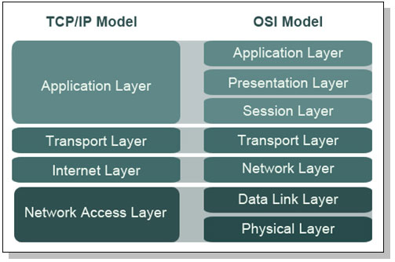
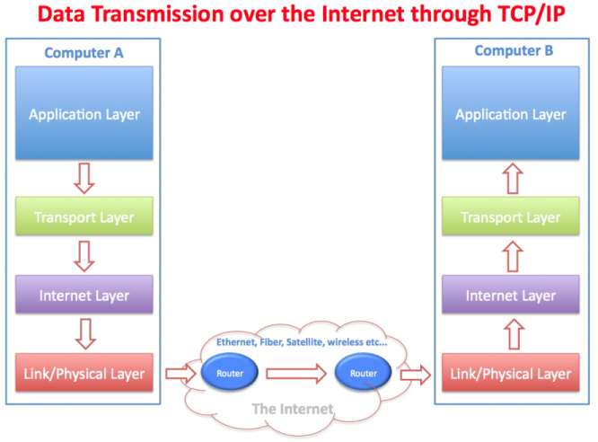
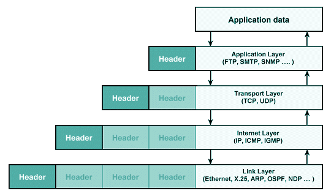
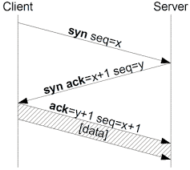
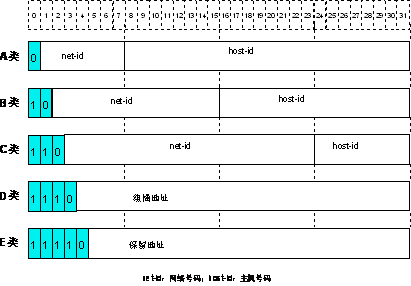
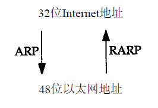
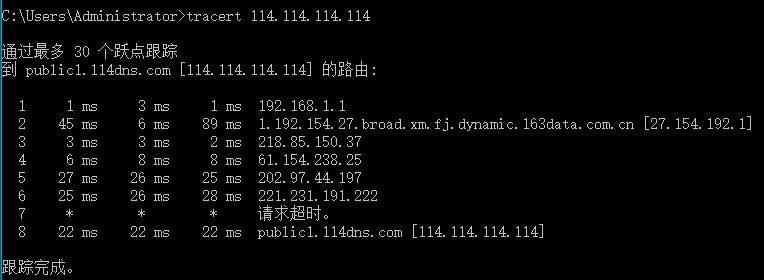
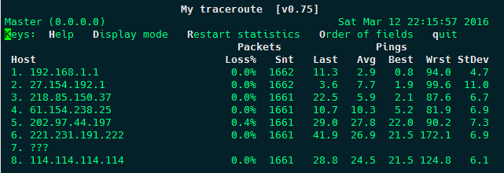
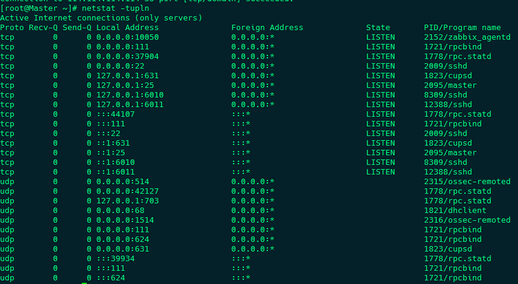

# 初识网络通信

### 写在前面

在计算机刚出现的时候，只能在本机进行一些运算处理，想将一台计算机中的数据转移到另一台计算机中，需要通过外部存储介质来传输，例如磁带、软盘。而网络技术的出现，使得计算机间可以通过一些传输介质(网线、光纤等)，实现快速的数据传输和信息交互。如今，网络已无处不在，那么，计算机之间究竟是如何通信的呢？下面会通过一些基础的网络知识来简单理解计算机之间的通信过程。

***

### 网络通信模型

> 网络通信模型是一种概念模型和框架，旨在使各种计算机在世界范围内互连为网络。其中有OSI七层模型和TCP/IP四层模型，现在大部分网络通信都是以TCP/IP四层模型为基础的。

它们的对应层次如下图：

> OSI有七层：从上到下依次为应用层、表示层、会话层、传输层、网络层、数据链路层、物理层

> TCP/IP有四层：从上到下依次为应用层、传输层、互连层(网络层)、网络接口层(链路层)。

因为目前大部分TCP/IP模型，所以就以TCP/IP为例，我们来理解下数据间的通信，下图是两台计算机通信的数据的传输过程：

***

### 数据封装

在详细了解TCP/IP每一层各自的作用前，先要理解数据封装的概念，数据在通过网络接口传送出去前，会经过层层封装，每层都会在前面的基础上添加自己的信息，在传输到对方计算机后，又会被层层进行解封装后得到最后的数据。其过程如下图所示：

***

### TCP/IP参考模型

> TCP/IP参考模型是一个抽象的分层模型，这个模型中，所有的TCP/IP系列网络协议都被归类到4个抽象的"层"中。每一抽象层创建在低一层提供的服务上，并且为高一层提供服务。 完成一些特定的任务需要众多的协议协同工作，这些协议分布在参考模型的不同层中的，因此有时称它们为一个协议栈。

***

#### 应用层(Application Layer)

> 该层包括所有和应用程序协同工作，利用基础网络交换应用程序专用的数据的协议。 应用层是大多数普通与网络相关的程序为了通过网络与其他程序通信所使用的层。这个层的处理过程是应用特有的；数据从网络相关的程序以这种应用内部使用的格式进行传送，然后被编码成标准协议的格式。

* 常见的应用层协议有HTTP、FTP、DNS、SNMP(基于UDP)

***

#### 传输层(Transport Layer)

> 主要为两台主机上的应用程序提供端到端的通信，包括TCP协议（传输控制协议）和UDP（用户数据报协议）。
> 端口号由此层提供，且在一台计算机中具有唯一性。

> UDP为应用层提供一种非常简单的服务。它只是把称作数据报的分组从一台主机发送到另一台主机，但并不保证该数据报能到达另一端。任何必需的可靠性必须由应用层来提供。

> TCP为两台主机提供高可靠性的数据通信。它所做的工作包括把应用程序交给它的数据分成合适的小块交给下面的网络层，确认接收到的分组，设置发送最后确认分组的超时时钟等,由于运输层提供了高可靠性的端到端的通信，因此应用层可以忽略所有这些细节。

因为TCP是一种面向连接的协议，所以两个在使用TCP的应用在彼此交换数据前必须先建立一个TCP连接，也就是有名的TCP三次握手，如下图所示：

建立连接协议过程：（TCP三次握手协议）

1. 客户端发送一个SYN段指明客户打算连接的服务器的端口，以及初始序号（ISN）。
2. 服务器发回包含服务器的初始序号的SYN报文段作为应答。同时，将确认序号设置为客户的ISN加1以对客户的SYN报文段进行确认。一个SYN占用一个序号。
3. 客户将确认序号设置为服务器的ISN加1以对服务器的SYN报文段进行确认。

***

#### 网络层(Internet Layer)

> 处理分组在网络中的活动。网络层协议包括IP协议（网际协议），ICPM协议（Internet互联网控制报文协议），以及IGMP协议（Internet组管理协议），其中的IP协议身是TCP/IP协议簇中最为核心的协议。IP提供的是不可靠、无连接的数据包传送服务。

##### IP地址

* 讲到IP协议就应该讲讲IP地址，IP地址是分配给网络上使用IP协议的设备的数字标签，有IPv4和IPv6两大类，我们目前使用的大部分还是IPv4的地址，以下简称IP地址，IP地址由32位二进制数组成，为便于使用，常以XXX.XXX.XXX.XXX形式表示。

* IP地址由两个字段组成：网络号(net-id)和主机号(host-id)，为方便IP地址管理，IP地址被分为五类，如下图：

  

* 其中A、B、C类地址为单播（unicast）地址；D类地址为组播（multicast）地址；E类地址为保留地址，以备将来的特殊用途。目前大量使用中的IP地址属于A、B、C三类地址。

  * A类地址范围：0.0.0.0～127.255.255.255
  * B类地址范围：128.0.0.0～191.255.255.255
  * C类地址范围：192.0.0.0～223.255.255.255
  * 私网地址范围：10.0.0.0～10.255.255.255 ，172.16.0.0～172.31.255.255 ，192.168.0.0～192.168.255.255，私网地址只能在本地局域网中使用，不在公网中使用。

##### 子网和掩码

* 传统的IP地址分配方式，对IP地址的浪费非常严重。为了充分利用已有的IP地址，人们提出了掩码（mask）和子网（subnet）的概念。
* 掩码是一个与IP地址对应的32位数字，这些数字中一些为1，另外一些为0。原则上这些1和0可以任意组合，不过一般在设计掩码时，网络号码和子网号码的比特值为1，主机号码的比特值为0。掩码可以把IP地址分为两个部分：子网地址和主机地址。IP地址与掩码中为1的位对应的部分为子网地址，其他的位对应的部分则是主机地址。当不进行子网划分时，子网掩码即为默认值，此时子网掩码中“1”的长度就是网络号码的长度。即A类地址对应的掩码默认值为255.0.0.0；B类地址的掩码默认值为255.255.0.0；C类地址掩码的默认值为255.255.255.0。

##### 路由

* 概念：若目的主机与源主机在同一共享网络内，IP数据报直接送达目的主机，否则，主机把数据报发往默认的路由器上，由路由器进行数据报转发。

***

#### 链路层(Link Layer)

> 通常包括设备驱动程序和网络接口卡。处理与传输媒介的物理接口细节。

主要协议有：ARP协议和RARP协议

* MAC地址 ：数据链路层具有自己的寻址机制(48bit地址)，当一台主机把以太网数据帧发送到位于同一局域网上得另一台主机时，是根据48bit的以太网地址来确定目的接口的。
* 而ARP和RARP协议是为IP地址和MAC地址提供映射的：

***

### 使用

> 我们在判断两台主机应用之间的网络是否正常，通常是判断到对方IP和端口是否能通。

常用网络判断命令：

##### Windows

* `ping $IP：最常用的判断网络是否可达的命令。`

  

* `tracert $IP：跟踪路由，即打印出本机到到目的IP，所经过路由。`

  

* `telnet $IP $port：可以测试某个IP和应用端口是否能通。`

* `netstat：查看本机监听和建立连接的端口。`

  

##### Linux

* `ping $IP：最常用的判断网络是否可达的命令`

* `traceroute $IP：跟踪路由，即打印出本机到到目的IP，所经过路由。`

* `或者使用mtr -ni 0.1 $IP，可以实现以上两个共同的效果`

  

* `nc -vz $IP $PORT：测试到目的IP的应用端口是否能通。`

  

* `netstat -tupln：可以查看本机目前监听的端口`

  

***

### 参考

[https://en.wikipedia.org/wiki/Internet_protocol_suite](https://en.wikipedia.org/wiki/Internet_protocol_suite)

[《TCP/IP详解卷1:协议》]()

 
