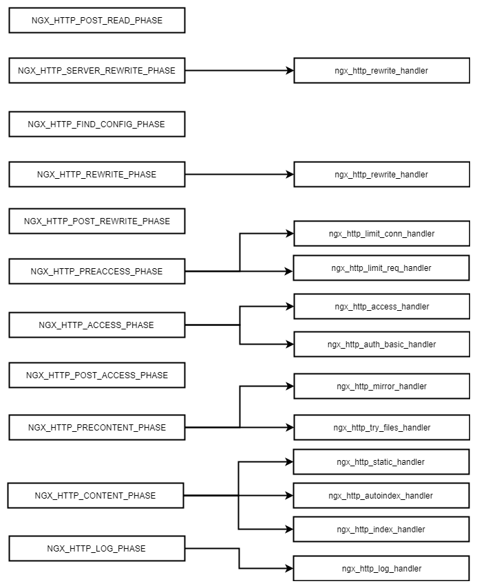

# Openresty执行阶段

### Nginx执行阶段

- `NGX_HTTP_POST_READ_PHASE` — 第一阶段， [ngx_http_realip_module](http://nginx.org/en/docs/http/ngx_http_realip_module.html) 在此阶段注册其处理程序，以允许在调用任何其他模块之前替换客户端地址。
- `NGX_HTTP_SERVER_REWRITE_PHASE` — 该阶段处理`server`块(`location`块除外)定义的rewrite指令。  [ngx_http_rewrite_module](http://nginx.org/en/docs/http/ngx_http_rewrite_module.html) 在此阶段安装其处理程序。
- `NGX_HTTP_FIND_CONFIG_PHASE` — 根据请求URI选择位置的特殊阶段。在此阶段之前，将相关虚拟服务器的默认位置分配给请求，并且任何请求位置配置的模块都将接收默认服务器位置的配置。该阶段为请求分配一个新位置。该阶段无法注册其他处理程序。
- `NGX_HTTP_REWRITE_PHASE` — 同 `NGX_HTTP_SERVER_REWRITE_PHASE`, 但处理的是上一个阶段选择的`location`块内的定义的rewrite规则指令。
- `NGX_HTTP_POST_REWRITE_PHASE` — 特殊阶段，如果请求的URI在rewirte期间更改，则将请求重定向到新的`location`块。这是通过再次请求  `NGX_HTTP_FIND_CONFIG_PHASE` 来完成的。此阶段无法注册其他处理程序。
- `NGX_HTTP_PREACCESS_PHASE` — 与访问控制无关的用于不同类型的处理程序的公共阶段。标准nginx模块 [ngx_http_limit_conn_module ](http://nginx.org/en/docs/http/ngx_http_limit_conn_module.html)和 [ngx_http_limit_req_module](http://nginx.org/en/docs/http/ngx_http_limit_req_module.html) 在此阶段注册其处理程序。
- `NGX_HTTP_ACCESS_PHASE` — 验证客户端请求是否合法的阶段。例如[ngx_http_access_module](http://nginx.org/en/docs/http/ngx_http_access_module.html) 和 [ngx_http_auth_basic_module ](http://nginx.org/en/docs/http/ngx_http_auth_basic_module.html)等标准nginx模块在此阶段注册其处理程序。默认情况下，客户端必须通过该阶段所有处理程序的合法验证才能继续请求下一个阶段。  通过[satisfy](http://nginx.org/en/docs/http/ngx_http_core_module.html#satisfy) 指令，则可以允许客户端在通过该阶段任何一个处理程序的合法验证后直接进入下一个阶段。
- `NGX_HTTP_POST_ACCESS_PHASE` — 特殊阶段，处理满足 [satisfy any](http://nginx.org/en/docs/http/ngx_http_core_module.html#satisfy) 指令的阶段。如果某些访问阶段处理程序拒绝了访问并且没有显式允许访问，则该请求完成。此阶段无法注册其他处理程序。
- `NGX_HTTP_PRECONTENT_PHASE` — 在生成内容之前调用处理程序的阶段。一些标准nginx模块如 [ngx_http_try_files_module](http://nginx.org/en/docs/http/ngx_http_core_module.html#try_files) 和 [ngx_http_mirror_module](http://nginx.org/en/docs/http/ngx_http_mirror_module.html) 在此阶段注册其处理程序。
- `NGX_HTTP_CONTENT_PHASE` — 正常生成响应的阶段. 多个Nginx标准模块在此阶段注册其处理程序, 包括 [ngx_http_index_module](http://nginx.org/en/docs/http/ngx_http_index_module.html) 和 `ngx_http_static_module`。它们按顺序被调用直到某一个模块产生输出。也可以按`location`设置内容处理程序，如果 [ngx_http_core_module](http://nginx.org/en/docs/http/ngx_http_core_module.html)的*location*配置已设置处理程序，则将其称为内容处理程序，并且在此阶段安装的处理程序将被忽略。
- `NGX_HTTP_LOG_PHASE` — 执行请求日志记录的阶段。当前，只有 [ngx_http_log_module](http://nginx.org/en/docs/http/ngx_http_log_module.html) 在此阶段注册其处理程序以进行访问日志记录。在释放请求之前，在请求处理的最后阶段调用日志阶段处理程序。

***

### Lua执行阶段

* `init_by_lua*` — 在Nginx master 进程加载配置时候时，在全局LuaVM 级别上运行指定的lua代码。通常在该阶段注册全局变量或者预加载lua模块。
* `init_worker_by_lua*` — 启用master进程后，在每次Nginx worker进程启动时运行指定的Lua代码。当禁用master进程时，此hook将仅在init_by_lua *之后运行。通常用于创建每个worker的重复计时器（通过Lua API的ngx.timer.at），也用于后端运行状况检查或其他定时例行工作。
* `ssl_certificate_by_lua*` — 当Nginx即将启动下游https连接的SSL握手时，此指令运行用户Lua代码。
* `set_by_lua*` — 该指令旨在执行简短，快速运行的代码块，因为在代码执行期间会阻止Nginx事件循环。因此，应该避免耗时的代码队列。
* `rewrite_by_lua*` — 充当rewrite阶段处理程序，并针对每个请求执行指定的Lua代码字符串。 Lua代码可以进行API调用，并在独立的全局环境（即沙箱）中作为新生成的协程执行。请注意，此处理程序始终在标准ngx_http_rewrite_module之后运行。
* `access_by_lua*` —  充当access阶段处理程序。请注意，此处理程序始终在标准[ngx_http_access_module](http://nginx.org/en/docs/http/ngx_http_access_module.html) 之后运行。
* `content_by_lua*` — 充当content阶段处理程序。
* `balancer_by_lua*` — 该指令将Lua代码作为upstream{}配置块定义的任何upstream实体的upsteam balancer 运行
* `header_filter_by_lua*` — 执行lua代码用于定义输出header过滤器
* `body_filter_by_lua*` — 执行lua代码用于定义输出body过滤器
* `log_by_lua*` — 在日志请求处理阶段执行lua代码，此操作不会替代当前的access日志，而是在它之前执行。

***

**参考**

[nginx-http-phases](https://nginx.org/en/docs/dev/development_guide.html#http_phases)

[openresty-reference](https://openresty-reference.readthedocs.io/en/latest/Directives/)

