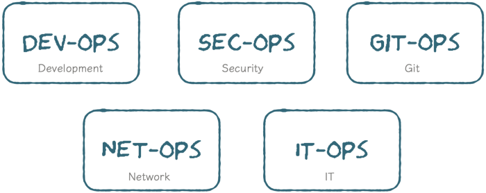
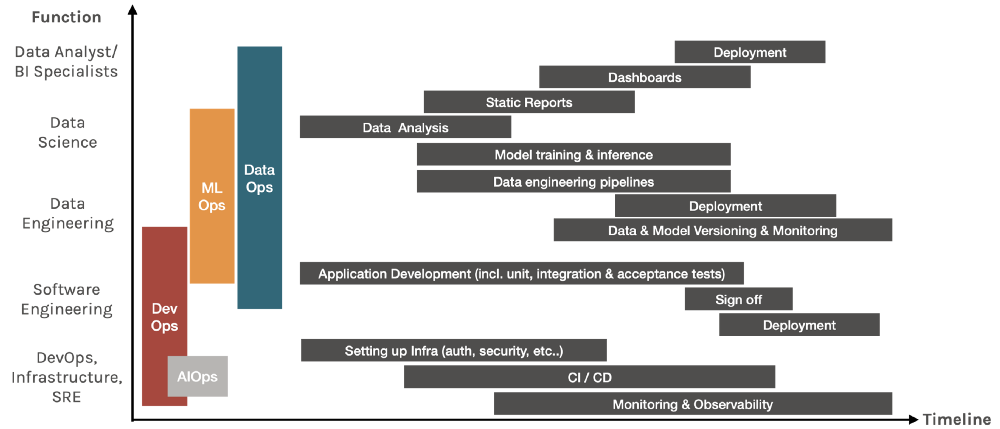

# [译]当我们谈论Ops，我们在谈论什么

原文链接：[What the Ops are you talking about?](https://towardsdatascience.com/what-the-ops-are-you-talking-about-518b1b1a2694)

**水平有限，本文不免存在遗漏或错误之处。如有疑问，请查阅原文。**

***

两年前，我因为效率低下的领导而获得了耻辱。我的背景是数据科学和机器学习，因此，我当然从我的工程同事那边学习到了DevOps。至少我们认为是这样的。

令人费解的是，即使我们遵循了日常站立会议所有敏捷开发的良好实践，讨论我们的难点，也没有将难题扔给别人的态度。我们紧密合作并且相互友爱。但是开发效率依然缓慢，这令整个团队很沮丧。

两年过后，我终于掌握了DevOps的含义，并且理解了它在数据团队中如此的相同而又如此不同。

在我们谈论以数据为中心的Ops时，先让我们从软件开始说起，

自从[09年DevOps](https://www.atlassian.com/devops/what-is-devops/history-of-devops)普及以来，软件行业就一直痴迷于各种操作术语。十年前，从软件开发到部署的方法已经推陈出新。软件工程师开发应用，然后将其交付给运维工程师。该应用程序在部署期间经常中断，并在团队之间造成很大的摩擦。

DevOps实践的目的是简化部署过程。该想法是将自动化视为构建和部署软件应用程序的一等公民。

这种想法彻底改变了这个行业。许多组织开始建立跨职能团队来照顾整个SDLC。该团队将建立基础架构（基础工程师），开发应用程序（软件工程师），构建CI/CD管道（DevOps工程师），部署应用程序（每位工程师），然后连续监视和观察应用程序（站点可靠性工程师）。

在一个大团队里面，一个工程师可能只会有一项主要职能，但是在较小的团队中，一位工程师经常担任许多职务。理想的情况是使许多团队成员能够履行多项职能，从而消除瓶颈和关键人员的依存关系。所以实际上，**DevOps并非是一项工作职能，而是更多的实践或文化。 在开始构建任何软件时都应采用它。**

随着DevOps的兴起，各种各样的Ops诞生了。

SecOps以安全性为核心，GitOps致力于持续交付，NetOps确保网络可以支持数据流，而ITOps则专注于软件交付之外的操作任务。但是，这些操作的基石共同源自DevOps所承诺的愿景：

> **“ To get software out there as fast as possible,** **with minimal errors.”**

***

五年前，“**数据是新石油**”一语成为炒作对象。世界各地的领导者开始倾注资源，建立大数据团队来挖掘这些宝贵的资产。这些团队交付的压力巨大—毕竟，我们如何才能兑现新石油的承诺？随着快速扩展，分析团队也经历了同样的痛苦。

然后，我们使这一切成为现实。

数据科学家成为21世纪最吃香的职业。我们正在建立和处于数据和分析的黄金时代。每个执行者都有一个仪表板，具有来自整个组织的数据和嵌入式预测模型的仪表板，每个客户都有基于其行为的个性化推荐。

但是，现在添加一个新功能需要花费数周甚至数月的时间。数据模型是混乱的并且没有人知道我们是使用信贷团队还是营销团队的活跃客户的定义。我们变得非常警惕将模型推向生成环境，因为我们不知道我们会破坏什么？

因此，以数据为中心的社区团结在一起，保证不会因管理不善的数据流程而造成的效率低下，从那时起，各种以数据为中心的OPS诞生了

## DataOps 🆚 MLOps 🆚 DevOps (and AIOps?)

**注意**：在本文中，分析团队是指使用SQL / PowerBI来生成业务洞察力的传统BI团队。 AI团队是指使用大数据技术构建高级分析和机器学习模型的团队。 有时他们是同一支球队，但我们将它们分开，以便更容易地解释概念。

要了解所有这些不同的Ops，让我们来看看数据如何在组织中流动的场景：

* 数据是由与软件应用程序交互的客户生成的
* 软件将数据存储在其应用程序数据库中
* 分析团队从组织中的团队使用这些应用程序数据库构建ETL
* 然后，数据工程师将原始数据，合并的数据集（来自分析团队）和其他非结构化数据集摄取到某种形式的数据湖中
* 然后，数据科学家根据这些庞大的数据集建立模型
* 然后，这些模型采用用户生成的新数据进行预测。
* 然后，软件工程师将预测结果呈现给用户
* 并且周期继续

我们知道DevOps的诞生是由于开发团队和运维团队之间的摩擦。因此，想象一下运维，开发，分析和AI团队之间的4向界面所带来的令人头疼的问题。

为了说明不同的Ops如何解决上述过程，下面的图形绘制了每个作业功能在整个时间轴上执行的一些任务

理想情况下，应在项目开始时采用X-Ops文化，并在整个过程中实施实践.

总而言之，这就是每个Ops的意义

### DevOps更快地交付软件

一系列实践旨在消除开发团队和运维团队之间的障碍，以便更快地构建和部署软件。工程团队通常采用它，包括DevOps工程师，基础架构工程师，软件工程师，站点可靠性工程师和数据工程师。

### DataOps更快地交付数据

一系列实践旨在提高数据分析的质量和减少周期时间。DataOps主要的任务包括数据打标、数据测试、数据管道编排、数据版本控制和数据监控。分析和大数据团队是DataOps主要的支撑对象，但是任何生成和使用数据的人都应该采用良好的DataOps做法，其中包括数据分析师，BI分析师，数据科学家，数据工程师，有时还包括软件工程师。

### MLOps更快地提供机器学习模型

一套设计，构建和管理可重现，可测试和可持续的ML支持软件的实践。对于大数据/机器学习团队，MLOps包含大多数DataOps任务和其他特定于ML的任务，例如模型版本控制，测试，验证和监视。

### 奖励：AIOps利用AI的功能增强了DevOps工具

有时人们会错误地将MLOps称为AIOps，但它们却大不相同。从Gartner：

> AIOps platforms utilize big data, modern machine learning and other advanced analytics technologies to directly and indirectly enhance IT operations (monitoring, automation and service desk) functions with proactive, personal and dynamic insight.

因此，AIOps通常是使用AI驱动技术来增强服务产品的DevOps工具。 AWS CloudWatch提供的警报和异常检测是AIOps的一个很好的例子.

***

## Principals not Job Roles

一个误解是，为了实现这些行动所承诺的效率，他们需要从选择正确的技术开始。事实上，技术不是最重要的东西。

> DataOps，MLOps和DevOps的实践必须与语言，框架，平台和基础架构无关。

每个人都有不同的工作流程，该工作流程应由负责人告知——而不是您想尝试的技术或最受欢迎的技术。首先要去技术的陷阱是，如果您想使用锤子，一切对您来说就像钉子一样。

所有的Ops都有相同的7个主要原则，但每个Ops都有自己的细微差别：

### 1. 合规

DevOps通常担心网络和应用程序的安全性。在MLOps领域，金融和医疗保健等行业通常需要模型可解释性。DataOps需要确保数据产品符合GDPR / HIPPA等法律。

🔧 **Tools:** [PySyft](https://github.com/OpenMined/PySyft) 解耦私人数据以进行模型训练， [AirCloak](https://aircloak.com/) 用于数据匿名. [Awesome AI Guidelines](https://github.com/EthicalML/awesome-artificial-intelligence-guidelines) 策划有关AI的原则，标准和法规。

### 2. 迭代开发

该原理源于敏捷方法论，该方法论着重于以可持续的方式持续产生业务价值。该产品经过迭代设计，构建，测试和部署，以最大程度地快速排除故障并学习原理。

### 3. 可重现性

软件系统通常是确定性的：每次代码都应以完全相同的方式运行。因此，为了确保可重现性，DevOps只需要跟踪代码即可。

但是，由于任一数据漂移，机器学习模型通常都需要重新训练。为了重现结果，MLOps需要对模型进行版本控制，而DataOps需要对数据进行版本控制。当审核员询问要使用哪些数据来训练哪种模型来产生特定结果时，数据科学家需要能够回答这一问题。

🔧 **Tools:** 实验跟踪工具, 例如 [KubeFlow](https://kubeflow.org/), [MLFlow](https://mlflow.org/) 或者 SageMaker 都具有将元数据链接到实验运行的功能。 [Pachyderm](https://www.pachyderm.com/) 和 [DVC](https://dvc.org/) 用于数据版本控制。

### 4. 测试

软件测试在于单元测试，集成测试和回归测试。DataOps需要严格的数据测试，其中包括架构更改，数据漂移，功能设计后的数据验证等。从机器学习的角度来看，模型准确性，安全性，偏见/公平性，可解释性都需要进行测试。

🔧 **Tools:** libraries such as [Shap](https://github.com/slundberg/shap) & [Lime](https://github.com/marcotcr/lime) for interpretability, [fiddler](https://www.fiddler.ai/) for explainability monitoring, [great expectation](https://greatexpectations.io/) for data testing.

### 5. 持续部署

这里有三个组件用于机器学习模型的持续部署：

* 第一个组件是触发事件，即触发是数据科学家手动触发，日历计划事件和阈值触发吗？
* 第二个组件是新模型的实际再培训。导致该模型的脚本，数据和超参数是什么？它们的版本以及如何相互链接。
* 最后一个组件是模型的实际部署，该部署必须由具有预警功能的部署管道进行编排。

🔧 **Tools:** most workflow management tools have this, such as AWS SageMaker, AzureML, DataRobot, etc. Open-source tools such as [Seldon](https://www.seldon.io/), [Kubeflow KFServing](https://github.com/kubeflow/kfserving).

### 6. 自动化

自动化是DevOps的核心价值，实际上有很多专门针对自动化各个方面的工具。以下是机器学习项目的一些资源：

- [Awesome Machine Learning](https://github.com/josephmisiti/awesome-machine-learning)
- [Awesome Production Machine Learning](https://github.com/ethicalml/awesome-production-machine-learning)

### 7. 监控

需要监视软件应用程序，机器学习模型和数据管道也需要监视。对于DataOps，监视新数据的分布是否有任何数据和/或概念漂移很重要。在MLOps方面，除了模型降级之外，如果您的模型具有公共API，监视对抗攻击也至关重要。

🔧 **Tools:** Most workflow management framework has some form of monitoring. Other popular tools include [Prometheus](https://prometheus.io/) for monitoring metrics, [Orbit by Dessa](https://dessa-orbit-team-docs.readthedocs-hosted.com/en/latest/) for data & model monitoring.

***

## 结论

采用正确的X-Ops文化，以加快数据驱动和机器学习驱动的软件产品的交付。请记住，有关技术的原则：

1. **建立跨学科技能:** 培养T型个人和团队 弥合差距并统一问责制
2. **尽早实现自动化:** 融合在技术堆栈上并实现自动化，减轻工程费用的流程
3. **着眼于最终发展:** 预先投资解决方案设计以减少从PoC到生产的摩擦
