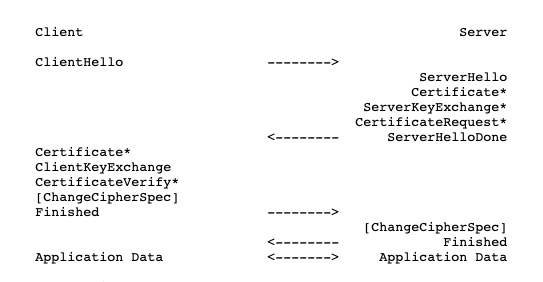

# 理解SSL/TLS协议


## 背景

早期我们在访问web时使用HTTP协议，该协议在传输数据时使用明文传输，明文传输带来了以下风险：

* 信息窃听风险，第三方可以获取通信内容
* 信息篡改风险，第三方可以篡改通信内容
* 身份冒充风险，第三方可以冒充他人身份参与通信

为了解决明文传输所带来的风险，网景公司在1994年设计了SSL用于Web的安全传输协议，这是SSL的起源。IETF将SSL进行标准化，1999年公布了第一版TLS标准文件。随后又公布了 RFC 5246（2008年8月）与 RFC 6176 （2011年3月）。该协议在web中被广泛应用。

***

## SSL/TLS协议

TLS（Transport Layer Security，传输层安全协议），及其前身SSL（Secure Sockets Layer，安全套接层）是一种安全协议，目的是为互联网通信，提供安全及数据完整性保障。

TLS协议使用以下三种机制为信息通信提供安全传输：

* 隐秘性，所有通信都通过加密后进行传播
* 身份认证，通过证书进行认证
* 可靠性，通过校验数据完整性维护一个可靠的安全连接

***

## 以TLS1.2为例说明TLS协议

TLS协议由`TLS Record Protocol`和`TLS Handshake Protocol`两层协议组成

### TLS Record Protocol

该协议提供了连接安全的两个基本特性：

- 连接私有

  对称密码用于数据加密，这种对称加密是为每条连接唯一生成的并基于另一个人协商的秘密协议

- 连接可靠

  消息传输包括一条消息 使用密钥MAC进行完整性检查，安全哈希函数（例如， SHA-1等）用于MAC计算。

***

### TLS Handshake Protocol

该协议提供了连接安全的三个基本特性：

* 可以使用非对称身份验证对等方的身份，或者 公钥，密码学等
* 共享密钥的协商是安全的
* 谈判可靠

***

一个TLS握手协议一般涉及以下步骤：

* 交换hello信息用于算法协商，交换随机值，并检查会话是否恢复
* 交换必要的密码信息以允许客户端和服务端同意使用premaster secret
* 交换证书和密码信息以允许客户端和服务端进行身份验证
* 通过随机值和premaster secret生成master secret
* 向record layer提供安全参数
* 允许客户端和服务器验证其对等方具有计算出的相同安全参数，并且握手发生在没有被攻击者篡改的情况下

#### TLS握手的完整消息流



* ClientHello

  客户端提供了以下内容: 

  * 支持的协议版本
  * 客户端随机数据(后续用于握手)
  * 可选的session id
  * 加密套件列表
  * 压缩方法列表
  * 扩展列表

* ServerHello

  服务端提供了以下内容：

  * 选择后的协议版本
  * 选择后的加密套件
  * 选择后的压缩方法
  * 服务端随机数据(后续用于握手)
  * session id
  * 扩展列表

* ServerCertificate

  服务端提供了证书，证书包含以下内容：

  * 服务端的hostname
  * 服务端所使用的公钥
  * 来自受信任的第三方的证明，证明此hostname的所有者拥有此公钥的私钥

* ServerKeyExchange(可选)

  服务端仅在证书包含的信息不足以使客户端进行premaster secret交换时发送该消息

* CertificateRequest(可选)

  当服务端需要客户端证书时发送，需要加密套件支持

* ServerHelloDone

  服务端表明已经完成了一半的handshake

* ClientCertificate(可选)

  当服务端有需要验证客户端证书时发送，如果加密套件不支持，则消息不包含证书

* ClientKeyExchange

  生成一个48byte的premaster secret，并通过服务端证书包含的公钥进行加密发送给服务端

* CertificateVerify(可选)

  该消息只在客户端证书具有签名能力时发送

* ClientChangeCipherSpec(message)

  一种协议，数据只有一字节，用于告知Server端已经切换到之前协商好的加密套件的状态，准备使用之前协商好的加密套件加密数据并进行传输了。

* ClientFinished

  客户端和服务端现在都拥有3个数值

  * ClientHello.random
  * ServerHello.random
  * premaster secret

  master secret由上面三个数值计算而成

  ```
  master_secret = PRF(pre_master_secret,"master secret",ClientHello.random + ServerHello.random)[0..47];
  ```

  使用master secret加密finished消息发送给服务端

* ServerChangeCipherSpec(message)

  同上

* ServerFinished

  同上

根据之前的握手信息，如果客户端和服务端都能对Finish信息进行正常加解密且消息正确的被验证，则说明握手通道已经建立成功。

接下来，双方所有的通信数据都通过Master Secret进行加密后传输。　　　　

***

### 参考：

[WIKI/Transport_Layer_Security](https://en.wikipedia.org/wiki/Transport_Layer_Security)

[RFC 5246](https://tools.ietf.org/html/rfc5246)

[图示TLS连接](https://tls.ulfheim.net/)


