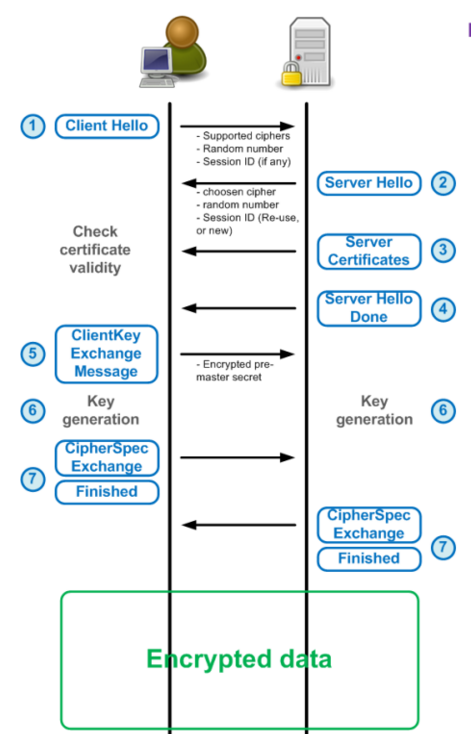

# 理解SSL/TLS协议

### 背景

早期我们在访问web时使用HTTP协议，该协议在传输数据时使用明文传输，明文传输带来了以下风险：

* 信息窃听风险，第三方可以获取通信内容
* 信息篡改风险，第三方可以篡改通信内容
* 身份冒充风险，第三方可以冒充他人身份参与通信

为了解决明文传输所带来的风险，网景公司在1994年设计了SSL用于Web的安全传输协议，这是SSL的起源。IETF将SSL进行标准化，1999年公布了第一版TLS标准文件。随后又公布了 RFC 5246（2008年8月）与 RFC 6176 （2011年3月）。该协议在web中被广泛应用。

***

### SSL/TLS协议

TLS（Transport Layer Security，传输层安全协议），及其前身SSL（Secure Sockets Layer，安全套接层）是一种安全协议，目的是为互联网通信，提供安全及数据完整性保障。

TLS协议使用以下三种机制为信息通信提供安全传输：

* 隐秘性，所有通信都通过加密后进行传播
* 身份认证，通过证书进行认证
* 可靠性，通过校验数据完整性维护一个可靠的安全连接

***

### 工作机制

TLS协议由两部分组成，包括（TLS Record Layer,TLS handshake protocol）

* Record Layer：

  为每条信息提供一个header和在尾部生成一个从Message Authentication Code (MAC) 得到的hash值，其中header由5 bytes组成，分别是协议说明(1bytes),协议版本(2bytes)和长度(2bytes)，跟在header后面的协议信息长度不得超过16384bytes。　

* Handshake Protocol：

  开始一个安全连接需要客户端和服务端经过反复的建立握手。一个TLS握手需要经过如下几个步骤：

  

 

首先还是要经过TCP三次握手建立连接，然后才是TLS握手的开始：

* ClientHello：Client端将自己的TLS协议版本，加密套件，压缩方法，随机数，SessionID(未填充)发送给Server端

* ServerHello：Server端将选择后的SSL协议版本，压缩算法，密码套件，填充SessionID，生成的随机数等信息发送给Client端

* ServerCertificates：Server端将自己的数字证书(包含公钥)，发送给Client端。(证书需要从数字证书认证机构(CA)申请，证书是对于服务端的一种认证)，若要进行更为安全的数据通信，Server端还可以向Client端发送Cerficate Request来要去客户端发送对方的证书进行合法性的认证。

* ServerHelloDone：当完成ServerHello后，Server端会发送Server Hello Done的消息给客户端，表示ServerHello 结束了。

* ClientKeyExchage：当Client端收到Server端的证书等信息后，会先对服务端的证书进行检查，检查证书的完整性以及证书跟服务端域名是否吻合，然后使用加密算法生成一个PreMaster Secret，并通过Server端的公钥进行加密，然后发送给Server端。

* ClientFinishd：Client端会发送一个ChangeCipherSpec(一种协议，数据只有一字节)，用于告知Server端已经切换到之前协商好的加密套件的状态，准备使用之前协商好的加密套件加密数据并进行传输了。然后使用Master Secret(通过两个随机数、PreMaster Secret和加密算法计算得出)加密一段Finish的数据传送给服务端，此数据是为了在正式传输应用数据之前对刚刚握手建立起来的加解密通道进行验证。

* Server Finishd：Sever端在接收到Client端传过来的加密数据后，使用私钥对这段加密数据进行解密，并对数据进行验证，然后会给客户端发送一个ChangeCipherSpec，告知客户端已经切换到协商过的加密套件状态，准备使用加密套件加密数据并传输了。之后，服务端也会使用Master Secret加密一段Finish消息发送给客户端，以验证之前通过握手建立起来的加解密通道是否成功。

根据之前的握手信息，如果客户端和服务端都能对Finish信息进行正常加解密且消息正确的被验证，则说明握手通道已经建立成功。

接下来，双方所有的通信数据都通过Master Secret进行加密后传输。　　　　

***

### 参考：

[https://en.wikipedia.org/wiki/Transport_Layer_Security](https://en.wikipedia.org/wiki/Transport_Layer_Security)

[https://www.sans.org/reading-room/whitepapers/protocols/ssl-tls-beginners-guide-1029](https://www.sans.org/reading-room/whitepapers/protocols/ssl-tls-beginners-guide-1029)

[https://support.microsoft.com/en-us/kb/257591](https://support.microsoft.com/en-us/kb/257591)
